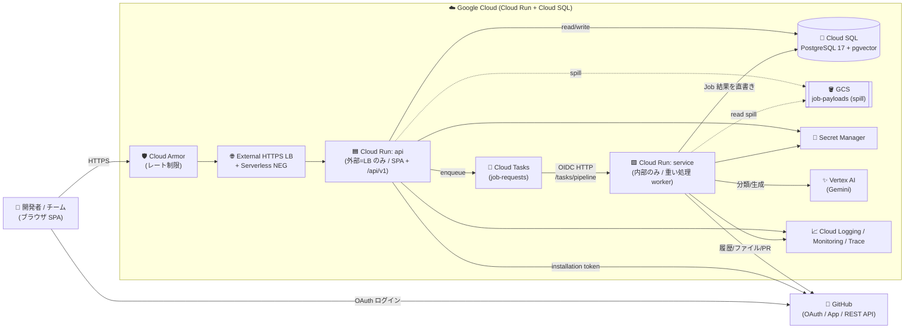

# インフラ・アーキテクチャ構成図

Rosetta（Tech Debt Twin Agent）の **Google Cloud インフラ構成**と**アプリケーション構成**を、
`infra/` の Terraform と `backend/` / `frontend/` の実コードを確認して図化したもの。

> このディレクトリの図は **実コードに基づく**（2026-06 時点）。出典は各セクションにファイルパスで明記する。

## 成果物一覧

| ファイル | 形式 | 内容 |
|---|---|---|
| `README.md`（本書） | Markdown + Mermaid | 全体像・検証済みコンポーネントインベントリ・高レベル構成図 |
| `cloud-architecture.drawio` | drawio (XML) | GCP クラウドアーキテクチャ図（編集・清書用の元データ） |
| `sequence-diagrams.md` | Markdown + Mermaid | シーケンス図（非同期ジョブ / スタック解析 / 認証 / リポジトリ接続 / CI/CD） |
| `use-cases.md` | Markdown + Mermaid | ユースケース図（アクター × 機能） |

> クラウドアーキテクチャ図は最終的に **drawio** で清書する前提のため、`cloud-architecture.drawio` を
> 編集の起点にする。本 README の Mermaid 版は GitHub 上でそのまま閲覧できる簡易版。

---

## 1. システム全体像

**要点（azure/aws 版との最大の差分）**
- **api / service の 2 コンテナ構成** + **Cloud Tasks による point-to-point ディスパッチ**。
- **結果は service が Cloud SQL の `Job` 行を直接更新**（Pub/Sub・コールバック無し）。フロントは `GET /api/v1/jobs/{id}` をポーリング。
- **AI は Vertex AI + ADC**（runtime SA に `roles/aiplatform.user`）。`google-api-key` Secret は作らない。
- フロントエンド SPA は **api コンテナに同梱**され api Cloud Run から配信（専用ホスティング無し）。

---

## 2. GCP リソースインベントリ（`infra/gcp/`・検証済み）

命名規約: `name_prefix = {project_name}-{region_short}-{environment}`（既定 `fullstack-app-an1-{stg|prod}`、`region` 既定 `asia-northeast1` → `an1`）。出典 `infra/gcp/main.tf`。

| 分類 | リソース | 要点 | 出典 |
|---|---|---|---|
| プロバイダ/State | `google` / `google-beta` `~>6.0`、`backend "gcs"` (`fullstack-app-tfstate`, prefix `gcp/`) | — | `main.tf` |
| API 有効化 | `run` `cloudtasks` `sqladmin` `secretmanager` `artifactregistry` `cloudbuild` `compute` `vpcaccess` `servicenetworking` `iam` `iamcredentials` `aiplatform` `logging` `monitoring` `cloudtrace` | **pubsub/functions/scheduler/eventarc は有効化しない** | `apis.tf` |
| コンテナ実行 | Cloud Run **api** | `ingress=INTERNAL_LOAD_BALANCER`、SA=api、VPC connector(egress=PRIVATE_RANGES_ONLY)、Cloud SQL volume、port 8000、`USE_MOCK_*=false` 強制 | `cloud-run.tf` |
| コンテナ実行 | Cloud Run **service** | `ingress=INTERNAL_ONLY`、SA=service、`run.invoker` を **tasks_invoker SA のみ**に付与（allUsers 不可） | `cloud-run.tf` |
| タスクキュー | Cloud Tasks `job-requests`（`for_each var.task_pipelines`） | `rate_limits` / `retry_config`(`max_doublings=4`)。DLQ は持たず失敗は `Job(FAILED)` | `cloud-tasks.tf` |
| DB | Cloud SQL **PostgreSQL 17** | prod=private IP + `REGIONAL`、stg=public IP + `authorized_networks 0.0.0.0/0` + `ZONAL`。`deletion_protection=prod` | `database.tf` |
| Secret | Secret Manager: `secret-key` / `github-app-private-key` / `github-client-secret` / `github-webhook-secret` / `database-url` | SA 別に必要分のみ accessor。**`google-api-key` 無し** | `secrets.tf` |
| ネットワーク | custom VPC + subnet(`10.10.0.0/20`) + Serverless VPC Access connector(`10.8.0.0/28`) + private service access(VPC peering) | Cloud Run → Cloud SQL private IP / 内部通信 | `networking.tf` |
| エッジ | External global HTTPS LB（serverless NEG → backend service → url map → https proxy + managed cert + forwarding rule） | cert/proxy/forwarding は `var.domain` 指定時のみ。NEG/backend/IP/Armor は常時 | `load-balancer.tf` |
| エッジ | Cloud Armor security policy | `login` 5/min・10/hour、`refresh` 30/min（IP 単位 `deny(429)`）、default `allow` | `cloud-armor.tf` |
| IAM | SA: **api** / **service(svc)** / **tasks_invoker(tasks)** | runtime: `cloudsql.client`・`aiplatform.user`・`logging.logWriter`、api: `cloudtasks.enqueuer`、tasks_invoker→service `run.invoker` | `iam.tf` |
| ストレージ | GCS `*-job-payloads` | UBLA、`lifecycle` 7 日で削除、`force_destroy` 非 prod。runtime SA に bucket 限定 `storage.objectAdmin` | `storage.tf` |
| レジストリ | Artifact Registry `DOCKER` repo `{project}-{env}` | api/service 共用（タグで分離） | `artifact-registry.tf` |
| 監視 | log-based metric(api 5xx) + alert(>10/300s) + uptime check(`/api/v1/health`、domain 指定時) | Cloud Run stdout/stderr は自動取込 | `monitoring.tf` |
| 出力 | `artifact_registry_repo` / `api_url` / `service_url` / `db_connection_name` / `job_payloads_bucket` / `tasks_queue_names` | — | `outputs.tf` |

### bootstrap（`infra/bootstrap/gcp/`・CI 用 WIF + tfstate）

| リソース | 要点 | 出典 |
|---|---|---|
| WIF pool/provider | `{project}-gh-pool` + `github-oidc`（issuer=`token.actions.githubusercontent.com`、`attribute_condition` で `repository==owner/repo`） | `wif.tf` |
| deploy SA | `{project}-gh-deploy`。`workloadIdentityUser` を **environment 単位**（`staging`/`production`）で付与 → production の required reviewers がデプロイゲート | `wif.tf` |
| deploy ロール | `run.admin` `cloudtasks.admin` `cloudsql.admin` `secretmanager.admin` `artifactregistry.admin` `iam.serviceAccountAdmin`+`User` `storage.admin` `compute.admin` `serviceusage.serviceUsageAdmin` `iam.workloadIdentityPoolAdmin` `resourcemanager.projectIamAdmin` | `roles.tf` |
| tfstate bucket | versioning + UBLA + `force_destroy=false`。app=`gcp/` / bootstrap=`gcp/bootstrap/` で分離 | `state.tf` |

> **デプロイ配線の注意:** WIF・SA・ロールは GitHub Actions からの `terraform apply` を前提にしているが、
> 本リポジトリには **`.github/workflows/` が未配置**（deploy ワークフローは issue-025 のスコープ）。
> したがって Terraform 構成は揃っているが、CI からの自動デプロイは未実装の状態。

---

## 3. アプリケーション構成（`backend/` uv workspace・検証済み）

### api（外部公開 Cloud Run・`backend/api/`）
- FastAPI、prefix `/api/v1`。ルータ: `health` `auth` `users` `orgs` `projects` `debts` `kc` `knowledge_debts` `overview` `galaxy` `quizzes` `learning` `agents` `github` `stack` `jobs`（`api/app/api/v1/router.py`）。
- SPA を `static/` から `/` にマウント（`SPAStaticFiles`、`main.py:89-91`）。`/api/openapi.json`・Scalar docs は非 prod のみ。
- 認証: fastapi-users（JWT access 5分 + DB-backed refresh 7日、cookie 分離、`token_epoch` で即時無効化）。
- 非同期ジョブ: `enqueue_job`（`services/job_orchestrator.py`）が `Job(QUEUED)` を永続化 → 90KB 超は GCS へ spill → `dispatcher.dispatch(jobType, request, dedup_key)`。`timeout_stale_jobs` が `PROCESSING>1h` を `FAILED` 化。
- ディスパッチャ選択（`services/dependencies.py:get_task_dispatcher`）:
  `USE_LOCAL_SERVICE`→`LocalHttpDispatcher` / `use_mock_queue()`→`MockTaskDispatcher` / それ以外→`CloudTasksDispatcher`（本番）。
- DB 所有: Alembic `0001`〜`0013`（`api/app/alembic/versions/`）+ エンジン（`api/app/core/db.py`）。

### service（内部 worker Cloud Run・`backend/service/`）
- FastAPI、`POST /tasks/{pipeline}` + `/health`（`service/main.py`）。`verify_oidc` で Cloud Tasks の OIDC（audience + invoker SA email）検証（`USE_MOCK_QUEUE` 時はスキップ）。
- `shared.worker.run_task` が共通処理: 冪等チェック（既 `COMPLETED` なら no-op）→ `PROCESSING` → `process(req, ctx)` → **`Job` を `COMPLETED`/`FAILED` + `result_data` で Cloud SQL に直書き**（api コールバック・Pub/Sub 無し）。transient は 503（Cloud Tasks リトライ）。
- パイプライン登録（`service/registry.py`）:

  | JobType | パイプライン | 外部依存 |
  |---|---|---|
  | `stack_analysis` | ADK エージェントでスタック解析 → `TechStack` upsert | GitHub API・Vertex AI(ADK Runner)・Cloud SQL |
  | `code_debt_detection` | 重複/dead/複雑度 + AI 生成痕跡検知 | GitHub・(Gemini)・Cloud SQL |
  | `kc_analysis` | Knowledge Coverage 算出（authorship/blame + 依存） | GitHub・Cloud SQL |
  | `knowledge_debt_detection` | AI生成/著者離脱/未レビュー検知 | GitHub・(Gemini)・Cloud SQL |
  | `repayment_pr_generation` | Gemini リファクタ案 + GitHub 返済 PR | Gemini・GitHub・Cloud SQL |
  | `quiz_generation` / `quiz_grading` | 低 KC ファイルからクイズ生成 / 意味採点 | Gemini・Cloud SQL |
  | `learning_plan_generation` | チーム資産浮上の学習プラン生成 | Gemini・Cloud SQL |
  | `code_debt_loop` / `knowledge_debt_loop` | 自律ループ束ね（検知→分析→計画→返済→検証） | 上記を束ねる |
  | `echo` / `ping` | 配線確認（shared、api の mock-worker と共用） | — |

- **GitHub トークンは方式 B**: service が `GITHUB_APP_PRIVATE_KEY`（Secret Manager）から installation token を都度 mint（`service/services/github_app.py`）。キュー/GCS に平文の秘密を残さない。

### shared（`backend/shared/`）
- ORM: `job` `tech_stack` `analysis_run` `repo_file` `code_debt` `file_kc` `dependency` `knowledge_debt` `assigned_developer` `debt_trend_point` `quiz_session` `quiz_answer` `quiz_result` `learning_plan` `agent_loop`。
- enum: `JobType`（lowercase snake_case → task path は `-`）/ `JobStatus`（大文字 `QUEUED`/`PROCESSING`/`COMPLETED`/`FAILED`/`CANCELLED`）。
- `shared.worker.run_task`・`shared.queue`(`TaskDispatcher`/`BlobClient` Protocol)・`shared.registry`(echo/ping)。

### frontend（`frontend/`・SvelteKit 2 SPA）
- `adapter-static` + `ssr=false`。ルート `[org]/[project]/{overview, galaxy, matrix/[debtId], quizzes/[sessionId]/result, learning, agents, repos, settings}`。
- ストア（`src/lib/stores/`）: `auth` `repo` `project` `sidebar` `galaxy` `quiz` `agent` `members` `recent-searches` `stack-analysis`(enqueue+poll)。
- API クライアント（`src/lib/api/client.ts`）: `apiFetch` + enqueue 関数群（`analyzeStack`/`detectDebts`/`detectKnowledgeDebts`/`analyzeGalaxy`/`generateQuiz`/`submitQuiz`/`createRepaymentPr`）+ `getJob` ポーリング。

---

## 4. ローカル / 本番のモード差（`USE_MOCK_*`）

| モード | `USE_MOCK_QUEUE` | `USE_MOCK_WORKER` | `USE_LOCAL_SERVICE` | 経路 |
|---|---|---|---|---|
| ローカル既定 | true | true | false | api 内 in-process mock-worker が処理（GCP 不要） |
| ローカル service 結合 | (無効) | (無効) | true | `LocalHttpDispatcher` が docker compose の service へ HTTP |
| 本番(GCP) | false | false | false | `CloudTasksDispatcher` → Cloud Tasks → service（OIDC） |

出典: `backend/api/app/core/config.py`（`use_mock_queue` / `use_mock_worker` / `use_local_service`）。
</content>
