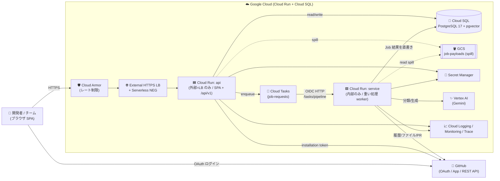

# インフラ・アーキテクチャ構成図

DevDebtOps（Tech Debt Twin Agent）の **Google Cloud インフラ構成**と**アプリケーション構成**を、
`infra/` の Terraform と `backend/` / `frontend/` の実コードを確認して図化したもの。

> このディレクトリの図は **実コードに基づく**（2026-06 時点）。出典は各セクションにファイルパスで明記する。

## 成果物一覧

| ファイル | 形式 | 内容 |
|---|---|---|
| `README.md`（本書） | Markdown + Mermaid | 全体像・検証済みコンポーネントインベントリ・高レベル構成図 |
| `cloud-architecture.drawio` | drawio (XML) | GCP クラウドアーキテクチャ図（編集・清書用の元データ） |
| `sequence-diagrams.md` | Markdown + Mermaid | シーケンス図（非同期ジョブ / スタック解析 / 認証 / リポジトリ接続 / CI/CD） |
| `use-cases.md` | Markdown + Mermaid | ユースケース図（アクター × 機能） |

> クラウドアーキテクチャ図は最終的に **drawio** で清書する前提のため、`cloud-architecture.drawio` を
> 編集の起点にする。本 README の Mermaid 版は GitHub 上でそのまま閲覧できる簡易版。

---

## 1. システム全体像


```mermaid
flowchart LR
    user["👤 開発者 / チーム<br/>(ブラウザ SPA)"]
    gh["🐙 GitHub<br/>(OAuth / App / REST API)"]

    subgraph gcp["☁️ Google Cloud (Cloud Run + Cloud SQL)"]
        direction TB
        armor["🛡️ Cloud Armor<br/>(レート制限)"]
        lb["🌐 External HTTPS LB<br/>+ Serverless NEG"]
        api["🟦 Cloud Run: api<br/>(外部=LB のみ / SPA + /api/v1)"]
        tasks["📨 Cloud Tasks<br/>(job-requests)"]
        svc["🟪 Cloud Run: service<br/>(内部のみ / 重い処理 worker)"]
        sql[("🐘 Cloud SQL<br/>PostgreSQL 17 + pgvector")]
        gcs[["🪣 GCS<br/>job-payloads (spill)"]]
        sm["🔐 Secret Manager"]
        vertex["✨ Vertex AI<br/>(Gemini)"]
        obs["📈 Cloud Logging / Monitoring / Trace"]
    end

    user -->|HTTPS| armor --> lb --> api
    api -->|enqueue| tasks -->|OIDC HTTP<br/>/tasks/pipeline| svc
    api -->|read/write| sql
    svc -->|Job 結果を直書き| sql
    api -.spill.-> gcs
    svc -.read spill.-> gcs
    api --> sm
    svc --> sm
    svc -->|分類/生成| vertex
    svc -->|履歴/ファイル/PR| gh
    user -->|OAuth ログイン| gh
    api -->|installation token| gh
    api --> obs
    svc --> obs
```

**要点（azure/aws 版との最大の差分）**
- **api / service の 2 コンテナ構成** + **Cloud Tasks による point-to-point ディスパッチ**。
- **結果は service が Cloud SQL の `Job` 行を直接更新**（Pub/Sub・コールバック無し）。フロントは `GET /api/v1/jobs/{id}` をポーリング。
- **AI は Vertex AI + ADC**（runtime SA に `roles/aiplatform.user`）。`google-api-key` Secret は作らない。
- フロントエンド SPA は **api コンテナに同梱**され api Cloud Run から配信（専用ホスティング無し）。

---

## 2. GCP リソースインベントリ（`infra/gcp/`・検証済み）

命名規約: `name_prefix = {project_name}-{region_short}-{environment}`（既定 `fullstack-app-an1-{stg|prod}`、`region` 既定 `asia-northeast1` → `an1`）。出典 `infra/gcp/main.tf`。

| 分類 | リソース | 要点 | 出典 |
|---|---|---|---|
| プロバイダ/State | `google` / `google-beta` `~>6.0`、`backend "gcs"` (`fullstack-app-tfstate`, prefix `gcp/`) | — | `main.tf` |
| API 有効化 | `run` `cloudtasks` `sqladmin` `secretmanager` `artifactregistry` `cloudbuild` `compute` `vpcaccess` `servicenetworking` `iam` `iamcredentials` `aiplatform` `logging` `monitoring` `cloudtrace` | **pubsub/functions/scheduler/eventarc は有効化しない** | `apis.tf` |
| コンテナ実行 | Cloud Run **api** | `ingress=INTERNAL_LOAD_BALANCER`、SA=api、VPC connector(egress=PRIVATE_RANGES_ONLY)、Cloud SQL volume、port 8000、`USE_MOCK_*=false` 強制 | `cloud-run.tf` |
| コンテナ実行 | Cloud Run **service** | `ingress=INTERNAL_ONLY`、SA=service、`run.invoker` を **tasks_invoker SA のみ**に付与（allUsers 不可） | `cloud-run.tf` |
| タスクキュー | Cloud Tasks `job-requests`（`for_each var.task_pipelines`） | `rate_limits` / `retry_config`(`max_doublings=4`)。DLQ は持たず失敗は `Job(FAILED)` | `cloud-tasks.tf` |
| DB | Cloud SQL **PostgreSQL 17** | prod=private IP + `REGIONAL`、stg=public IP + `authorized_networks 0.0.0.0/0` + `ZONAL`。`deletion_protection=prod` | `database.tf` |
| Secret | Secret Manager: `secret-key` / `github-app-private-key` / `github-client-secret` / `github-webhook-secret` / `database-url` | SA 別に必要分のみ accessor。**`google-api-key` 無し** | `secrets.tf` |
| ネットワーク | custom VPC + subnet(`10.10.0.0/20`) + Serverless VPC Access connector(`10.8.0.0/28`) + private service access(VPC peering) | Cloud Run → Cloud SQL private IP / 内部通信 | `networking.tf` |
| エッジ | External global HTTPS LB（serverless NEG → backend service → url map → https proxy + managed cert + forwarding rule） | cert/proxy/forwarding は `var.domain` 指定時のみ。NEG/backend/IP/Armor は常時 | `load-balancer.tf` |
| エッジ | Cloud Armor security policy | `login` 5/min・10/hour、`refresh` 30/min（IP 単位 `deny(429)`）、default `allow` | `cloud-armor.tf` |
| IAM | SA: **api** / **service(svc)** / **tasks_invoker(tasks)** | runtime: `cloudsql.client`・`aiplatform.user`・`logging.logWriter`、api: `cloudtasks.enqueuer`、tasks_invoker→service `run.invoker` | `iam.tf` |
| ストレージ | GCS `*-job-payloads` | UBLA、`lifecycle` 7 日で削除、`force_destroy` 非 prod。runtime SA に bucket 限定 `storage.objectAdmin` | `storage.tf` |
| レジストリ | Artifact Registry `DOCKER` repo `{project}-{env}` | api/service 共用（タグで分離） | `artifact-registry.tf` |
| 監視 | log-based metric(api 5xx) + alert(>10/300s) + uptime check(`/api/v1/health`、domain 指定時) | Cloud Run stdout/stderr は自動取込 | `monitoring.tf` |
| 出力 | `artifact_registry_repo` / `api_url` / `service_url` / `db_connection_name` / `job_payloads_bucket` / `tasks_queue_names` | — | `outputs.tf` |

### bootstrap（`infra/bootstrap/gcp/`・CI 用 WIF + tfstate）

| リソース | 要点 | 出典 |
|---|---|---|
| WIF pool/provider | `{project}-gh-pool` + `github-oidc`（issuer=`token.actions.githubusercontent.com`、`attribute_condition` で `repository==owner/repo`） | `wif.tf` |
| deploy SA | `{project}-gh-deploy`。`workloadIdentityUser` を **environment 単位**（`staging`/`production`）で付与 → production の required reviewers がデプロイゲート | `wif.tf` |
| deploy ロール | `run.admin` `cloudtasks.admin` `cloudsql.admin` `secretmanager.admin` `artifactregistry.admin` `iam.serviceAccountAdmin`+`User` `storage.admin` `compute.admin` `serviceusage.serviceUsageAdmin` `iam.workloadIdentityPoolAdmin` `resourcemanager.projectIamAdmin` | `roles.tf` |
| tfstate bucket | versioning + UBLA + `force_destroy=false`。app=`gcp/` / bootstrap=`gcp/bootstrap/` で分離 | `state.tf` |

> **デプロイ配線:** WIF・SA・ロールは GitHub Actions からの `terraform apply` を前提とする。deploy ワークフロー
> （`deploy-stg.yml` / `deploy-prod.yml` → 共通 `deploy-gcp.yml`）は配置済みで、実際に stg デプロイに使用している。
> 運用手順（デプロイ / 破棄 / 再デプロイ / トラブルシュート）は本書「5. 運用ランブック」を参照。

---

## 3. アプリケーション構成（`backend/` uv workspace・検証済み）

### api（外部公開 Cloud Run・`backend/api/`）
- FastAPI、prefix `/api/v1`。ルータ: `health` `auth` `users` `orgs` `projects` `debts` `kc` `knowledge_debts` `overview` `galaxy` `quizzes` `learning` `agents` `github` `stack` `jobs`（`api/app/api/v1/router.py`）。
- SPA を `static/` から `/` にマウント（`SPAStaticFiles`、`main.py:89-91`）。`/api/openapi.json`・Scalar docs は非 prod のみ。
- 認証: fastapi-users（JWT access 5分 + DB-backed refresh 7日、cookie 分離、`token_epoch` で即時無効化）。
- 非同期ジョブ: `enqueue_job`（`services/job_orchestrator.py`）が `Job(QUEUED)` を永続化 → 90KB 超は GCS へ spill → `dispatcher.dispatch(jobType, request, dedup_key)`。`timeout_stale_jobs` が `PROCESSING>1h` を `FAILED` 化。
- ディスパッチャ選択（`services/dependencies.py:get_task_dispatcher`）:
  `USE_LOCAL_SERVICE`→`LocalHttpDispatcher` / `use_mock_queue()`→`MockTaskDispatcher` / それ以外→`CloudTasksDispatcher`（本番）。
- DB 所有: Alembic `0001`〜`0013`（`api/app/alembic/versions/`）+ エンジン（`api/app/core/db.py`）。

### service（内部 worker Cloud Run・`backend/service/`）
- FastAPI、`POST /tasks/{pipeline}` + `/health`（`service/main.py`）。`verify_oidc` で Cloud Tasks の OIDC（audience + invoker SA email）検証（`USE_MOCK_QUEUE` 時はスキップ）。
- `shared.worker.run_task` が共通処理: 冪等チェック（既 `COMPLETED` なら no-op）→ `PROCESSING` → `process(req, ctx)` → **`Job` を `COMPLETED`/`FAILED` + `result_data` で Cloud SQL に直書き**（api コールバック・Pub/Sub 無し）。transient は 503（Cloud Tasks リトライ）。
- パイプライン登録（`service/registry.py`）:

  | JobType | パイプライン | 外部依存 |
  |---|---|---|
  | `stack_analysis` | ADK エージェントでスタック解析 → `TechStack` upsert | GitHub API・Vertex AI(ADK Runner)・Cloud SQL |
  | `code_debt_detection` | 重複/dead/複雑度 + AI 生成痕跡検知 | GitHub・(Gemini)・Cloud SQL |
  | `kc_analysis` | Knowledge Coverage 算出（authorship/blame + 依存） | GitHub・Cloud SQL |
  | `knowledge_debt_detection` | AI生成/著者離脱/未レビュー検知 | GitHub・(Gemini)・Cloud SQL |
  | `repayment_pr_generation` | Gemini リファクタ案 + GitHub 返済 PR | Gemini・GitHub・Cloud SQL |
  | `quiz_generation` / `quiz_grading` | 低 KC ファイルからクイズ生成 / 意味採点 | Gemini・Cloud SQL |
  | `learning_plan_generation` | チーム資産浮上の学習プラン生成 | Gemini・Cloud SQL |
  | `code_debt_loop` / `knowledge_debt_loop` | 自律ループ束ね（検知→分析→計画→返済→検証） | 上記を束ねる |
  | `echo` / `ping` | 配線確認（shared、api の mock-worker と共用） | — |

- **GitHub トークンは方式 B**: service が `GITHUB_APP_PRIVATE_KEY`（Secret Manager）から installation token を都度 mint（`service/services/github_app.py`）。キュー/GCS に平文の秘密を残さない。

### shared（`backend/shared/`）
- ORM: `job` `tech_stack` `analysis_run` `repo_file` `code_debt` `file_kc` `dependency` `knowledge_debt` `assigned_developer` `debt_trend_point` `quiz_session` `quiz_answer` `quiz_result` `learning_plan` `agent_loop`。
- enum: `JobType`（lowercase snake_case → task path は `-`）/ `JobStatus`（大文字 `QUEUED`/`PROCESSING`/`COMPLETED`/`FAILED`/`CANCELLED`）。
- `shared.worker.run_task`・`shared.queue`(`TaskDispatcher`/`BlobClient` Protocol)・`shared.registry`(echo/ping)。

### frontend（`frontend/`・SvelteKit 2 SPA）
- `adapter-static` + `ssr=false`。ルート `[org]/[project]/{overview, galaxy, matrix/[debtId], quizzes/[sessionId]/result, learning, agents, repos, settings}`。
- ストア（`src/lib/stores/`）: `auth` `repo` `project` `sidebar` `galaxy` `quiz` `agent` `members` `recent-searches` `stack-analysis`(enqueue+poll)。
- API クライアント（`src/lib/api/client.ts`）: `apiFetch` + enqueue 関数群（`analyzeStack`/`detectDebts`/`detectKnowledgeDebts`/`analyzeGalaxy`/`generateQuiz`/`submitQuiz`/`createRepaymentPr`）+ `getJob` ポーリング。

---

## 4. ローカル / 本番のモード差（`USE_MOCK_*`）

| モード | `USE_MOCK_QUEUE` | `USE_MOCK_WORKER` | `USE_LOCAL_SERVICE` | 経路 |
|---|---|---|---|---|
| ローカル既定 | true | true | false | api 内 in-process mock-worker が処理（GCP 不要） |
| ローカル service 結合 | (無効) | (無効) | true | `LocalHttpDispatcher` が docker compose の service へ HTTP |
| 本番(GCP) | false | false | false | `CloudTasksDispatcher` → Cloud Tasks → service（OIDC） |

出典: `backend/api/app/core/config.py`（`use_mock_queue` / `use_mock_worker` / `use_local_service`）。

---

## 5. 運用ランブック（デプロイ / 破棄 / 再デプロイ / 運用メモ）

ステージング環境（GCP）の **破棄（terraform destroy）** と **再デプロイ（復旧）** の手順。
※ここに**秘密情報は書かない**（鍵・client secret 等は GitHub Secrets / Secret Manager にのみ存在）。

- デプロイは GitHub Actions（WIF・鍵レス）。トリガー: **`develop` → stg**（現在は `deploy-stg.yml` を `workflow_dispatch` に切替中／コスト削減のため。自動化に戻すには `push: { branches: [develop] }` へ）／**タグ `v*.*.*` → prod**。
- 認証: デプロイは WIF、ランタイムは Cloud Run アタッチ SA（ADC、鍵ファイル無し）。`gsa.json` は**ローカル(compose)専用**。
- AI（Gemini）は **Vertex AI を実行時に呼ぶだけ**（terraform でデプロイするものではない。API 有効化 + SA に `roles/aiplatform.user` + project/region 注入のみ）。

### 5.1 構成（2 つの Terraform スタック）

| スタック | パス | 中身 | 普段の扱い |
|---|---|---|---|
| **bootstrap** | `infra/bootstrap/gcp` | WIF プール / デプロイ SA + ロール / **tfstate バケット `gs://dev-debt-ops`** | **基本そのまま残す**（消さない） |
| **app（アプリ環境）** | `infra/gcp` | Cloud Run(api/service) / Cloud SQL / 外部 LB + Cloud Armor + マネージド証明書 / VPC コネクタ / Secret Manager / Artifact Registry / 監視 / GCS(job-payloads) | **destroy / 再デプロイの対象** |

### 5.2 主要な値（リファレンス）

| 項目 | 値 |
|---|---|
| GCP プロジェクト | `phrasal-talon-496014-f4`（プロジェクト番号 `761276691103`） |
| 請求アカウント | DevOps × AI Agent Hackathon 2026 |
| リージョン | `asia-northeast1` |
| tfstate バケット | `gs://dev-debt-ops`（app は prefix `gcp/`、bootstrap は `gcp/bootstrap/`） |
| WIF プロバイダ | `projects/761276691103/locations/global/workloadIdentityPools/dev-debt-ops-gh-pool/providers/github-oidc` |
| デプロイ SA | `dev-debt-ops-gh-deploy@phrasal-talon-496014-f4.iam.gserviceaccount.com` |
| stg ドメイン | `stg.devdebtops.harutotakita.dev` |
| prod ドメイン | `devdebtops.harutotakita.dev` |
| GitHub App（stg） | `devdebtops-stg`（App ID `4151789` / Client ID `Iv23liHhadKwbVgb8ZlP`） |
| GitHub Variables | `GCP_WIF_PROVIDER` / `GCP_DEPLOY_SA` / `GCP_PROJECT_ID` / `GCP_REGION` |
| GitHub Secrets | `DB_PASSWORD` / `SECRET_KEY` / `GH_APP_PRIVATE_KEY` / `GH_CLIENT_SECRET` / `GH_WEBHOOK_SECRET` |

DNS: `harutotakita.dev` は お名前.com（ネームサーバ `01〜04.dnsv.jp`）。`stg.devdebtops` の A レコードを LB IP に向ける。

### 5.3 コスト

- **常時課金 ≒ 月 $45**（外部 LB ~$18 / Cloud SQL db-f1-micro ~$14 / VPC コネクタ ~$12 / その他 ~$2）。
- Vertex AI（Gemini）は**解析実行時のみ従量課金**。
- **destroy するとほぼ $0**（残るのは state バケットの数円 + bootstrap の WIF/SA = 無料）。

### 5.4 アプリ環境を破棄する（terraform destroy）

bootstrap は別スタックなので触れない。stg は `deletion_protection=false` / バケット `force_destroy=true` なのでクリーンに消える。

```bash
cd infra/gcp
terraform init   # 念のため（gcs backend: gs://dev-debt-ops, prefix gcp/）

terraform destroy \
  -var-file=environments/stg.tfvars \
  -var="gcp_project_id=phrasal-talon-496014-f4" \
  -var="db_password=unused" \
  -var="secret_key=unused" \
  -var="github_app_private_key=unused" \
  -var="github_client_secret=unused"
```

- `Plan: 0 to add, 0 to change, NN to destroy` を確認して `yes`。
- **`-var` は削除不可**：5 つとも default 無しの必須変数（`stg.tfvars` に無い）。`gcp_project_id` のみ実値が必要、残り 4 つは **ダミーで可**（destroy は値を使わず Secret ごと削除するだけ）。省略すると対話プロンプト or `No value for required variable` で停止。
- まれに `google_service_networking_connection` 削除でエラー → **もう一度 `terraform destroy`** で残りが片付く。
- Cloud SQL 削除等で数分かかる。

#### 破棄後の確認

```bash
gcloud run services list --region=asia-northeast1 --project=phrasal-talon-496014-f4   # 空
gcloud sql instances list --project=phrasal-talon-496014-f4                            # 空
gcloud compute forwarding-rules list --global --project=phrasal-talon-496014-f4        # 空
```

#### 残るもの（意図どおり）
bootstrap（WIF / デプロイ SA + ロール / state バケット）、GitHub の Variables・Secrets・Environments、ドメイン、GitHub App。→ **再デプロイは（トリガーを起動するだけ）**で復活する。

### 5.5 再デプロイする（復旧）

1. **起動**
   - コード変更あり: `develop` に push（`deploy-stg.yml` が `push` トリガーの場合。現在は手動のため下記）
   - 手動起動（現行）: `gh workflow run deploy-stg.yml --ref develop`、または直近 Deploy Staging を再実行
     ```bash
     gh run rerun $(gh run list --branch develop --workflow=deploy-stg.yml --limit 1 --json databaseId --jq '.[0].databaseId')
     ```
2. **新しい LB IP を取得 → DNS を更新（唯一の手作業）**
   destroy で固定 IP が解放されるため、**毎回 IP が変わる**。
   ```bash
   cd infra/gcp && terraform output -raw lb_ip
   ```
   → お名前.com の DNS で `stg.devdebtops` の A レコードをこの新 IP に張り替える。
3. **マネージド証明書 ACTIVE 待ち → 確認**（DNS 反映後 ~15〜60 分）
   ```bash
   gcloud compute ssl-certificates list --project=phrasal-talon-496014-f4 \
     --format='table(name, managed.status, managed.domains)'
   curl -sS https://stg.devdebtops.harutotakita.dev/api/v1/health   # {"status":"ok"}
   ```

**注意**
- **Cloud SQL は新規＝空**（解析データは消える）。マイグレーションは **デプロイ内の migrate ステップ**（Cloud Run Job `migrate` を `gcloud run jobs execute --wait` で先行実行、issue 072）で適用され、api 起動時には実行しない。
- DNS の A レコード更新を忘れると HTTPS が通らない（IP が毎回変わるため）。
- 本番（prod）は タグ `v0.1.0` 以上の push。prod 用 DNS（`devdebtops.harutotakita.dev`）と GitHub App が別途必要。

### 5.6 解析が「処理中」のまま固まったときの対処

- **通常**: 画面コックピットの **「キャンセル」ボタン**（実行中に表示）で解除 → 再実行。
  - 裏側: `POST /api/v1/orgs/{org}/projects/{project}/cancel-analysis` が QUEUED/PROCESSING の解析ジョブを CANCELLED 化。
- **緊急（UI でも解除できない / 過去の滞留ジョブ）**: DB で直接終端化（stg は Cloud SQL パブリック IP + 全許可）。
  ```bash
  P=phrasal-talon-496014-f4
  IP=$(gcloud sql instances describe dev-debt-ops-an1-stg-pg --project=$P --format='value(ipAddresses[0].ipAddress)')
  URL=$(gcloud secrets versions access latest --secret=dev-debt-ops-stg-database-url --project=$P)
  PW=$(printf '%s' "$URL" | sed -E 's#.*://postgres:([^@]*)@.*#\1#')
  docker run --rm -e PGPASSWORD="$PW" pgvector/pgvector:pg17 \
    psql -h "$IP" -U postgres -d dev_debt_ops \
    -c "UPDATE jobs SET status='CANCELLED', completed_at=now() WHERE status IN ('QUEUED','PROCESSING');"
  ```
  ※ DB パスワードは独立 secret ではなく `database-url` secret に埋め込まれている。

### 5.7 解決済みの「初回デプロイのハマりどころ」

すべてコード / bootstrap に反映済み（cold-start 関連の一部は初回ブートストラップ対応ブランチにあり、develop へ取り込み予定）。

| 症状 | 原因 | 対処（反映先） |
|---|---|---|
| イメージビルドで `CHANGELOG.md not found` | `.dockerignore` の `*.md` 除外 | `!CHANGELOG.md` を追加（`.dockerignore`） |
| Trivy で停止 | 依存/ベースの HIGH CVE（一部は upstream バイナリで修正不可） | 依存更新 + 修正不可分は根拠付きで `.trivyignore` |
| Terraform Apply 権限エラー | デプロイ SA のロール不足 | `monitoring.editor`/`vpcaccess.admin`/`servicenetworking.networksAdmin`/`logging.configWriter` 追加（**bootstrap `roles.tf`**、適用済み） |
| Cloud SQL 作成エラー | edition 既定が ENTERPRISE_PLUS で db-f1-micro 不可 | `edition="ENTERPRISE"`（`database.tf`） |
| VPC コネクタ作成エラー | instances/throughput 未指定 | `min_instances=2 / max_instances=3`（`networking.tf`） |
| cold-start で migrate Job 作成失敗 | targeted apply が secret version / cloudsql.client / sql db・user を作らない | migrate ステップの `-target` に追加、migrate Job に `ENVIRONMENT/COOKIE_SECURE/SECRET_KEY` を付与、`deletion_protection=false` |
| アラートポリシー 404 | ログメトリクスの伝播待ち（一過性） | 再実行で解消 |
| 画面 403（LB 経由） | api に `allUsers` invoker 無し | api に `allUsers` の `run.invoker`（`cloud-run.tf`） |
| 解析が全失敗（api→service 不達） | api SA が tasks_invoker を actAs 不可 / Cloud Tasks の token 発行不可 | api SA に `iam.serviceAccountUser`、Cloud Tasks SA に `iam.serviceAccountTokenCreator`（`iam.tf`） |
| service が OIDC で 401 | verify_oidc の audience 不一致（自己参照不可） | 固定 audience を `custom_audiences` で受理 + ディスパッチャで audience を POST URL と分離（`cloud-run.tf` / api `cloud_tasks_dispatcher.py`） |
| ログイン時に noreply メールになる | GitHub App に「Email addresses」権限が無い | 対象 App に Email addresses(Read) を付与し再認可（`RobustGitHubOAuth2` は権限無しでも noreply へフォールバック） |
| デモ入口「お試しはこちら」が出ない | api に `DEMO_MODE_ENABLED` 未配線（既定 false） | api env に `DEMO_MODE_ENABLED`（`cloud-run.tf`）+ `stg.tfvars` で true |

### 5.8 補足

- ローカル `secrets/gsa.json` は **ローカル(compose)専用**の SA 鍵。クラウドには鍵を置かない（Cloud Run アタッチ SA の ADC）。
- ローカル `develop` が origin より遅れている場合あり。同期は `git stash → git pull --rebase → git stash pop`。
- デプロイの自動クローズ漏れ防止: PR 本文に `Closes #<番号>`（PR タイトルの `issue-0XX` は docs ファイル名なので GitHub は連動しない）。
