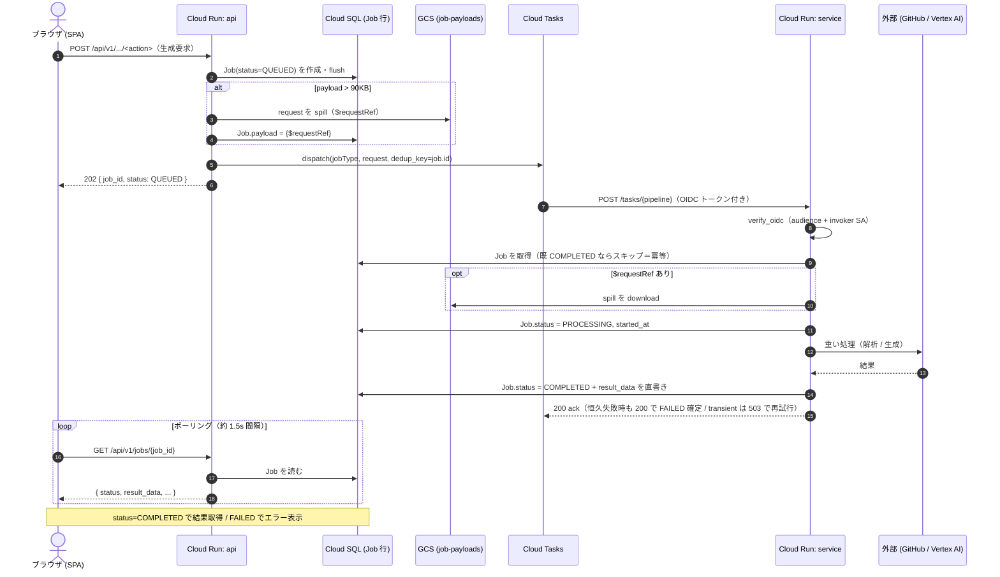
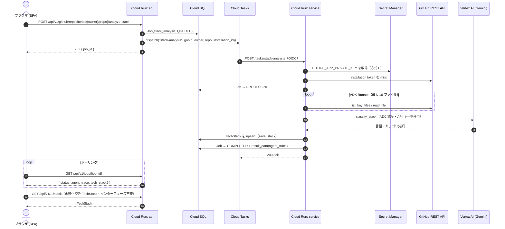
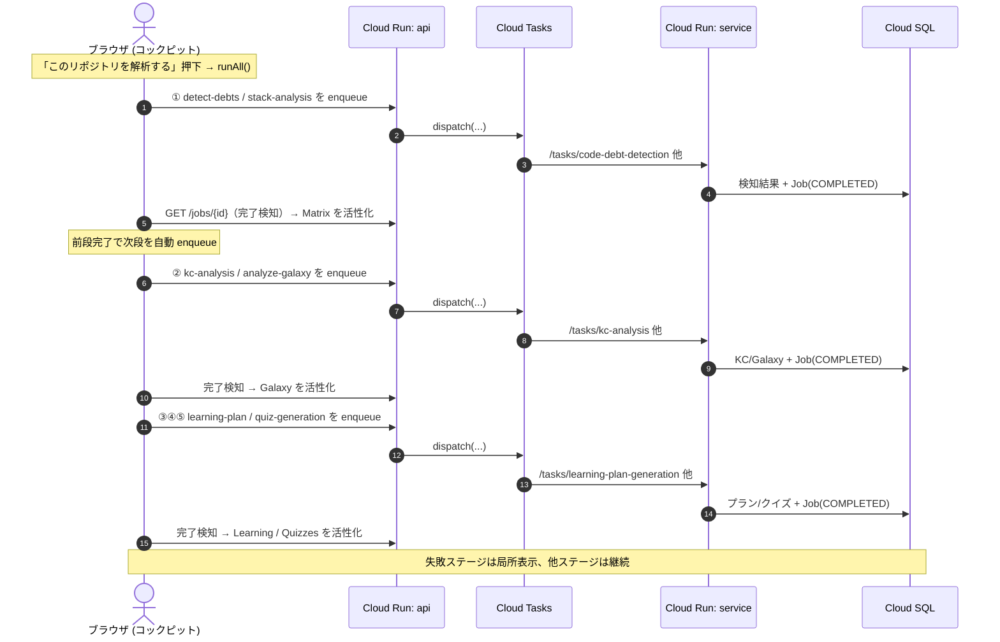
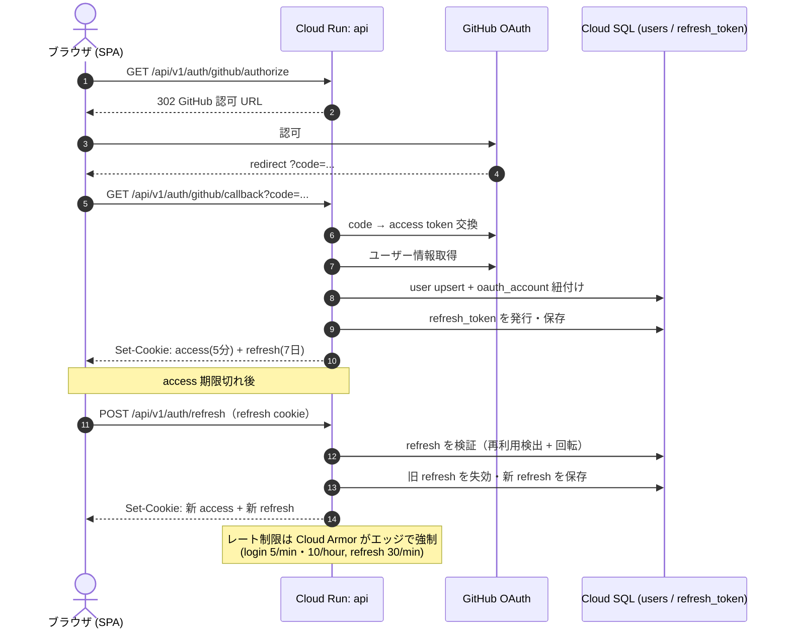
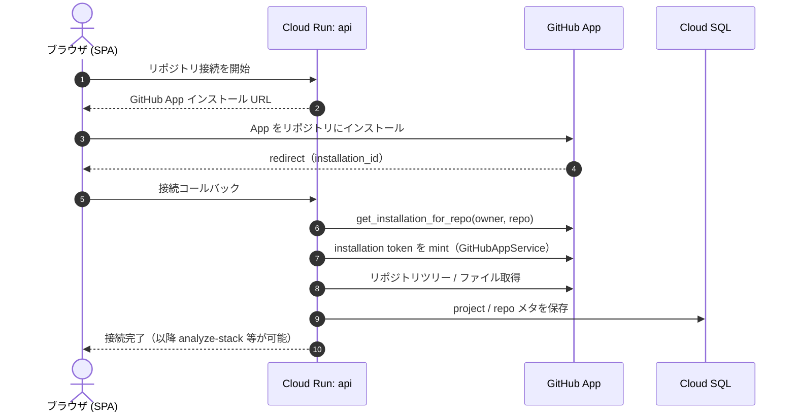
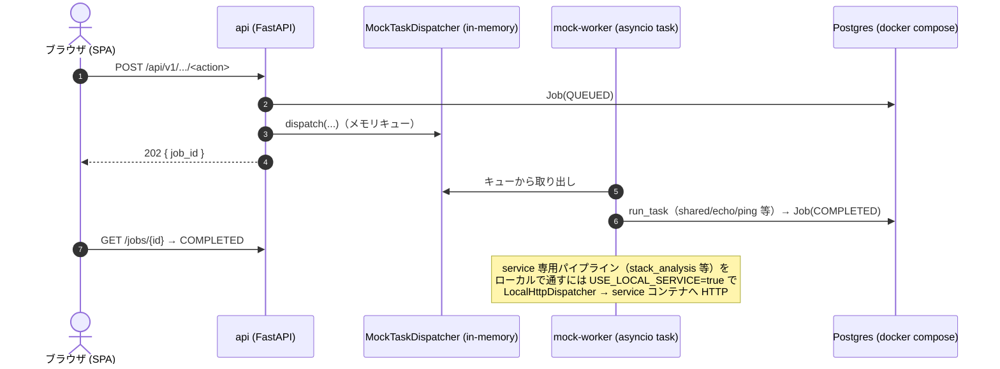
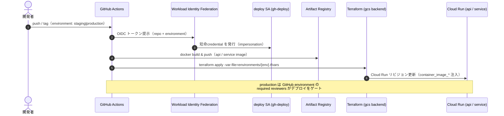

# シーケンス図

Rosetta の主要フローを Mermaid シーケンス図で示す。すべて `backend/` / `frontend/` / `infra/` の実コードに基づく。

- [1. 非同期ジョブのライフサイクル（汎用）](#1-非同期ジョブのライフサイクル汎用)
- [2. スタック解析（stack-analysis・具体例）](#2-スタック解析stack-analysis具体例)
- [3. 解析ラン・コックピット（複数パイプライン段階生成／issue-037）](#3-解析ランコックピット複数パイプライン段階生成issue-037)
- [4. 認証（GitHub OAuth ログイン + リフレッシュ回転）](#4-認証github-oauth-ログイン--リフレッシュ回転)
- [5. リポジトリ接続（GitHub App インストール）](#5-リポジトリ接続github-app-インストール)
- [6. ローカル開発のモック経路](#6-ローカル開発のモック経路)
- [7. CI/CD デプロイ（WIF → Terraform）](#7-cicd-デプロイwif--terraform)

---

## 1. 非同期ジョブのライフサイクル（汎用）

`enqueue_job`（`api/app/services/job_orchestrator.py`）→ Cloud Tasks → `service` の `/tasks/{pipeline}` →
`shared.worker.run_task` が Cloud SQL に結果を直書き → フロントが `GET /api/v1/jobs/{id}` をポーリング。

> 失敗・DLQ 代替: Cloud Tasks にネイティブ DLQ は無く、恒久失敗は `Job(FAILED)`、`PROCESSING` のまま放置された
> Job は api の `timeout_stale_jobs`（>1h）が `FAILED` 化する。

---

## 2. スタック解析（stack-analysis・具体例）

`POST .../analyze-stack` → ADK エージェント（`list_key_files`→`read_file`→`classify_stack`→`save_stack`）を service で実行。
**GitHub トークンは方式 B**（service が Secret Manager の App 秘密鍵から installation token を mint）。

---

## 3. 解析ラン・コックピット（複数パイプライン段階生成／issue-037）

プロジェクトトップの「このリポジトリを解析する」から、コアループ（検知→分析→計画→返済→検証）を
**段階生成**として順次起動する（issue-037 の設計）。各ステージは §1 の汎用ジョブとして走る。

---

## 4. 認証（GitHub OAuth ログイン + リフレッシュ回転）

fastapi-users ベース。access(JWT, 5分) と refresh(DB-backed, 7日) を **別 cookie** に分離し、
refresh は **再利用検出付きで回転**。`token_epoch` で即時ログアウト無効化。

---

## 5. リポジトリ接続（GitHub App インストール）

---

## 6. ローカル開発のモック経路

本番の Cloud Tasks → service の代わりに、`USE_MOCK_QUEUE=USE_MOCK_WORKER=true`（既定）では
**api プロセス内の mock-worker** が同じ `shared.worker.run_task` を実行する（GCP 不要）。

---

## 7. CI/CD デプロイ（WIF → Terraform）

long-lived 鍵を使わず、GitHub Actions が **WIF** で deploy SA を impersonate して
`terraform apply` する想定（bootstrap が WIF/SA/ロールを用意。deploy ワークフロー自体は issue-025・未配置）。

</content>
