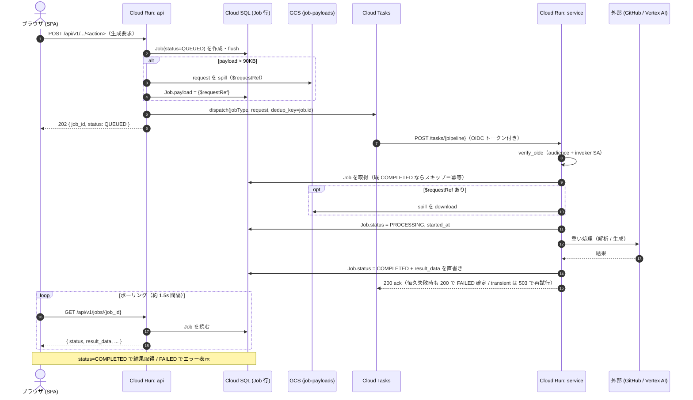
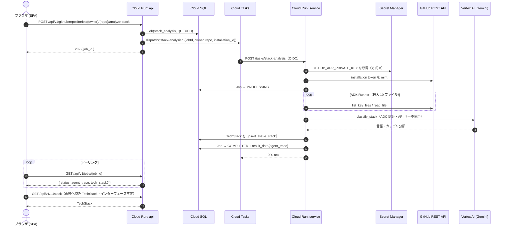
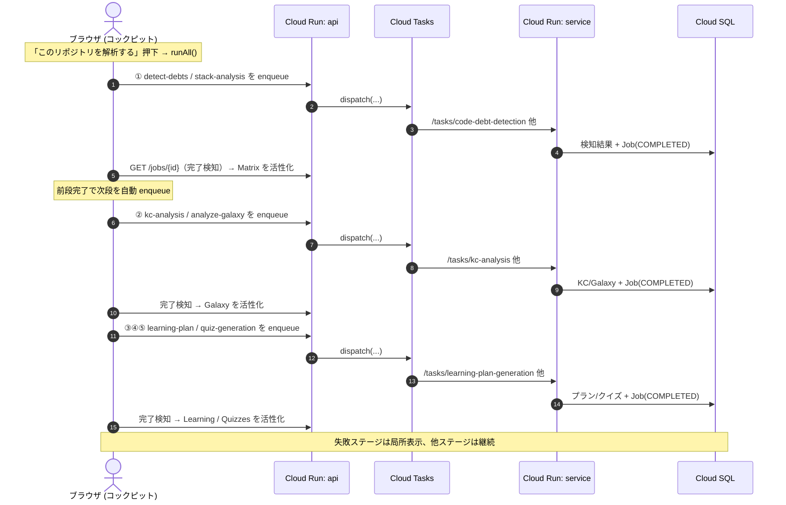
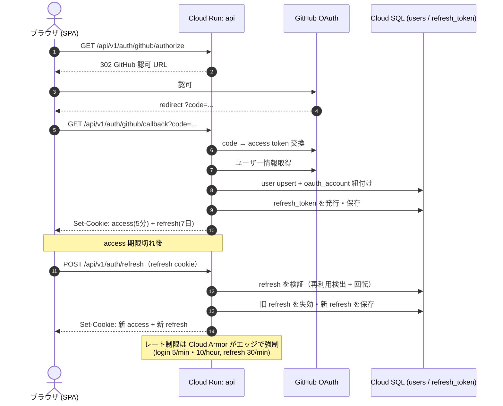
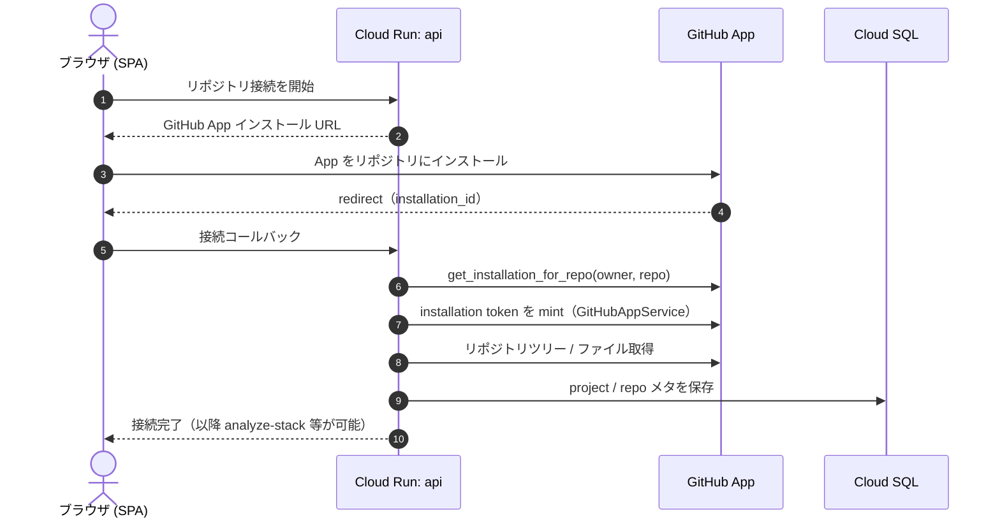
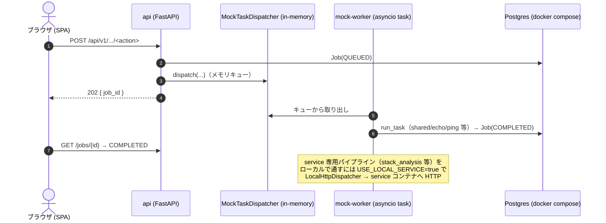
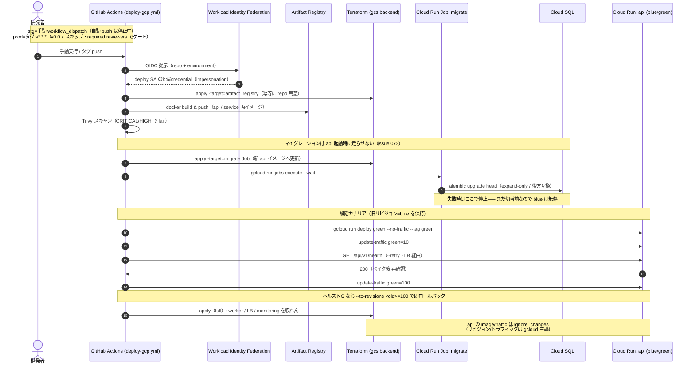

# シーケンス図

DevDebtOps の主要フローを Mermaid シーケンス図で示す。すべて `backend/` / `frontend/` / `infra/` の実コードに基づく。

- [1. 非同期ジョブのライフサイクル（汎用）](#1-非同期ジョブのライフサイクル汎用)
- [2. スタック解析（stack-analysis・具体例）](#2-スタック解析stack-analysis具体例)
- [3. 解析ラン・コックピット（複数パイプライン段階生成／issue-037）](#3-解析ランコックピット複数パイプライン段階生成issue-037)
- [4. 認証（GitHub OAuth ログイン + リフレッシュ回転）](#4-認証github-oauth-ログイン--リフレッシュ回転)
- [5. リポジトリ接続（GitHub App インストール）](#5-リポジトリ接続github-app-インストール)
- [6. ローカル開発のモック経路](#6-ローカル開発のモック経路)
- [7. CI/CD デプロイ（WIF → migrate Job → 段階カナリア）](#7-cicd-デプロイwif--migrate-job--段階カナリア)

---

## 1. 非同期ジョブのライフサイクル（汎用）

`enqueue_job`（`api/app/services/job_orchestrator.py`）→ Cloud Tasks → `service` の `/tasks/{pipeline}` →
`shared.worker.run_task` が Cloud SQL に結果を直書き → フロントが `GET /api/v1/jobs/{id}` をポーリング。

```mermaid
sequenceDiagram
    autonumber
    actor U as ブラウザ (SPA)
    participant API as Cloud Run: api
    participant DB as Cloud SQL (Job 行)
    participant GCS as GCS (job-payloads)
    participant CT as Cloud Tasks
    participant SVC as Cloud Run: service
    participant EXT as 外部 (GitHub / Vertex AI)

    U->>API: POST /api/v1/.../<action>（生成要求）
    API->>DB: Job(status=QUEUED) を作成・flush
    alt payload > 90KB
        API->>GCS: request を spill（$requestRef）
        API->>DB: Job.payload = {$requestRef}
    end
    API->>CT: dispatch(jobType, request, dedup_key=job.id)
    API-->>U: 202 { job_id, status: QUEUED }

    CT->>SVC: POST /tasks/{pipeline}（OIDC トークン付き）
    SVC->>SVC: verify_oidc（audience + invoker SA）
    SVC->>DB: Job を取得（既 COMPLETED ならスキップ＝冪等）
    opt $requestRef あり
        SVC->>GCS: spill を download
    end
    SVC->>DB: Job.status = PROCESSING, started_at
    SVC->>EXT: 重い処理（解析 / 生成）
    EXT-->>SVC: 結果
    SVC->>DB: Job.status = COMPLETED + result_data を直書き
    SVC-->>CT: 200 ack（恒久失敗時も 200 で FAILED 確定 / transient は 503 で再試行）

    loop ポーリング（約 1.5s 間隔）
        U->>API: GET /api/v1/jobs/{job_id}
        API->>DB: Job を読む
        API-->>U: { status, result_data, ... }
    end
    Note over U,DB: status=COMPLETED で結果取得 / FAILED でエラー表示
```

> 失敗・DLQ 代替: Cloud Tasks にネイティブ DLQ は無く、恒久失敗は `Job(FAILED)`、`PROCESSING` のまま放置された
> Job は api の `timeout_stale_jobs`（>1h）が `FAILED` 化する。

---

## 2. スタック解析（stack-analysis・具体例）

`POST .../analyze-stack` → ADK エージェント（`list_key_files`→`read_file`→`classify_stack`→`save_stack`）を service で実行。
**GitHub トークンは方式 B**（service が Secret Manager の App 秘密鍵から installation token を mint）。

```mermaid
sequenceDiagram
    autonumber
    actor U as ブラウザ (SPA)
    participant API as Cloud Run: api
    participant DB as Cloud SQL
    participant CT as Cloud Tasks
    participant SVC as Cloud Run: service
    participant SM as Secret Manager
    participant GH as GitHub REST API
    participant VX as Vertex AI (Gemini)

    U->>API: POST /api/v1/github/repositories/{owner}/{repo}/analyze-stack
    API->>DB: Job(stack_analysis, QUEUED)
    API->>CT: dispatch("stack-analysis", {jobId, owner, repo, installation_id})
    API-->>U: 202 { job_id }

    CT->>SVC: POST /tasks/stack-analysis（OIDC）
    SVC->>SM: GITHUB_APP_PRIVATE_KEY を取得（方式 B）
    SVC->>GH: installation token を mint
    SVC->>DB: Job → PROCESSING
    loop ADK Runner（最大 10 ファイル）
        SVC->>GH: list_key_files / read_file
    end
    SVC->>VX: classify_stack（ADC 認証・API キー不使用）
    VX-->>SVC: 言語・カテゴリ分類
    SVC->>DB: TechStack を upsert（save_stack）
    SVC->>DB: Job → COMPLETED + result_data(agent_trace)
    SVC-->>CT: 200 ack

    loop ポーリング
        U->>API: GET /api/v1/jobs/{job_id}
        API-->>U: { status, agent_trace, tech_stack? }
    end
    U->>API: GET /api/v1/.../stack（永続化済み TechStack・インターフェース不変）
    API-->>U: TechStack
```

---

## 3. 解析ラン・コックピット（複数パイプライン段階生成／issue-037）

プロジェクトトップの「このリポジトリを解析する」から、コアループ（検知→分析→計画→返済→検証）を
**段階生成**として順次起動する（issue-037 の設計）。各ステージは §1 の汎用ジョブとして走る。

```mermaid
sequenceDiagram
    autonumber
    actor U as ブラウザ (コックピット)
    participant API as Cloud Run: api
    participant CT as Cloud Tasks
    participant SVC as Cloud Run: service
    participant DB as Cloud SQL

    Note over U: 「このリポジトリを解析する」押下 → runAll()
    U->>API: ① detect-debts / stack-analysis を enqueue
    API->>CT: dispatch(...)
    CT->>SVC: /tasks/code-debt-detection 他
    SVC->>DB: 検知結果 + Job(COMPLETED)
    U->>API: GET /jobs/{id}（完了検知）→ Matrix を活性化

    Note over U: 前段完了で次段を自動 enqueue
    U->>API: ② kc-analysis / analyze-galaxy を enqueue
    API->>CT: dispatch(...)
    CT->>SVC: /tasks/kc-analysis 他
    SVC->>DB: KC/Galaxy + Job(COMPLETED)
    U->>API: 完了検知 → Galaxy を活性化

    U->>API: ③④⑤ learning-plan / quiz-generation を enqueue
    API->>CT: dispatch(...)
    CT->>SVC: /tasks/learning-plan-generation 他
    SVC->>DB: プラン/クイズ + Job(COMPLETED)
    U->>API: 完了検知 → Learning / Quizzes を活性化
    Note over U,DB: 失敗ステージは局所表示、他ステージは継続
```

---

## 4. 認証（GitHub OAuth ログイン + リフレッシュ回転）

fastapi-users ベース。access(JWT, 5分) と refresh(DB-backed, 7日) を **別 cookie** に分離し、
refresh は **再利用検出付きで回転**。`token_epoch` で即時ログアウト無効化。

```mermaid
sequenceDiagram
    autonumber
    actor U as ブラウザ (SPA)
    participant API as Cloud Run: api
    participant GH as GitHub OAuth
    participant DB as Cloud SQL (users / refresh_token)

    U->>API: GET /api/v1/auth/github/authorize
    API-->>U: 302 GitHub 認可 URL
    U->>GH: 認可
    GH-->>U: redirect ?code=...
    U->>API: GET /api/v1/auth/github/callback?code=...
    API->>GH: code → access token 交換
    API->>GH: ユーザー情報取得
    API->>DB: user upsert + oauth_account 紐付け
    API->>DB: refresh_token を発行・保存
    API-->>U: Set-Cookie: access(5分) + refresh(7日)

    Note over U,API: access 期限切れ後
    U->>API: POST /api/v1/auth/refresh（refresh cookie）
    API->>DB: refresh を検証（再利用検出 + 回転）
    API->>DB: 旧 refresh を失効・新 refresh を保存
    API-->>U: Set-Cookie: 新 access + 新 refresh
    Note over API: レート制限は Cloud Armor がエッジで強制<br/>(login 5/min・10/hour, refresh 30/min)
```

---

## 5. リポジトリ接続（GitHub App インストール）

```mermaid
sequenceDiagram
    autonumber
    actor U as ブラウザ (SPA)
    participant API as Cloud Run: api
    participant GH as GitHub App
    participant DB as Cloud SQL

    U->>API: リポジトリ接続を開始
    API-->>U: GitHub App インストール URL
    U->>GH: App をリポジトリにインストール
    GH-->>U: redirect（installation_id）
    U->>API: 接続コールバック
    API->>GH: get_installation_for_repo(owner, repo)
    API->>GH: installation token を mint（GitHubAppService）
    API->>GH: リポジトリツリー / ファイル取得
    API->>DB: project / repo メタを保存
    API-->>U: 接続完了（以降 analyze-stack 等が可能）
```

---

## 6. ローカル開発のモック経路

本番の Cloud Tasks → service の代わりに、`USE_MOCK_QUEUE=USE_MOCK_WORKER=true`（既定）では
**api プロセス内の mock-worker** が同じ `shared.worker.run_task` を実行する（GCP 不要）。

```mermaid
sequenceDiagram
    autonumber
    actor U as ブラウザ (SPA)
    participant API as api (FastAPI)
    participant MQ as MockTaskDispatcher (in-memory)
    participant MW as mock-worker (asyncio task)
    participant DB as Postgres (docker compose)

    U->>API: POST /api/v1/.../<action>
    API->>DB: Job(QUEUED)
    API->>MQ: dispatch(...)（メモリキュー）
    API-->>U: 202 { job_id }
    MW->>MQ: キューから取り出し
    MW->>DB: run_task（shared/echo/ping 等）→ Job(COMPLETED)
    U->>API: GET /jobs/{id} → COMPLETED
    Note over MW: service 専用パイプライン（stack_analysis 等）を<br/>ローカルで通すには USE_LOCAL_SERVICE=true で<br/>LocalHttpDispatcher → service コンテナへ HTTP
```

---

## 7. CI/CD デプロイ（WIF → migrate Job → 段階カナリア）

`deploy-stg.yml`（`develop`。現在は**手動 `workflow_dispatch`** のみ ── コスト削減のため自動 push デプロイは停止中）と
`deploy-prod.yml`（タグ `v*.*.*`。`v0.0.x` プレリリースはスキップ、GitHub environment の required reviewers でゲート）が、
再利用ワークフロー `deploy-gcp.yml` を呼ぶ。long-lived 鍵は使わず **WIF** で deploy SA を impersonate する。
**マイグレーションは api 起動時に実行しない**（issue 072）。独立した **migrate Cloud Run Job** で expand-only（N-1 後方互換）
マイグレーションを**切替前に**適用し、api は **段階カナリア**（green を 0%→10%→100%・各段でヘルス確認・旧リビジョン保持で即ロールバック）
で切り替える。api service の image/traffic は Terraform の `ignore_changes` とし、リビジョン/トラフィックは gcloud 主導。

```mermaid
sequenceDiagram
    autonumber
    actor Dev as 開発者
    participant GHA as GitHub Actions (deploy-gcp.yml)
    participant WIF as Workload Identity Federation
    participant AR as Artifact Registry
    participant TF as Terraform (gcs backend)
    participant MJ as Cloud Run Job: migrate
    participant DB as Cloud SQL
    participant API as Cloud Run: api (blue/green)

    Note over Dev,GHA: stg=手動 workflow_dispatch（自動 push は停止中）<br/>prod=タグ v*.*.*（v0.0.x スキップ・required reviewers でゲート）
    Dev->>GHA: 手動実行 / タグ push
    GHA->>WIF: OIDC 提示（repo + environment）
    WIF-->>GHA: deploy SA の短命credential（impersonation）

    GHA->>TF: apply -target=artifact_registry（冪等に repo 用意）
    GHA->>AR: docker build & push（api / service 両イメージ）
    GHA->>GHA: Trivy スキャン（CRITICAL/HIGH で fail）

    Note over GHA,DB: マイグレーションは api 起動時に走らせない（issue 072）
    GHA->>TF: apply -target=migrate Job（新 api イメージへ更新）
    GHA->>MJ: gcloud run jobs execute --wait
    MJ->>DB: alembic upgrade head（expand-only / 後方互換）
    Note over MJ,DB: 失敗時はここで停止 ── まだ切替前なので blue は無傷

    Note over GHA,API: 段階カナリア（旧リビジョン=blue を保持）
    GHA->>API: gcloud run deploy green --no-traffic --tag green
    GHA->>API: update-traffic green=10
    GHA->>API: GET /api/v1/health（--retry・LB 経由）
    API-->>GHA: 200（ベイク後 再確認）
    GHA->>API: update-traffic green=100
    Note over GHA,API: ヘルス NG なら --to-revisions <old>=100 で即ロールバック

    GHA->>TF: apply（full）: worker / LB / monitoring を収れん
    Note over TF,API: api の image/traffic は ignore_changes<br/>（リビジョン/トラフィックは gcloud 主導）
```
</content>
