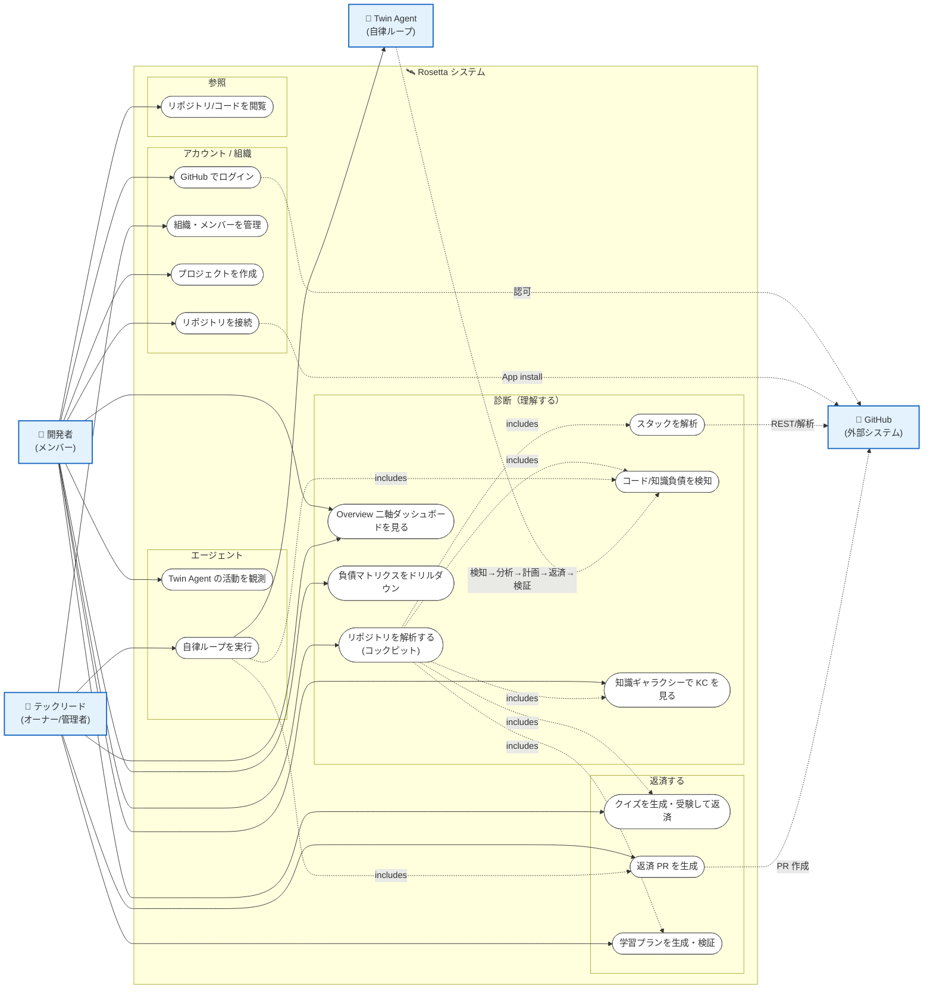

# ユースケース図

Rosetta（Tech Debt Twin Agent）のアクターと主要ユースケースを Mermaid で示す。
Mermaid に UML ユースケース図の専用記法は無いため、**アクター → ユースケース（システム境界）** を
flowchart で表現する。機能は `frontend/` のルートと `backend/api` のルータ、`backend/service` のパイプラインに対応する。

## 全体ユースケース図

## アクターと責務

| アクター | 説明 | 主なユースケース |
|---|---|---|
| 👤 開発者（メンバー） | プロジェクトに参加する一般開発者 | ログイン / プロジェクト作成 / リポジトリ接続 / 解析実行 / 各 Map 閲覧 / クイズ返済 / 活動観測 |
| 🧭 テックリード（オーナー/管理者） | 組織・チームを管理する責任者 | メンバー管理 / 返済 PR 生成 / 学習プラン / 自律ループ実行 / 全体ダッシュボード |
| 🐙 GitHub | OAuth・GitHub App・REST API を提供する外部システム | ログイン認可 / App インストール / リポジトリ読取 / PR 作成 |
| 🤖 Twin Agent | service 上で動く自律ループ（検知→分析→計画→返済→検証） | 各パイプラインを束ねナラティブ化 |

## ユースケース ↔ 実装対応

| ユースケース | フロント（ルート） | バックエンド（api ルータ / service パイプライン） |
|---|---|---|
| GitHub でログイン | `/login` | `auth`（GitHub OAuth + JWT/refresh cookie） |
| 組織・メンバーを管理 | `[org]/settings/members` | `orgs` / `users` |
| プロジェクトを作成 | `[org]/projects/new` | `projects` |
| リポジトリを接続 | `[org]/[project]/repos` | `github`（App installation） |
| リポジトリを解析する（コックピット） | `[org]/[project]`（Overview・issue-037） | 各 enqueue を束ねる |
| スタックを解析 | （Repos / Overview） | `stack` → `stack_analysis` |
| コード/知識負債を検知 | （Matrix） | `debts` / `knowledge_debts` → `code_debt_detection` / `knowledge_debt_detection` |
| Overview 二軸ダッシュボード | `[org]/[project]` | `overview` |
| 負債マトリクスをドリルダウン | `[org]/[project]/matrix/[debtId]` | `debts` |
| 知識ギャラクシーで KC を見る | `[org]/[project]/galaxy` | `galaxy` / `kc` → `kc_analysis` |
| クイズを生成・受験して返済 | `[org]/[project]/quizzes/[sessionId]/result` | `quizzes` → `quiz_generation` / `quiz_grading` |
| 返済 PR を生成 | （Matrix 詳細） | `debts` → `repayment_pr_generation` |
| 学習プランを生成・検証 | `[org]/[project]/learning` | `learning` → `learning_plan_generation` |
| Twin Agent の活動を観測 | `[org]/[project]/agents` | `agents` |
| 自律ループを実行 | `[org]/[project]/agents` | `agent_loop`（`code_debt_loop` / `knowledge_debt_loop`） |
| リポジトリ/コードを閲覧 | `[org]/[project]/repos` | `github` |

> 注: 各 Map の「生成を起動する UI」は issue-037（解析ラン・コックピット）で配線する。
> 現状は enqueue API（`client.ts`）は配線済みだが、UI 起点が未実装のものがある。
</content>
