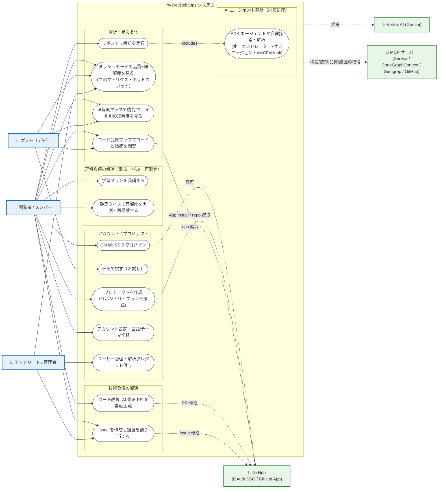

# ユースケース図

DevDebtOps のアクターと主要ユースケースを Mermaid で示す。
Mermaid に UML ユースケース図の専用記法は無いため、**アクター → ユースケース（システム境界）** を
flowchart で表現する。機能は `frontend/` のルートと `backend/api` のルータ、`backend/service` のパイプラインに対応する。

> このドキュメントは実コード（`frontend/src/routes`・`backend/api/app/api/v1`・`backend/service/service/pipelines`）に基づく。

## 全体ユースケース図

```mermaid
flowchart LR
    classDef actor fill:#e3f2fd,stroke:#1565c0,stroke-width:2px;
    classDef uc fill:#fff,stroke:#666,rx:18,ry:18;
    classDef ext fill:#e8f5e9,stroke:#2e7d32,stroke-width:2px;

    dev["👤 開発者 / メンバー"]:::actor
    lead["🧭 テックリード / 管理者"]:::actor
    guest["🧪 ゲスト（デモ）"]:::actor

    gh["🐙 GitHub<br/>(OAuth SSO / GitHub App)"]:::ext
    gem["✨ Vertex AI (Gemini)"]:::ext
    mcp["🔌 MCP サーバー<br/>(Serena / CodeGraphContext / Semgrep / GitHub)"]:::ext

    subgraph SYS["🛰️ DevDebtOps システム"]
        direction TB

        subgraph ACC["アカウント / プロジェクト"]
            a1(["GitHub SSO でログイン"]):::uc
            a2(["デモで試す（お試し）"]):::uc
            a3(["プロジェクトを作成<br/>(リポジトリ・ブランチ接続)"]):::uc
            a4(["アカウント設定・言語/テーマ切替"]):::uc
            a5(["ユーザー管理・解析クレジット付与"]):::uc
        end

        subgraph SEE["解析・見える化"]
            b1(["リポジトリ解析を実行"]):::uc
            b2(["ダッシュボードで品質×理解度を見る<br/>(二軸マトリクス・ホットスポット)"]):::uc
            b3(["理解度マップで機能/ファイル別の理解度を見る"]):::uc
            b4(["コード品質マップでコードと指摘を閲覧"]):::uc
        end

        subgraph KNOW["理解負債の解消（測る→学ぶ→再測定）"]
            c1(["学習プランを受講する"]):::uc
            c2(["確認クイズで理解度を実測・再受験する"]):::uc
        end

        subgraph CODE["技術負債の解消"]
            d1(["コード改善: AI 修正 PR を自動生成"]):::uc
            d2(["Issue を作成し担当を割り当てる"]):::uc
        end

        subgraph AG["AI エージェント基盤（内部処理）"]
            e1(["ADK エージェントが自律探索・解析<br/>(オーケストレーター×サブエージェント×MCP×Hook)"]):::uc
        end
    end

    dev --> a1 & a3 & a4
    dev --> b1 & b2 & b3 & b4
    dev --> c1 & c2 & d1 & d2
    guest --> a2
    guest --> b2 & b3 & b4
    lead --> a5 & b2 & d2

    %% 解析実行はエージェント基盤を起動（include）
    b1 -.includes.-> e1

    %% 外部システム連携
    a1 -.認可.-> gh
    a3 -.App install / repo 読取.-> gh
    b4 -.repo 読取.-> gh
    d1 -.PR 作成.-> gh
    d2 -.Issue 作成.-> gh
    e1 -.推論.-> gem
    e1 -.構造/依存/品質/履歴の取得.-> mcp
```

## アクターと責務

| アクター | 説明 | 主なユースケース |
|---|---|---|
| 👤 開発者 / メンバー | 自分のコード理解と品質を扱う一般ユーザー | ログイン / プロジェクト作成 / 解析実行 / 各画面閲覧 / 学習・クイズ / コード改善 |
| 🧭 テックリード / 管理者 | チームの理解度・品質を俯瞰し運用を管理 | 二軸ダッシュボードで優先度把握 / ユーザー管理 / 解析クレジット付与 / レビュー・学習の割当 |
| 🧪 ゲスト（デモ） | GitHub なしでシード済みデモ org を体験（解析は読み取り専用） | デモログイン / 各画面の閲覧 |
| 🐙 GitHub | OAuth SSO・GitHub App・REST を提供する外部システム | ログイン認可 / App インストール / リポジトリ読取 / PR・Issue 作成 |
| ✨ Vertex AI (Gemini) | エージェントおよび各生成の推論エンジン（外部） | 機能クラスタリング / 学習プラン・クイズ・改善案の生成 / AI 生成痕跡の推定 |
| 🔌 MCP サーバー | Serena / CodeGraphContext / Semgrep / GitHub（外部の解析ツール群） | コード構造・依存グラフ・品質/脆弱性・変更履歴の取得 |

## ユースケース ↔ 実装対応

| ユースケース | フロント（ルート） | バックエンド（api ルータ / service パイプライン） |
|---|---|---|
| GitHub SSO でログイン | `/login`, `/login/callback` | `auth` / `auth_custom`（GitHub OAuth ＋ access/refresh cookie の分離） |
| デモで試す（お試し） | `/login` | `auth_demo`（`POST /api/v1/auth/demo`） |
| プロジェクトを作成（リポジトリ・ブランチ接続） | `/[org]`（新規プロジェクト） | `projects` / `github`（GitHub App installation） |
| アカウント設定・言語/テーマ | `/account` | `users` / `config` |
| ユーザー管理・解析クレジット付与（管理者） | `/admin` | `users` / `orgs` |
| リポジトリ解析を実行 | `/[org]/[project]`（解析コックピット） | `agentic` → `agentic_analysis`（下流の各処理を束ね enqueue） |
| ダッシュボード（品質×理解度の二軸・ホットスポット） | `/[org]/[project]` | `overview`（`debts` / `knowledge_debts` / `kc` を集約） |
| 理解度マップ（機能/ファイル別の理解度） | `/[org]/[project]/galaxy` | `galaxy` / `kc` / `features` → `kc_analysis` / `feature_clustering` |
| コード品質マップ（コード閲覧・指摘の確認） | `/[org]/[project]/repos` | `github` / `debts` → `code_debt_detection`（Semgrep / Trivy / ヒューリスティック） |
| 学習プランを受講する | `/[org]/[project]/learning`（+ `/learning/code/[resourceId]`） | `learning` / `knowledge_units` → `learning_plan_generation` / `code_walkthrough_generation` |
| 確認クイズを実測・再受験する | `/[org]/[project]/quizzes/[sessionId]/result` | `quizzes` → `quiz_generation`（生成）/ `quiz_grading`（ルールベース採点・LLM 不使用） |
| コード改善（AI 修正 PR / Issue 作成） | `/[org]/[project]/matrix`（+ `/matrix/[debtId]`） | `debts` / `knowledge_debts` → `repayment_pr_generation`（GitHub へ PR / Issue） |
| AI 解析エージェント（内部） | —（解析実行時に自動起動） | `agentic_analysis`（ADK：探索→著述の SequentialAgent ＋ 用途特化サブエージェント、MCP、予算/PII マスキング Hook） |

> 補足:
> - 重い処理は `agentic` などが Cloud Tasks 経由で `service`（Worker）へ非同期ディスパッチし、`jobs` でジョブ状態を管理する。
> - 計測の芯（理解度 KC・クイズ採点・負債スコア/深刻度）は決定論的。LLM（Gemini）は解析の探索・所見と、学習/クイズ/改善案の生成に用いる。
