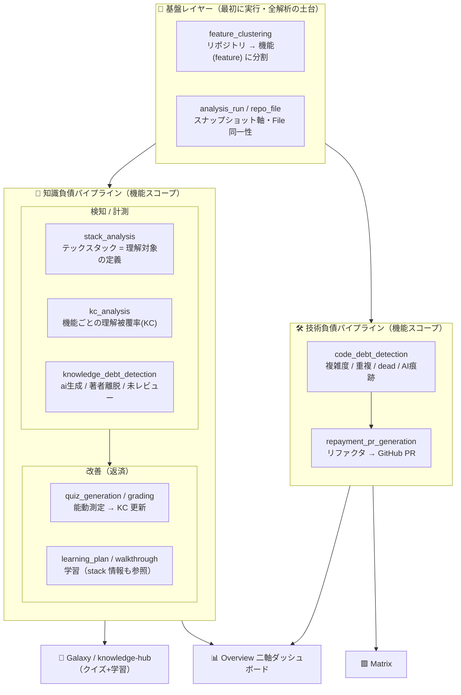
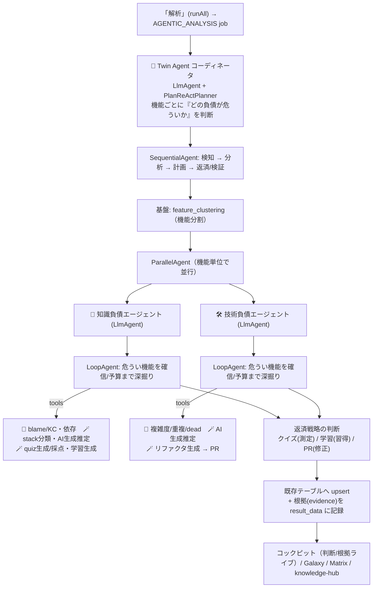
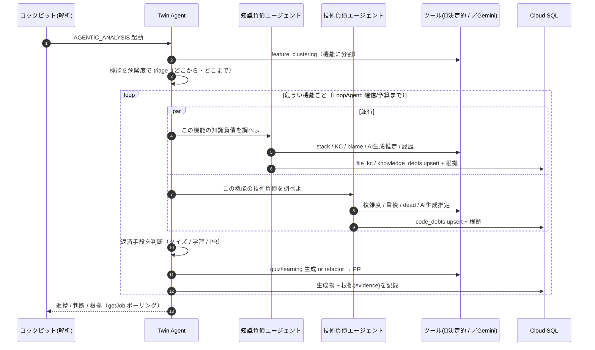
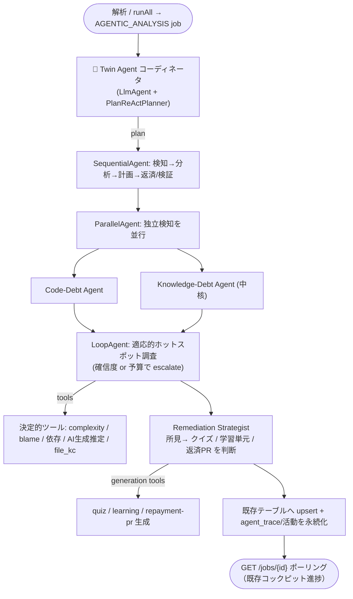

# ADK で解析フローを agentic 化し、Twin Agent をプロダクトの中核に据える

## 概要

現状の「解析」は、フロントの `analysis-run-store.runAll`（issue 037/064）が **決定的な Python パイプラインを順番に
呼ぶだけ**で、AI（Gemini）は各パイプライン内の**限定的な単発呼び出し**でしか使われていない。ADK を使うのは
`stack_analysis` 1 本だけで、その ADK エージェントすら instruction が「1.→2.→3.→4.」の**固定手順スクリプト**である。
つまり本プロダクトは *物語上は* 「Tech Debt **Twin Agent**」だが、*アーキテクチャ上は* 「決定的パイプライン + 散発的 LLM 呼び出し」に
留まっており、**AI エージェントが作品の中核として機能しているとは言い難い**。

本 issue は、ハッカソン審査基準

> **AI エージェントが価値の中心になっているか** — 単なる機能ではなく AI エージェントが作品の中核として機能しているか、
> 自律的な振る舞い（判断・タスク実行）があるか、"AI エージェントである必然性" があるか

に正面から応えるため、**ADK（Agent Development Kit, 推奨技術）で解析フローを agentic に作り替える**。要点は次の 3 つ：

1. **決定的解析は「ツール」に降ろす** — 複雑度/重複/dead/blame/依存抽出/AI 生成推定などの確定的計算は**ADK ツール**として温存し、
   正確性とコストを担保する。
2. **判断・優先順位付け・解釈・返済戦略を「エージェントの自律行動」に引き上げる** — どのファイル/機能を深掘りするか、
   どこまで調べるか、どの返済（クイズ / 学習単元 / 返済 PR）を選ぶか、を **Twin Agent が自律的に決定**する。
3. **自律性を内部記録する** — ADK の events / callbacks（plugin）でエージェントの判断・ツール呼び出し・根拠を
   `agent_trace` / `Job.result_data` に記録し、`GET /api/v1/jobs/{id}` と既存コックピットの進捗で確認できるようにする
   （**専用のナラティブ画面・Agents ビューは作らない**）。

これにより「コードを書かない PM・単独開発でも、理解度を**能動的に実測**して返済する閉ループ」（issue 058/059 のリポジション）が、
**LLM エージェントでなければ成立しない必然性**を持つ形で実装される。

## 背景・目的

### 現状（検証済み・"agentic ではない"）

| 観点 | 実態 | 出典 |
|---|---|---|
| ADK の利用範囲 | **`stack_analysis` の 1 本のみ**。`Agent` + `Runner` + 4 ツール | `service/service/pipelines/stack_analysis.py:18-20,245-336` |
| その ADK の自律性 | instruction が **固定手順**（「1. list_key_files → 2. read_file → 3. classify_stack → 4. save_stack」） | `stack_analysis.py:255-265` |
| 他パイプラインの実体 | **決定的 Python**（`cyclomatic_complexity` / `find_duplicate_ratios` / `find_dead_files` / blame line-share / 依存抽出）＋**範囲限定の単発 Gemini**（`estimate_ai_generation` は既に flag 済みファイルのみ等） | `pipelines/code_debt_detection.py:72-118,221-228`、`services/code_analysis.py`、`pipelines/kc_analysis.py`、`pipelines/knowledge_debt_detection.py` |
| オーケストレーション | **フロントの `analysis-run-store.runAll`** が 5 ステージ（`detect_code`/`detect_knowledge`/`analyze_galaxy`/`cluster_features`/`plan_learning`）を順次 enqueue するだけ。**バックエンドに「判断する主体」が居ない** | issue 064、`frontend/src/lib/stores/analysis-run-store.svelte.ts` |
| Twin Agent ループ | **削除済み**。`JobType.CODE_DEBT_LOOP` / `KNOWLEDGE_DEBT_LOOP` は既存行ロード互換のための死んだ値 | `shared/shared/enums.py:31-33` |
| ADK 依存 | `google-adk` **2.2.0**（`>=0.4.0`）, `google-genai` 1.0.0（Vertex AI + ADC） | `service/pyproject.toml:14-15`、`uv.lock` |

> まとめ: 各「機能」は AI を**部品として**使うが、**作品の中核に自律エージェントが存在しない**。最も agentic だったはずの
> 自律ループ（036）は外され、`stack_analysis` のエージェントも台本どおりに動くだけ。これが審査観点で「不十分」な理由。

### なぜ "AI エージェントである必然性" が今は薄いか

現状の各ステップは、原理的に**純粋関数で書ける**ものが多い（閾値判定・集計・upsert）。LLM 呼び出しも「分類」「推定」という
**固定入出力の一発**で、エージェント（推論 + ツール選択 + 反復 + 判断）である必要がない。したがって審査の
「単なる機能ではないか」「必然性があるか」に弱い。

### 目的

1. **Twin Agent を解析の中核オーケストレータにする。** 「解析」(064 の `runAll`) が起動する実体を、フロント主導の順次 enqueue から
   **バックエンドの ADK エージェント実行**に置き換える（または新パイプラインとして併設）。
2. **自律的判断を具体化・デモ可能にする。** 「どのホットスポットを深掘りするか」「どこまで反復するか」「どの返済手段を選ぶか」を
   エージェントが決め、**自然言語の根拠（evidence）**とともに提示する。
3. **必然性を担保する。** 探索範囲が未知（どのファイル/機能が重要かは事前に不明）、複数シグナルの**横断的リスク判断**、
   適応的な深さ、能動的測定（クイズ）の設計——これらは固定関数では表せず、**推論 + ツール + 反復**を要する。
4. **既存資産を壊さない。** 決定的計算・Cloud Tasks / Job ライフサイクル（016/018）・直書き・冪等 upsert・配信 API・各 Map は維持。
   エージェントは既存サービスを**ツール経由で呼ぶ**だけにし、書き込む先のテーブルも不変にする。

### 前提・連動 issue

- **004 / 018** — ADK スタック解析エージェントと、その非同期ジョブ化（本 issue の ADK パターンの原型）。
- **016 / 042** — Cloud Tasks + `Job` ライフサイクル + `run_task`（`shared.worker.run_task`）。エージェント実行もこの上に載せる。
- **028–035 / 052 / 055 / 063 / 064** — 決定的検知/算出/生成パイプライン群（= 本 issue でツール化する対象）と「解析に生成を集約」方針。
- **036（削除済み）** — Twin Agent 自律ループ + ナラティブ。本 issue は **自律ループの概念のみ ADK ネイティブで実体化**し、
  036 のナラティブ UI は**復活させない**（可観測性は `agent_trace` / `result_data` への記録で足りる）。
- **037** — 解析ラン・コックピット（起動 UI と進捗表示）。本 issue はその「裏側」をエージェントに置換する。
- **058 / 059** — 知識負債ファーストのリポジション。Twin Agent の主眼を「理解ギャップの能動測定と返済」に置く根拠。

## 現状の処理棚卸し（agentic 化の前提整理）

> 「今どんな処理が走っているか」を実コードから棚卸しし、各処理を **🤖 判断（エージェント） / 🔧 決定的（ツール温存） /
> 🪄 単発 LLM（エージェントが呼ぶツール）** に仕分ける。これが agentic 化の対象マップになる。

### A. パイプライン別・現状の処理（実コード）

- **テックスタック解析** `stack_analysis`（ADK・ただし固定手順）
  - 🔧 設定ファイル列挙（`_is_key_file` ヒューリスティック）/ 取得 / `tech_stacks` upsert
  - 🪄 `analyze_tech_stack`（Gemini 分類）
- **コード品質分析 / コード負債検知** `code_debt_detection`
  - 🔧 `cyclomatic_complexity` / `find_duplicate_ratios` / `find_dead_files` と閾値判定（`*_is_debt`）/ `quantize_severity` / `code_debts` upsert
  - 🔧 対象ファイルは **先頭 N 件固定**（`_MAX_FILES`）
  - 🪄 `estimate_ai_generation`（Gemini・flag 済みファイルのみ）
- **KC（理解被覆率）算出** `kc_analysis`
  - 🔧 blame ライン占有 → KC(file,dev)（authorship は **0.6 上限**）/ 集計 / `extract_dependencies`（依存グラフ）/ `file_kc`・`dependencies` upsert
- **知識負債検知** `knowledge_debt_detection`
  - 🔧 `is_ai_generated` / `is_author_left` / `is_no_review` / `reason_score`（閾値）/ commit→PR→review 履歴 / `knowledge_debts`・`assigned_developers` upsert
  - 🪄 `estimate_ai_generation`（Gemini）
- **機能クラスタリング** `feature_clustering`
  - 🔧 source 抽出（上限 200）/ 依存グラフ / `features`・`feature_files` upsert
  - 🪄 `cluster_features`（Gemini）
- **クイズ作成** `quiz_generation`
  - 🔧 対象ファイル/機能の取得 / `quiz_sessions` 充填
  - 🪄 `generate_quiz`（Gemini・L1–L5 + 解答鍵）
- **クイズ採点** `quiz_grading`
  - 🔧 選択肢一致のオフライン採点（`_grade_offline`）/ `quiz_results` / **`file_kc` へ `certified_via="quiz"` 反映（uncapped）**
  - 🪄 `grade_quiz`（Gemini・意味採点 / understood・gap 抽出）
- **学習プラン作成** `learning_plan_generation`
  - 🔧 機能代表ファイル取得 / `learning_resources`・`learning_steps` / 分集計
  - 🪄 `generate_code_learning_steps` / `generate_external_resources` / `generate_code_walkthrough`（Gemini）
- **コード解説生成** `code_walkthrough_generation`
  - 🪄 `generate_code_walkthrough`（Gemini・行範囲 + 解説）
- **返済 PR 生成** `repayment_pr_generation`
  - 🔧/IO GitHub write（branch→commit→PR）/ `code_debts.related_pr`・`status=in_pr` / 簡易検証 `_is_plausible_refactor`
  - 🪄 `generate_refactor`（Gemini）
- **ナラティブ** `generate_agent_narrative`（Gemini 単発・現状は表層演出のみ）
- **オーケストレーション**（現状）: フロント `analysis-run-store.runAll` が `detect_code → detect_knowledge → analyze_galaxy → cluster_features → plan_learning`（+ baseline quizzes）を**順次 enqueue するだけ**。**判断する主体はバックエンドに居ない**。

### B. 3 分類（agentic 化の仕分け）

- 🤖 **エージェントに任せる（自律判断・新設）** ← *本 issue の主対象*
  - **解析全体のオーケストレーション**（今はフロントの固定順次 → Twin Agent の計画に）
  - **ホットスポットの選定**（先頭 N 固定 → 「どのファイル/機能を読むか」を動的判断）
  - **横断的リスク判断**（complexity × churn × 著者離脱 × AI生成 × レビュー欠如 を突き合わせ「最も危険な理解ギャップ」を特定）
  - **適応的な深掘り**（確信 or 予算まで反復＝`LoopAgent`）
  - **返済手段の選択**（所見ごとに クイズ / 学習単元 / 返済 PR を選ぶ）
  - **クイズの設計判断**（理解を測るために「何を・どの難度で」問うか）
  - **根拠（evidence）の生成**（`result_data` に記録。専用ナラティブ UI は作らない）
- 🔧 **決定的ツール（温存・FunctionTool 化）** ← *ロジック不変*
  - `code_analysis`（複雑度/重複/dead/閾値/severity/priority）・`authorship`（blame 占有）・`knowledge_analysis`（理由閾値）・`dependency_extraction`（import グラフ）・`github_git_client`（取得/write）・各 upsert
- 🪄 **単発 LLM ツール（エージェントが必要時に呼ぶ）** ← *既存 Gemini 関数をツール化*
  - `analyze_tech_stack` / `estimate_ai_generation` / `cluster_features` / `generate_quiz` / `grade_quiz` / `generate_code_learning_steps` / `generate_external_resources` / `generate_code_walkthrough` / `generate_refactor` / `generate_agent_narrative`

> 要するに **「測る・数える・書き込む」は 🔧/🪄 のツールに残し、「どこを・どこまで・どう返済するか／なぜ」を 🤖 エージェントの判断に引き上げる**。
> これにより既存の正確性・コストを保ったまま、中核が自律エージェントになる。

## 機能ドメイン構造の再定義（本見直しの決定）

> 全機能を **知識負債（検知＋改善＝クイズ/学習）／技術負債（検知＋改善＝PR）／それ以外** の 3 構造で整理し直し、
> 2 つの決定を反映する:
> 1. **`feature_clustering` を全解析の基盤**にし、両負債を **機能ベース**で組み立てる。
> 2. **`stack_analysis` を知識負債パイプラインに所属**させる（学習プラン・クイズ生成が参照する "理解すべき対象" の基盤のため）。

### 基盤レイヤー — 機能クラスタリング（全解析の土台）
- `feature_clustering`（052）を **最初に実行する基盤ステージ**にする。以降の検知・計測・改善・表示は **機能（feature）を一次粒度**にし、ファイルは機能内の詳細として扱う。
- 含意: `code_debts` / `knowledge_debts` / `file_kc` を **機能粒度でロールアップ**（052/055/060 と整合）。Overview / Matrix / Galaxy は機能ビューが主、ファイルはドリルダウン。
- agentic 化との接続: Twin Agent は **「どの機能が最も危ういか」を triage** し、**機能単位**で深掘り（`LoopAgent`）→ 機能単位で返済手段を選ぶ。判断単位が「生ファイル top-N」から「機能」に変わる。

### A. 知識負債パイプライン（検知 → 改善：クイズ・学習）
- **検知 / 計測（機能スコープ）**
  - `stack_analysis`（018・**ここへ統合**）— 検出したテックスタックは「**何を理解すべきか**」を定義し、**学習プラン（スタック面）とクイズ題材**の参照基盤になる
  - `kc_analysis`（029）— 機能ごとの理解被覆率（KC）
  - `knowledge_debt_detection`（030）— 機能ごとの理由付き指摘（ai_generated / author_left / no_review）
- **改善**
  - `quiz_generation` / `quiz_grading`（034/053）— 能動測定で返済 → KC を uncapped 更新
  - `learning_plan_generation` / `code_walkthrough_generation`（035/068）— 習得（stack 情報も参照）
- 表示: **Galaxy** / **Quizzes** / **Learning**

### B. 技術負債パイプライン（検知 → 改善：PR）
- **検知（機能スコープ）**: `code_debt_detection`（028）— 複雑度 / 重複 / dead / AI生成痕跡
- **改善**: `repayment_pr_generation`（033）— Gemini リファクタ案 → GitHub 返済 PR
- 表示: **Matrix**

### C. それ以外（横断ビュー・プロダクト基盤）
- **横断ビュー**: Overview（機能ベース二軸＝コード負債 × 知識被覆）/ Matrix（両負債レジストリ）　※Agents ルートは撤去済み・新規ナラティブ画面も作らない
- **基盤**: 認証 `auth` / `orgs` / `projects` / `members` / `settings` / `github`（接続）/ Repos（閲覧）/ `analysis_run`・`repo_file`（スナップショット軸）

### 再構成後の全体像

```
[基盤] feature_clustering（機能分割）→ 以降すべて機能単位
   │
   ├─ A. 知識負債  検知/計測: stack_analysis ＋ kc_analysis ＋ knowledge_debt_detection
   │               改善:     quiz(生成/採点) ＋ learning(プラン/解説)        → Galaxy / Quizzes / Learning
   │
   ├─ B. 技術負債  検知: code_debt_detection
   │               改善: repayment_pr_generation                            → Matrix
   │
   └─ C. それ以外  横断: Overview(二軸) / Matrix / Agents
                   基盤: auth・org・project・member・github・repos・analysis_run
```

> agentic 化への含意: 専門サブエージェントは **知識負債エージェント**（stack/KC/知識負債 + クイズ/学習で返済）と
> **技術負債エージェント**（コード負債 + PR で返済）の 2 系統に整理され、両者を **機能単位**で回す。
> Twin Agent コーディネータは「機能ごとにどちらの負債がどれだけ危ういか」を判断して調査順と返済戦略を決める。

## 新パイプライン構成（Mermaid）

> 上記の決定（機能ベース基盤化 / `stack_analysis` を知識負債へ / agentic 化）を反映した新パイプラインの全体像。

### 図 1 — 機能ベース 2 系統のドメイン構造



### 図 2 — ADK エージェント・オーケストレーション



### 図 3 — 機能単位の自律実行シーケンス



## 設計

### 設計原則 — 「決定的＝ツール / 判断＝エージェント」

```
┌─ Twin Agent（ADK・自律オーケストレータ）──────────────────────────────┐
│  判断する: どのホットスポットを・どの順で・どこまで深掘りするか / どの返済手段か   │
│  説明する: 一人称の根拠 (evidence) と考古学的なナラティブ                      │
│                                                                       │
│   ├─ tools（決定的・確定計算 = 既存サービスのラッパ。正確性とコストを担保）        │
│   │    complexity / duplication / dead / blame line-share / 依存抽出 /        │
│   │    commit→PR→review 履歴 / AI生成推定 / file_kc 参照 / 機能クラスタ        │
│   └─ tools（生成・副作用 = 既存パイプライン関数）                              │
│        upsert code_debts / knowledge_debts / file_kc / 学習プラン / クイズ / PR │
└───────────────────────────────────────────────────────────────────────┘
```

- **温存（ツール化）:** `services/code_analysis.py`・`services/authorship.py`・`services/dependency_extraction.py`・
  `services/knowledge_analysis.py`・`services/github_git_client.py`・`gemini_stack_service.estimate_ai_generation` 等の
  確定的計算は **ADK FunctionTool** として登録する（ロジックは変えない）。
- **エージェント化（自律）:** 「どのファイル/機能を読むか」「閾値で機械的に拾うのでなく、複数シグナルを突き合わせて
  *リスク判断* する」「不確実な箇所をもう一段深掘りするか打ち切るか」「検知結果に対し返済手段を選ぶ」を **LLM の判断**にする。

### ADK 構成（インストール済み google-adk 2.2.0 の実 API に準拠）

> 本リポジトリの `google-adk` **2.2.0**（`backend/service/.venv` で確認）に実在する API に準拠する：
> `google.adk.agents`（`LlmAgent`/`SequentialAgent`/`ParallelAgent`/`LoopAgent`）、`google.adk.tools`
> （`FunctionTool`/`AgentTool`/`LongRunningFunctionTool`/`exit_loop`/`ToolContext`）、
> `google.adk.planners`（`PlanReActPlanner`/`BuiltInPlanner`）、`google.adk.plugins`（`BasePlugin` ほか）、
> `google.adk.runners`（`Runner`）、`google.adk.models.google_llm`（Vertex AI Gemini）。

- **Twin Agent コーディネータ（`LlmAgent` + `PlanReActPlanner`）**
  - 機能を危険度で triage し、**調査順序と返済戦略を判断**（plan→act→reflect）。
  - 専門エージェントを **`AgentTool`** で「ツールとして」保持する（例: `AgentTool(agent=knowledge_agent)`）。
    生成物の二重要約を避けたい所は `skip_summarization=True`。委譲が主目的なら `sub_agents`（transfer）でもよいが、
    **本設計は `AgentTool` を主**にする（コーディネータが「いつ・どの専門家を・何回」呼ぶかを制御しやすいため）。
- **専門サブエージェント（2 系統・各 `LlmAgent`）** — `output_key` で所見を `session.state` に書き、`{key}` テンプレートで後段が読む：
  - **知識負債エージェント**（中核 / 058）: 検知 tools = stack分類 / KC(blame) / 著者離脱・未レビュー / AI生成推定 / `file_kc`参照、
    返済 tools = クイズ生成・採点 / 学習生成。
  - **技術負債エージェント**: 検知 tools = 複雑度 / 重複 / dead / churn / AI生成推定、返済 tool = リファクタ生成 → PR。
- **ワークフローエージェント（決定的な骨格）**:
  - `SequentialAgent`: **基盤(feature_clustering) → 検知 → 分析 → 計画 → 返済/検証** のバックボーン。
  - `ParallelAgent`: 知識負債 ‖ 技術負債を並行ファンアウト。
  - **`LoopAgent`（`max_iterations` + `exit_loop`）**: **機能ごとの適応深掘り** —「最も危うく未説明の機能を、確信 or 予算上限まで」
    調べ、十分と判断したら子エージェントが組込 **`exit_loop` ツール**（内部的に `EventActions(escalate=True)`）でループを抜ける。
    `LoopAgent` は「子の escalate or `max_iterations` 到達」で停止する（2.2.0 実装で確認）。**ここが自律性の核**。
- **ツール（`FunctionTool`）**: 決定的計算も単発 Gemini も Python 関数として登録（docstring + 型ヒントからスキーマ自動生成）。
  `ToolContext` から `state` / `analysis_run` / `job_id` を授受。長時間処理は `LongRunningFunctionTool`。
- **モデル / 認証**: `google_llm`（Gemini）を Vertex AI + ADC で（`model="projects/.../gemini-..."`）。`stack_analysis` と同じ方式。

### Hook（callbacks / plugins）の活用 ← *本見直しで強化*

ADK 2.2.0 は **2 層の hook** を持つ。両方を積極的に使い、自律性の制御・可観測性・コストガードを実装する。

**(1) エージェント単位 callback**（`LlmAgent` の引数。**リスト指定**で順に呼ばれ、**非 None を返すと短絡**＝以降をスキップ/結果を差し替え）:

| callback | 用途（本設計） |
|---|---|
| `before_model_callback` / `after_model_callback` | **トークン予算ガード**（超過時に値を返して LLM 呼び出しを止める）/ プロンプト整形 / 出力検証 |
| `before_tool_callback` / `after_tool_callback` | **ツール呼び出し回数・読込ファイル数の上限**、引数検証、結果の `agent_trace` 整形 |
| `on_model_error_callback` | モデルエラー時のフォールバック（部分結果で継続） |
| `before_agent_callback` / `after_agent_callback` | 機能スコープの state セット / 所見の集約 |

**(2) Runner 全体 Plugin**（`google.adk.plugins.BasePlugin` を Runner に登録＝**全エージェント横断**）:

| plugin hook | 用途（本設計） |
|---|---|
| `before_run_callback` / `after_run_callback` | run 全体の予算初期化 / 最終ナラティブ確定・`Job.result_data` 反映 |
| `on_event_callback` | **全 event を `agent_trace` / `Job.result_data` に記録**（可観測性の中心。`getJob` で参照。専用 UI は作らない） |
| `before_tool_callback` / `on_tool_error_callback` | 横断ガードレール・失敗集計 |
| 組込 plugin の流用 | `logging_plugin`（構造化ログ）/ `reflect_retry_tool_plugin`（ツール失敗時の自動リトライ）を活用 |

> **使い分け**: 個別エージェントの判断制御は **agent callback**、run 横断の予算・可観測性・リトライは **plugin** に置く。
> 予算超過時は `before_model` / `before_tool` callback が**実行を止める値を返して短絡**し、`LoopAgent` を `exit_loop` で打ち切る。
> これにより「自律的に動くが、回数・トークン・時間の上限はフレームワーク側で機械的に保証される」状態を作る。

### 既存インフラとの統合（壊さない）

- 実行は引き続き **service の非同期パイプライン**（`run_task` + `Job` ライフサイクル + Cloud Tasks、016/018/042）として動く。
  新 `JobType.AGENTIC_ANALYSIS`（仮）を 1 本足し、その `process` が Twin Agent を起動する。配信 API・各 Map は不変。
- エージェントは **既存テーブル**（`code_debts` / `knowledge_debts` / `file_kc` / `learning_plans` / `quiz_*` / `tech_stacks` /
  `analysis_run`）にツール経由で書くため、`overview` / `debts` / `galaxy` / `quizzes` / `learning` 等の読み取り API は変更不要。
- **冪等性**は `run_task`（既 `COMPLETED` は no-op）＋各 upsert キーを継続利用。エージェントのツール副作用も同じ upsert を呼ぶ。
- **コスト/暴走の制御**: ADK callbacks（before_model / before_tool）で **ツール呼び出し回数・読込ファイル数・トークン**の上限を強制。
  決定的ツールに重い計算を寄せ、LLM には「判断と要約」だけさせる。
- **可観測性（UI 新設なし）**: `Runner.run_async` の events（function_call / function_response / final）を plugin で
  `agent_trace` / `Job.result_data` に記録し、`GET /api/v1/jobs/{id}` のポーリングと既存コックピットの進捗表示で確認する
  （**専用ナラティブ画面・Agents ビューは作らない**）。

### "AI エージェントである必然性"（審査対応・明文化）

| 必然性の根拠 | なぜ固定関数では不可能か |
|---|---|
| **未知の探索空間** | どのファイル/機能が重要かは事前に不明。固定 top-N でなく、読みながら次に何を見るか決める動的探索が要る |
| **横断的リスク判断** | 複雑度 × churn × 著者離脱 × AI生成 × レビュー欠如 を**突き合わせて**「この理解ギャップが最も危険」と判断＋根拠提示 |
| **適応的な深さ** | 確信が持てるまで深掘り / 十分なら打ち切る（`LoopAgent` の escalate）。固定反復回数では表せない |
| **返済手段の選択** | 所見ごとに「測定（クイズ）/ 学習（単元）/ 修正（PR）」を選ぶ判断。各々生成物も異なる |
| **能動測定の設計** | blame に依存せず、理解度を測るクイズを**何について出すか**を判断（058 の差別化の核） |
| **自然言語の根拠/物語** | 考古学的根拠の一人称ナラティブは本質的に LLM 出力 |

## タスク（フェーズ分割）

### Phase 0 — ADK 基盤の共通化（`backend/service/service/agents/`）
- [ ] `stack_analysis.py` の ADK 利用（`Agent` / `Runner` / event→trace）を **再利用可能な基盤**へ抽出する：
      `google_llm` モデル解決（Vertex/ADC）、`SessionService`、**event→`agent_trace` アダプタ**。
- [ ] 既存決定的サービスと単発 Gemini を **`FunctionTool` 化**するラッパを作る（ロジック不変・`ToolContext` で run state / `analysis_run` / `job_id` を授受）：
      `code_analysis`・`authorship`・`dependency_extraction`・`knowledge_analysis`・`github_git_client`・`gemini_stack_service.*`。
- [ ] **Hook 基盤を用意する（本見直しの肝）**:
      - agent callback: `before_model` / `before_tool` で **予算ガード**（トークン・ツール回数・読込ファイル数の上限。超過時は値を返して短絡）。
      - Runner plugin（`BasePlugin`）: `on_event_callback` で **全 event を永続化**、`before_run` / `after_run` で予算初期化・最終確定。
        組込 `logging_plugin` / `reflect_retry_tool_plugin` を登録。
- [ ] 基盤のユニットテスト（ツール呼び出し / 予算 callback の短絡発火 / plugin の event 永続化 / trace 整形）。

### Phase 1 — 検知を「エージェント主導」に（自律的ホットスポット選定 + 根拠）
- [ ] **知識負債エージェント / 技術負債エージェント** を各 `LlmAgent` で実装し、**読む対象（機能/ファイル）と深掘り先を自律選定**させる
      （固定 top-N を廃す）。所見は既存テーブルへ**同じ upsert ツール**で書く。`output_key` で所見を `state` に出す。
- [ ] **機能単位の適応深掘りを `LoopAgent`** で実装（`max_iterations` 上限 + 十分なら `exit_loop` で打ち切り）。
- [ ] 各所見に **evidence（自然言語の根拠）** を付与し `result_data` / 該当行に保存（フロントは既存契約のまま表示）。
- [ ] 既存の決定的パイプライン（`code_debt_detection` 等）は **ツールの内部実装として残置**（互換・フォールバック）。

### Phase 2 — Twin Agent コーディネータ（中核）
- [ ] `SequentialAgent`（基盤→検知→分析→計画→返済/検証）+ `ParallelAgent`（知識 ‖ 技術）+ `LoopAgent`（機能ごと適応調査）で骨格を構成。
- [ ] コーディネータ `LlmAgent` に **`PlanReActPlanner`** を付け、専門エージェントを **`AgentTool`** で束ねて
      **調査順序と返済戦略を判断**（`skip_summarization` の要否を検討。委譲が要る局面のみ `sub_agents`）。
- [ ] 新 `JobType.AGENTIC_ANALYSIS`（仮）を `registry.py` に登録し、`process` が Twin Agent を起動。`enqueue_job` / `run_task` 経由で実行。

### Phase 3 — 可観測性（記録のみ・UI 新設なし）
- [ ] Phase 0 の **plugin `on_event_callback`** で、判断・ツール呼び出し・反復・根拠を **`agent_trace` / `Job.result_data`** に記録する。
- [ ] コックピット（037/064）の「解析」を **Twin Agent 起動**に接続（既存のステージ進捗表示はそのまま＝エージェントの局面に対応）。
- [ ] **専用ナラティブ画面・Agents 活動ビューは作らない**（自律性の確認は `getJob` の `result_data` と既存コックピット進捗で足りる）。

### Phase 4 — 返済戦略（生成の統合・064 と接続）
- [ ] **返済手段の判断**（コーディネータ or 専用 sub-agent）が所見ごとに **クイズ / 学習単元 / 返済 PR** を選び、対応する生成ツール
      （`quiz_generation` / `learning_plan_generation` / `baseline-quizzes` / `repayment_pr_generation`）を呼ぶ。064 の「解析で全生成」を**判断駆動**にする。

### Phase 5 — 評価・ガードレール・ドキュメント
- [ ] **ADK 評価**（`google.adk.evaluation` の eval set）で「危険機能/ファイルの特定再現率」「無関係ファイルを深掘りしない」等を回帰テスト化。
- [ ] ガードレールの検証（agent callback の予算短絡 / plugin の `reflect_retry_tool` / `LoopAgent` の `max_iterations` / Cloud Tasks の `timeout`・`max_attempts` / `timeout_stale_jobs`）。
- [ ] **ADR** を `docs/adr/` に追加：「決定的＝ツール / 判断＝エージェント」の境界、hook（callback/plugin）の責務分担、自律性の範囲と安全策、モデル/リージョン方針。
- [ ] `CHANGELOG.md`（日本語）に `Added`（Twin Agent 中核化）/`Changed`（解析の agentic 化）。

## 完了条件

- 「解析」押下で起動する実体が、フロント順次 enqueue ではなく **バックエンドの ADK Twin Agent 実行**になっている
  （`JobType.AGENTIC_ANALYSIS` を `run_task`/Cloud Tasks 上で実行）。
- Twin Agent が **どのファイル/機能を深掘りするかを自律選定**し（固定 top-N でない）、**複数シグナルを突き合わせたリスク判断**と
  **自然言語の根拠**を出力する。`LoopAgent` による適応的深掘り（確信度 or 予算で打ち切り）が動く。
- 所見に応じて **返済手段（クイズ / 学習単元 / 返済 PR）を判断**して生成する。
- エージェントの判断・ツール呼び出し・反復が、**plugin の `on_event_callback` 経由で `agent_trace` / `Job.result_data` に記録**され、
  `getJob` で参照できる（**専用ナラティブ UI は作らない**）。予算 callback・`LoopAgent.max_iterations` の上限が機械的に効いている。
- 既存テーブル/配信 API/各 Map は不変で、Overview・Matrix・Galaxy・Quizzes・Learning が従来どおり表示される。
- 決定的計算（複雑度/重複/blame 等）は **ツールとして温存**され、結果の正確性が変わらない。冪等性・コスト上限が検証されている。
- バックエンド: `cd backend && uv run pytest`（api/service/shared）・`ruff`・`ty` が通る。フロント: `bun run check`/`lint`/`test:unit`。

## 技術詳細

### Twin Agent の自律解析フロー（イメージ）



### ADK 構成要素の対応（実装時に 2.2.0 ドキュメントで要確認）

| 役割 | ADK 構成（想定） | 既存資産との接続 |
|---|---|---|
| 中核オーケストレータ | `LlmAgent` + `PlanReActPlanner` + `AgentTool`/`sub_agents` | 新 `process` が `Runner.run_async` で起動 |
| 決定性のある骨格 | `SequentialAgent` / `ParallelAgent` / `LoopAgent`(`max_iterations`,`escalate`) | 検知→分析→計画→返済/検証 |
| 専門家 | `LlmAgent`（Code/Knowledge/KC/Remediation） | 各々が既存サービスをツール呼び |
| 確定計算 | `FunctionTool`（`ToolContext`） | `code_analysis`/`authorship`/`dependency_extraction`/`knowledge_analysis`/`github_git_client` |
| 状態受け渡し | `output_key` + instruction `{key}` テンプレート / state | `analysis_run` / `job_id` に紐付け |
| 可観測性 | events + before/after callbacks | `agent_trace` + 活動行へ永続化 |
| 実行基盤 | `Runner` + `SessionService`（Vertex/ADC） | `run_task` / `Job` / Cloud Tasks（016/018/042） |

### リスクと緩和

| リスク | 緩和策 |
|---|---|
| コスト/レイテンシ増 | 予算 callback（ツール回数/ファイル数/トークン上限）、重い計算は決定的ツールへ、結果キャッシュ、`LoopAgent` の早期 escalate |
| 非決定性（再現性） | 確定計算はツールに固定、書き込みは冪等 upsert、ADK eval set で回帰、`temperature` 低め |
| 暴走/無限ループ | `LoopAgent.max_iterations`、Cloud Tasks の `timeout`/`max_attempts`、`timeout_stale_jobs`（>1h を FAILED） |
| 秘密の扱い | GitHub トークンは方式 B（service が Secret Manager から mint）を継続。ツールにのみ渡す |

## 対象外・保留
- SSE / WebSocket のライブ更新（ポーリング継続）。リアルタイム配信は別 issue。
- 定期スキャン（Cloud Scheduler 起動の自律再解析）はインフラ未整備（pubsub/functions/scheduler は未有効化）。将来 issue。
- 既存の決定的パイプラインの**削除**はしない（ツールの内部実装として残置・フォールバック）。
- マルチプロバイダ化（Gemini 以外）は対象外。Vertex AI + ADK + ADC を前提。

## 参考
- 関連 issue: `004`(ADK 初版) / `018`(非同期 ADK) / `016`,`042`(Job 基盤) / `028`–`035`,`052`,`055`,`063`,`064`(決定的検知/生成) /
  `036`(削除済み Twin ループ・概念のみ実体化／UI は復活しない) / `037`(コックピット) / `058`,`059`(知識負債ファースト)
- 実装（ツール化・改修対象）:
  - `backend/service/service/pipelines/stack_analysis.py`（ADK パターン原型）
  - `backend/service/service/pipelines/{code_debt_detection,kc_analysis,knowledge_debt_detection,feature_clustering,quiz_generation,quiz_grading,learning_plan_generation,repayment_pr_generation}.py`
  - `backend/service/service/services/{code_analysis,authorship,dependency_extraction,knowledge_analysis,github_git_client,gemini_stack_service}.py`
  - `backend/service/service/registry.py`・`backend/shared/shared/enums.py`（`JobType` 追加）
  - `backend/shared/shared/worker.py`（`run_task` 上で実行・不変）
  - `frontend/src/lib/stores/analysis-run-store.svelte.ts`・コックピット（037/064、解析→Twin Agent 接続。新規 UI なし）
- ADK: `google-adk` 2.2.0（`service/pyproject.toml`）。**公式ドキュメント / context7 で `SequentialAgent`/`ParallelAgent`/`LoopAgent`/
  `AgentTool`/`PlanReActPlanner`/`output_key`/callbacks の正確な API を確認のこと**。
- 規約: `CLAUDE.md`（Vertex AI + ADC・Secret Manager 必須・Python snake_case・最新ドキュメント参照・警告無視しない）
</content>
