# ProtoPedia 提出ドラフト

---

## 作品ステータス 〔必須〕

完成

---

## 作品タイトル 〔必須〕

DevDebtOps — 技術負債・理解負債の解消を DevOps に組み込む AI エージェント

---

## 概要 〔必須〕

DevDebtOps は、技術負債と理解負債を見える化し、その解消を開発・運用サイクルに組み込む AI エージェント基盤です。ADK エージェントが解析し、学習・クイズ・修正 PR を提案します。

---

## 画像 〔任意〕

LPから抜粋してアップロード済み

---

## 動画 〔必須〕

`https://youtu.be/j3r0Ybvz9Js`

### 読み上げ原稿

DevDebtOps は「コードは動くが、複雑で変更しづらい」という技術負債と「コードは動くが、中身を誰も理解していない」という理解負債を見える化し、解消まで支援する AI エージェント・プラットフォームです。

---

いま、AI コーディングツールの普及で開発のスピードはかつてなく加速しています。
その裏で、「AI が書いたコードを理解できていない」という理解負債が静かに積み上がり、放置すれば属人化やオンボーディングの遅延、レビューの形骸化を招きます。

---

そこで DevDebtOps は、AI エージェントが MCP や Hook、サブエージェントを活用してリポジトリを解析し、理解度や品質の低いコードを検出、学習プラン・確認クイズ・修正 PR を提案することで、開発・運用のサイクルに、技術負債・理解負債の継続的な解消を取り込むことを目指します。

---

DevDebtOps は、AI エージェントによる高度なリポジトリ解析、理解負債の可視化とクイズと学習による改善、低品質コードへの推奨提案と自動修正の 3 つのコア機能から構成されます。

---

まず、DevDebtOps のはじめ方を説明します。

ユーザーは自身の GitHub アカウントでログインします。
GitHub アカウントをお持ちでない方は、「お試しはこちら」からデモ版を体験できます。
ログイン後、接続するリポジトリとブランチを選択し、新規プロジェクトを作成します。

プロジェクトを作成したら、まずは右上の解析ボタンからリポジトリの解析を実行しましょう。
エージェントがリポジトリを自律的に探索し、技術負債の検知、理解負債の整理、クイズと学習の生成を行います。
解析が完了すると、結果がアプリに反映されます。

次に、DevDebtOps を構成する 5 つの画面について、順番に紹介します。

---

ダッシュボードでは、リポジトリの理解度とコード品質を確認できます。
上部のマトリクスは、ファイルを「理解度 かける コード品質」の二軸で整理しており、どちらも低い左下の領域が、優先して改善すべきファイルを示しています。
中央の指標は、理解度・低品質ファイルの件数・修正済みの件数を、変化量つきで示します。
左下のグラフでは、コード品質と理解度の時間的推移を確認できます。
右下の優先対応リストでは、優先して対応すべきファイルを一覧で確認できます。

---

理解度マップでは、機能・ファイル別に、ユーザーの理解度をグラフで可視化します。
表示方法にはマップ表示とリスト表示の 2 種類があります。
機能チップを選択すると、その機能に関連するファイル群だけを表示することができます。

マップ表示では、各ノードがファイルで、線がファイル間の依存関係を示します。ノードの色は理解度を表します。
ノードを選択することで、隣接ファイルが強調表示されます。

リスト表示では、機能ごとの理解度を一覧で確認できます。各行から該当機能の学習に進むことができます。

---

クイズと学習では、機能ごとの学習プランを受講し、確認クイズで理解度をチェックすることができます。

学習プラン一覧画面では、各学習プランのステータスや理解度が確認できます。
「学習を開く」を押すと、その機能の学習プランを受講できます。
リポジトリ特有の機能に関する学習プランを受講したり、関連技術の公式ドキュメントを閲覧したりすることができます。
学習プランをチェックすることで、全体の学習進捗を確認できます。
学習プランでは、その機能を構成する重要な処理について学ぶことができます。

次に、「理解度を確認する」から確認クイズを受験できます。
この時、理解が不十分で後から復習したい問題にフラグをつけることもできます。
テストを終えると、理解度テストの結果と解答が確認できます。
フラグをつけた問題や間違えた問題に絞って再テストすることもできます。

---

コード品質マップでは、ソースコードをファイル単位で閲覧し、どのファイルにどのような改善余地があるかを確認できます。
左のファイルツリーからファイルを選択できます。改善余地があるファイルにはバッジが付きます。
右側に選んだファイルの中身が表示されます。
また、選択中のファイルの指摘箇所がハイライトされ、確認することができます。

---

コード改善では、ファイル単位で改善箇所を確認し、AI による修正 PR の自動生成や Issue の作成が行えます。
フィルタでファイルを絞り込んだり、優先度順に並び替えたりすることができます。
改善対象のファイルをクリックすると、詳細画面に移動します。
詳細画面では、指摘箇所がハイライトされ、品質が低い理由や優先度、修正にかかる推定工数を確認することができます。
品質改善の方法として、AI に修正 PR の自動作成を依頼するか、担当者を割り当てて Issue を作成するか選択することができます。

---

その他の機能は、左下のヘルプのオンボーディングガイドから確認できます。
これまでに紹介した主要な機能に加えて、アカウント設定やユーザー管理、ダークモードとライトモードの切り替え、言語の切り替え、機能の検索などを行うことができます。

---

最後に、これらを支える仕組みを紹介します。

まず、リポジトリ解析の中心にいるのは、Google の ADK で構築した AI エージェントです。
エージェントは複数の MCP を活用しており、コード構造の解析には Serena MCP、依存関係の把握には CodeGraphContext MCP、品質の検出には Semgrep MCP、リポジトリ操作には GitHub MCP を用います。
また、サブエージェントや Hook も活用し、機能のクラスタリングから、クイズと学習プランの生成、低品質コードの検知と修正計画までを自動で組み立てます。
さらに、エージェントを安全・安定に動かすためのハーネスエンジニアリングも行っており、個人情報やシークレットのマスキング、エージェントのトレース記録などにより、網羅的かつ安全なリポジトリの解析を実現しています。

---

次に、インフラ構成です。
アプリはコンテナイメージとしてビルド・デプロイし、ロードバランサーと Cloud Run の自動スケールで負荷分散しています。
時間のかかる解析は Cloud Tasks で非同期ワーカーに切り出しています。
レート制限は Cloud Armor、シークレットは Secret Manager、機密情報のマスキングは Cloud DLP が担い、インフラ全体は Terraform でコード化しています。
開発時も、GitHub Actions の CI/CD が、テストからデプロイ、リンター・フォーマッターの自動適用、そして Gemini による自動コードレビューまでを回し、コード品質を高く保っています。

---

セキュリティにも配慮しています。
認証には GitHub SSO を採用し、アクセストークンとリフレッシュトークンを分離した安全なセッション管理や自動タイムアウトを実施しています。
また、XSS・CSRF・SSRF など一般的な Web アプリケーションの脆弱性にも対策。
さらに、OWASP に準拠したアプリケーションの脆弱性スキャンと、Trivy によるコンテナイメージのスキャンを継続的に回すことで、実運用に耐えるセキュリティを確保しています。

---

さらに、モバイルにも対応しています。
レスポンシブ設計により、移動中などの隙間時間でも、理解度マップの確認やコード品質の把握、クイズの受験を、スマートフォンからそのまま行えます。

---

以上が、DevDebtOps のご紹介になります。
皆さんも DevDebtOps を使って、技術負債と理解負債の解消を DevOps のサイクルに組み込んでいきましょう。

---

## システム構成 〔必須〕

**システムアーキテクチャ図:** [`docs/infra/infrastructure.drawio`](https://github.com/HarutoTakita/dev-debt-ops/blob/main/docs/infra/infrastructure.drawio) をアップロード。

## 1. インフラ構成 — スケーラブルかつセキュアなサーバーレス基盤

Google Cloud を活用した、フルスタック・サーバーレス構成です。
コンテナ化したアプリを **Cloud Run** で自動スケールさせ、負荷の高い解析は **Cloud Tasks** で非同期ワーカーへ切り出し、シークレットや通信は **Secret Manager・Cloud Armor・Workload Identity Federation** で保護、インフラ全体は **Terraform** でコード化しています。
**スケーラビリティ・セキュリティ・可用性**を高い水準で両立した構成を実現しています。

### アプリケーション

- **フロントエンド（SPA）**
  - SvelteKit で構築した UI を SPA としてビルドし、API コンテナに同梱して同一オリジンで配信。CORS 設定が不要になり、配信もシンプルになります。
- **バックエンド（API / Worker）**
  - FastAPI で構築した **API コンテナ** と、リポジトリ解析などの重い処理を担う **Worker コンテナ** に分離。
  - リポジトリ解析のような時間のかかる処理は、**Cloud Tasks** を介して Worker コンテナへ非同期ディスパッチすることで、リクエストが集中しても安定した処理が可能です。

### データ

- **Cloud SQL（PostgreSQL 17）** に、アプリケーションデータと解析ジョブの状態を保存。
- 本番環境では **Private IP** と **自動バックアップ** を有効化し、安全性と可用性を確保します。

### AI エージェント基盤

- **Google ADK（Agent Development Kit）** でリポジトリ解析エージェントを構築し、推論エンジンに **Gemini** を利用します。
- コード構造の解析に **Serena MCP**、依存関係グラフの構築に**CodeGraphContext MCP**、品質・脆弱性の検出に**Semgrep MCP**、リポジトリ操作に **GitHub MCP** の 4 つを活用します。

### セキュリティ

- **Workload Identity Federation** — 長期のサービスアカウントキーを発行せず、GitHub Actions から Google Cloud へキーレスで認証。鍵の漏洩リスクをなくします。
- **Secret Manager** — API キーや DB 認証情報などのシークレットを一元管理し、平文の環境変数を排除。実行時に安全に注入します。
- **Cloud Armor** — ロードバランサの手前で過剰なリクエストをレート制限し、乱用や過負荷を防ぎます。

## 2. 実運用を見据えたデプロイ戦略 — ゼロダウンタイムのリリース

安全かつゼロダウンタイムのリリースを実現するため、**ステージング環境と本番環境の分離 / ブルーグリーンデプロイ / 段階的カナリアリリース**を組み合わせ、デプロイ作業もDevOps のプラクティスに基づいて設計しています。  
変更はまずステージング環境で検証したうえで本番へ段階的に広げ、異常を検知した場合は旧リビジョンへ即座にロールバックできるようにしています。

### 環境分離

- `develop` へのマージで **ステージング環境**へ自動デプロイし、本番に近い構成で統合検証。
- `v*.*.*` タグの push で **本番環境**へのリリースデプロイを行う。

### ブルーグリーンデプロイメント

- 現行（blue）と新（green）の 2 リビジョンを Cloud Run 上に並存させ、ヘルスチェックを通過してからトラフィックを切り替えます。
- 障害時は**旧リビジョンへ即座にロールバック**でき、ダウンタイムなしで安全にアップデートを行えます。

### 段階的カナリアリリース

- リビジョン切替の際には、新リビジョンへ**少量のトラフィックから段階的に配分**し、エラー率やレイテンシを監視。
- 異常を検知したら本番全体へ広がる前に切り戻せるため、リリースの影響範囲を最小化します。

## 3. AI 時代の DevOps

開発フローに AI 自動化を組み込み、**コミットからデプロイまでの各段階で品質を自動的に担保**する仕組みを整えました。
コーディングエージェントのスラッシュコマンドを開発プロセスに組み込み、ローカル（lefthook）とリモート（GitHub Actions）の二段構えの CI／CD、そして **Gemini による自動コードレビュー**を通すことで、高い品質とリリース速度を両立します。

### AI 駆動開発の進め方

1. [`/issue`](https://github.com/HarutoTakita/dev-debt-ops/blob/main/.claude/skills/issue/SKILL.md) で GitHub Issue を作成。
2. 担当者にアサインして開発。
3. [`/commit`](https://github.com/HarutoTakita/dev-debt-ops/blob/main/.claude/skills/commit/SKILL.md) でコミット（**pre-commit フック**がリンター・フォーマッターとシークレット流出チェックを自動実行）。
4. [`/push`](https://github.com/HarutoTakita/dev-debt-ops/blob/main/.claude/skills/push/SKILL.md) で feature ブランチへ push（**pre-push フック**が型チェック（ty / svelte-check）をローカル実行）。
5. [`/pr`](https://github.com/HarutoTakita/dev-debt-ops/blob/main/.claude/skills/pr/SKILL.md) で Pull Request を作成。
6. **GitHub Actions** がリンター・フォーマッター／型チェック／ユニットテスト／**Gemini によるコードレビュー**を実行。
7. 指摘があれば修正し、develop へマージ。

### CI

- **ローカル CI（lefthook）**
  - **pre-commit フック**：コミット時に変更ファイルへ、**ruff**（Python）・**Prettier / ESLint**（TypeScript / Svelte）でリンター・フォーマッターを適用し、**gitleaks** でシークレットの流出をチェック。
  - **pre-push フック**：push 前にプロジェクト全体へ **ty**（Python）・**svelte-check**（TypeScript / Svelte）で型チェックを実行し、型エラーを CI に到達する前にローカルで検出。
- **リモート CI（GitHub Actions / PR・push 時）**
  - バックエンド（Python）— **ruff** でリンター・フォーマッター、**ty** で型チェック、**pytest** でユニットテスト。
  - フロントエンド（TypeScript / Svelte）— **Prettier / ESLint** でリンター・フォーマッター、**svelte-check** で型チェック、**vitest** でユニットテスト。
  - さらに **Gemini** が Pull Request を自動でコードレビュー。

### CD

- **develop** ブランチが更新されると **ステージング環境**へ自動デプロイ。
- **`v*.*.*` タグ**を push すると **本番環境**へデプロイ。
- デプロイ時に **Trivy** でコンテナイメージの脆弱性スキャンを実施し、**CRITICAL / HIGH の CVE** が見つかった場合はデプロイをブロック。

---

## 開発素材（使用した開発ツール）〔必須〕

**Google Cloud**
- Cloud Run / Cloud SQL / Cloud Tasks / Secret Manager / Cloud Armor / Artifact Registry /
  Cloud Monitoring・Logging / Workload Identity Federation
- **Vertex AI（Gemini）** / **Google ADK（Agent Development Kit）**

**フロントエンド**
- SvelteKit / Svelte / shadcn-svelte / Tailwind CSS v4 / Zod / bun / Vite

**バックエンド**
- Python / FastAPI / SQLAlchemy / Alembic / uv / pytest
- google-genai（Gemini SDK）/ google-adk

**インフラ・DevOps**
- Terraform / Docker / GitHub Actions / Trivy / gitleaks / lefthook

**データベース**
- PostgreSQL

**開発支援**
- Claude Code（実装・レビュー支援）/ VS Code / gh CLI

---

## タグ 〔必須〕

`findy_hackathon`（必須）, `AIエージェント`, `ADK`, `Vertex AI`, `Google Cloud`, `Cloud Run`,
`DevOps`, `理解負債`, `技術負債`, `SvelteKit`, `FastAPI`, `Terraform`

---

## ストーリー 〔必須〕

## 1. 本作品で解決したい課題とその背景

### AI時代に急速に蓄積する「理解負債」
  
Claude Code や Codex、Gemini CLI をはじめとするAIコーディングツールの普及により、DevOpsにおける「開発」と「運用」のサイクルがかつてないほど加速しています。  
しかし今、ソフトウェア開発の本質を揺るがす深刻な問題が浮き彫りになっています。  
  
それが「理解負債」です。  
  
理解負債とは、従来の技術負債のように「設計の甘さを自覚している状態」とは異なり、「AIが生成したコードが何をしているのか、なぜ動いているのか、なぜそう書かれているのかを説明できない状態」を指します。  
  
理解負債が発生してしまう原因として、人間はAIが出力した「もっともらしいコード」を無意識に信頼してしまうことが指摘されています。  
実際に Anthropic 社が発表した研究「[How AI assistance impacts the formation of coding skills](https://www.anthropic.com/research/AI-assistance-coding-skills)」では、AI の支援を受けた開発者は自力で書いたグループに比べて「コード理解度テスト」のスコアが 17% 低いという結果が出ました。  
コードは期日通りにデプロイされる一方で、開発者の「理解」だけが置き去りにされていることが実証されています。  
  
こうしたAIへの過信と、実装過程における思考のスキップも相まって、理解負債が現代のソフトウェア開発において急速に蓄積しています。  

### 既存ツールの限界と本プロダクトの強み
  
ソフトウェアは「動くこと」と「理解されていること」が別物です。  
既存の技術負債検知ソリューションは、コードの複雑度や参照関係から「おそらく危ない場所」を推測することはできても、「人が実際にそのコードを理解しているか」は測れません。  
  
コードは動くのに、その意図やリスクを誰も把握していない。  
  
この「理解負債」を放置すれば、属人化・オンボーディングの遅延・レビューの形骸化・改修時の工数などが増大します。  
  
DevDebtOpsは、既存ツールがアプローチできていない理解負債を、AIエージェントがリポジトリ解析を通して作成した学習プランとクイズで能動的に実測し、
AIエージェントが「解消まで伴走する」ことで解決します。
加速し続けるDevOpsのサイクルの中に、AIエージェントを通じて「人間の確かな理解」を取り戻し、見えない理解負債を可視化・解消可能にする全く新しいアプローチです。  

## 2. 想定する利用ユーザー

DevDebtOps は、"自分たちのコードを **確かに理解した状態で** 開発・運用したいすべてのチーム・開発者" をターゲットにしています。

今回は、その中でも代表的な利用シーンをいくつかピックアップしてご紹介します。

### 例① 新しくチームに参画したエンジニア：巨大なコードベースを体系的に理解する

新しくチームに加わったとき、最初に立ちはだかるのが「どこから読めばいいのか分からない」巨大な既存コードベースです。  
ドキュメントは断片的で、肝心な部分は先輩の頭の中にしかない、ということも珍しくありません。

DevDebtOps を使えば、AI エージェントがリポジトリを解析し、コードを **機能単位に整理** したうえで、機能ごとの **学習プランと確認クイズ** をあらかじめ生成してくれます。  
新メンバーは「まずどの機能から理解すべきか」を優先度つきで示され、学習プランを読み、クイズで自分の理解度を測りながら進められます。  
理解度マップ上では、理解できた機能が明るく、まだ手つかずの機能が暗く表示されるため、**オンボーディングの進捗が一目で分かる** ようになります。

### 例② テックリード / マネージャー：チームの「理解の空白地帯」を把握する

チームを預かる立場になると、「このコード、実は誰も中身を分かっていないのでは？」という不安がついて回ります。  
とくに AI が書いたコードが増えるほど、動いてはいるが誰も説明できない箇所が静かに広がっていきます。

DevDebtOps のダッシュボードは、ファイルを **「コード品質 × 理解度」の二軸** で整理し、どちらも低い左下の領域を「最優先で対応すべきホットスポット」として浮かび上がらせます。  
マネージャーは、そこにレビューや学習を割り当て、担当者をアサインして Issue 化することもできます。  
理解度の推移も記録されるため、**チームの理解が育っているかを継続的に確認** しながら、限られたレビュー工数を最も効くところに配分できます。

## 3. プロダクトの特徴

DevDebtOps は、**3 つのコア機能**を軸に、それを支える**自律的な AI エージェント** から構成されます。  
さらに、**サービスとしての実運用・拡張性への配慮**で構成されます。

### コア機能

1. **AI エージェントによる高度なリポジトリ解析** — エージェントがリポジトリを自律的に探索し、機能ごとの学習プランとクイズを生成、品質の低いソースコードの検知と修正計画までを自動で組み立てる。
2. **理解負債の可視化 — クイズと学習による改善** — ソースコードを機能単位でクラスタリングし、機能ごとに学習プランと理解度確認テストを生成。グラフビューで機能・ファイル別の理解度を可視化する。
3. **低品質コードへの推奨提案と自動修正** — 解析で検出した低品質コードに対し、推奨事項を GitHub Issue として作成し、自動修正の PR 作成まで行える。

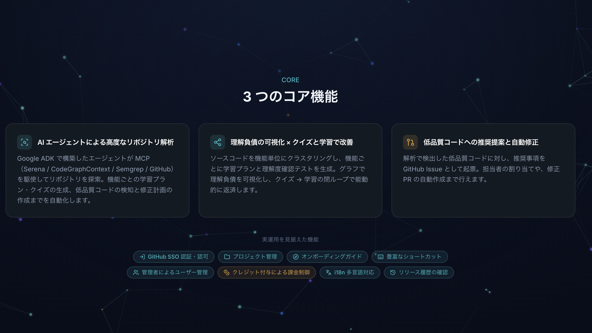

▶ デモ動画 [0:39〜0:49](https://youtu.be/j3r0Ybvz9Js?t=39)

### ユーザージャーニー

DevDebtOps は、対話や設定に時間をかけることなく、**「ログインして解析するだけ」で、自分のリポジトリが"理解できる教材"に変わる** ように設計されています。  
ここでは、実際の画面に沿って利用の流れを紹介します。  

**① はじめ方：ログインして、解析を回すだけ**

ユーザーは GitHub アカウントでログインします（アカウントがなくても「お試しはこちら」からデモを体験できます）。  
解析したいリポジトリとブランチを選んでプロジェクトを作成し、あとは右上の解析ボタンを押すだけ。  
AI エージェントがリポジトリを自律的に探索し、技術負債の検知・理解負債の整理・クイズと学習の生成までを自動で組み立てます。  

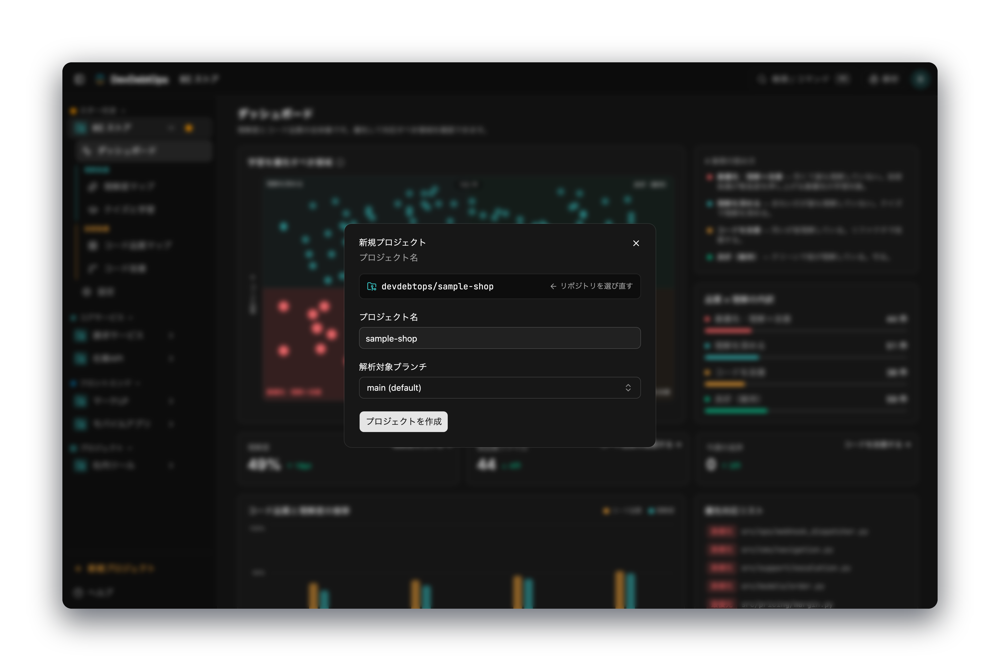

解析の進捗はリアルタイムに表示され、完了すると結果がアプリ全体に反映されます。  

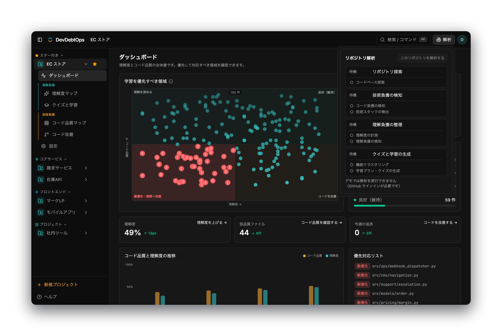

▶ デモ動画 [0:50〜1:20](https://youtu.be/j3r0Ybvz9Js?t=50)

**② ダッシュボード：どこから手をつけるべきかが一目で分かる**

解析が終わると、まずダッシュボードでリポジトリの全体像を把握できます。中心にあるのは、ファイルを **「コード品質 × 理解度」の二軸** で整理したマトリクス。どちらも低い左下の領域が「最優先で対応すべきホットスポット」として浮かび上がります。理解度・低品質ファイル数・修正済み件数の推移や、優先対応リストもここで確認できます。

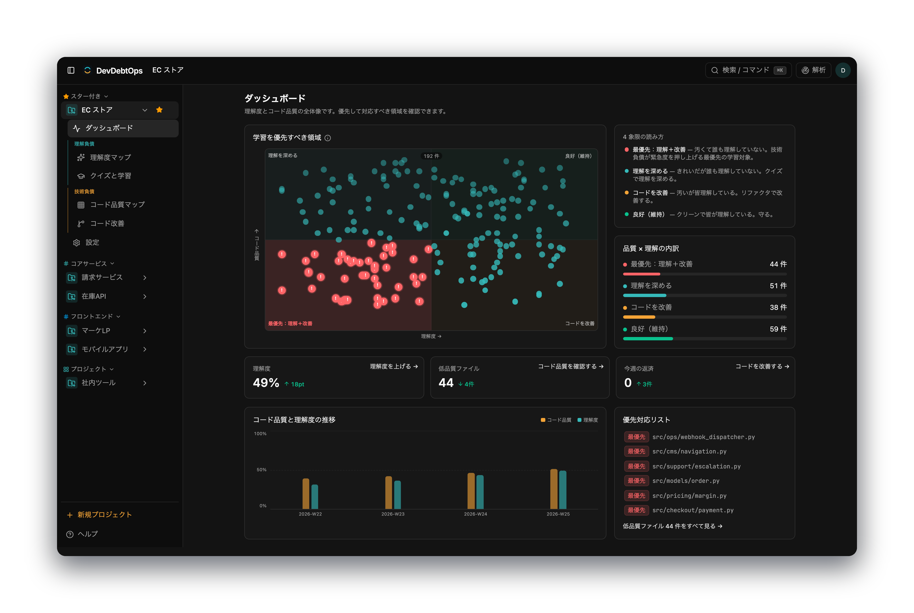

▶ デモ動画 [1:27〜1:53](https://youtu.be/j3r0Ybvz9Js?t=87)

**③ 理解度マップ：チーム／自分の理解を可視化する**

理解度マップでは、機能・ファイル別の理解度をグラフで可視化します。各ノードがファイル、線が依存関係を表し、ノードの色が理解度を示します。「どの機能を誰も理解していないのか」が直感的に分かり、機能チップで関心のある領域だけに絞り込むこともできます。

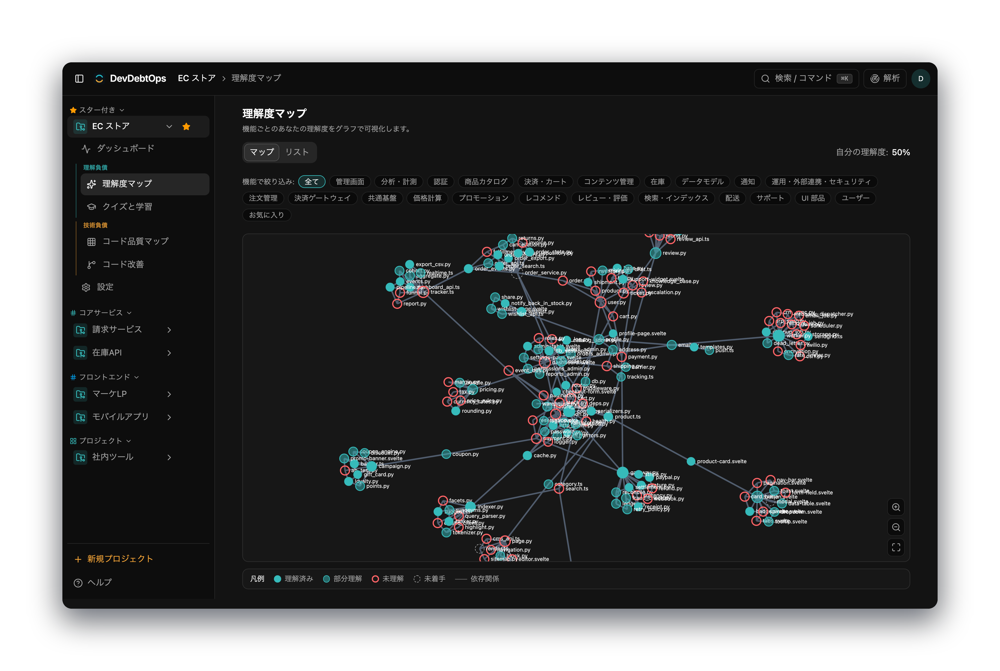

▶ デモ動画 [1:56〜2:24](https://youtu.be/j3r0Ybvz9Js?t=116)

**④ クイズと学習：理解を"能動的に測り"、埋める**

DevDebtOps の核心が、この画面です。機能ごとに生成された学習プランで、そのリポジトリ固有の実装や関連技術を学べます。

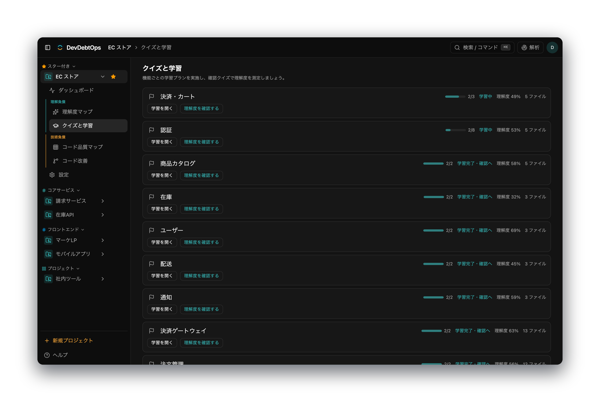

学んだあとは確認クイズを受験します。理解度を git blame からの推測ではなく **クイズで能動的に実測** するため、単独開発者やコードを書かない PM でも、自分の理解度を客観的に把握できます。

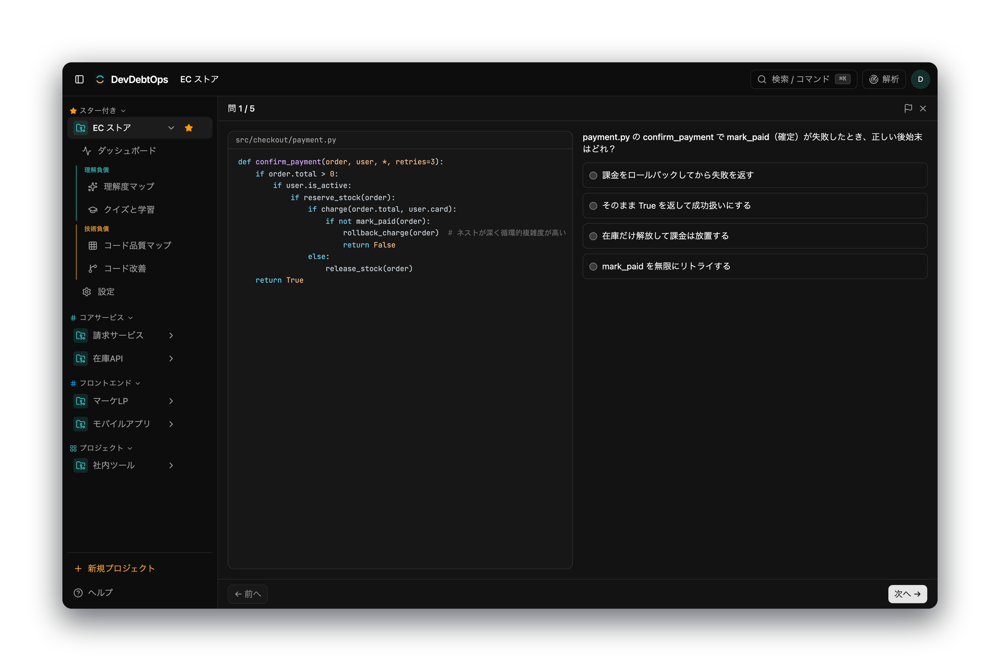

採点結果はその場で理解度に反映され、間違えた問題やフラグを付けた問題だけに絞って再受験することも可能です。「測って → 学んで → もう一度測る」の閉ループで、理解負債を着実に埋めていきます。

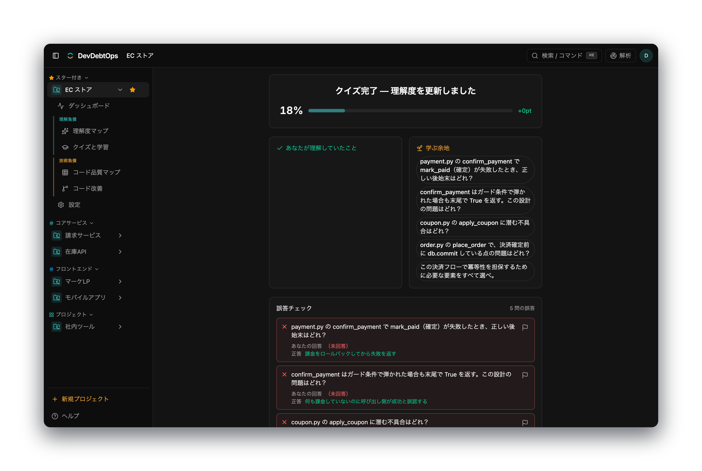

▶ デモ動画 [2:28〜3:16](https://youtu.be/j3r0Ybvz9Js?t=148)

**⑤ コード品質マップ／コード改善：低品質コードを見つけ、AI が直す**

技術負債の側は、コード品質マップでファイル単位に閲覧できます。改善余地のあるファイルにはバッジが付き、指摘箇所がソースコード上でハイライトされます。

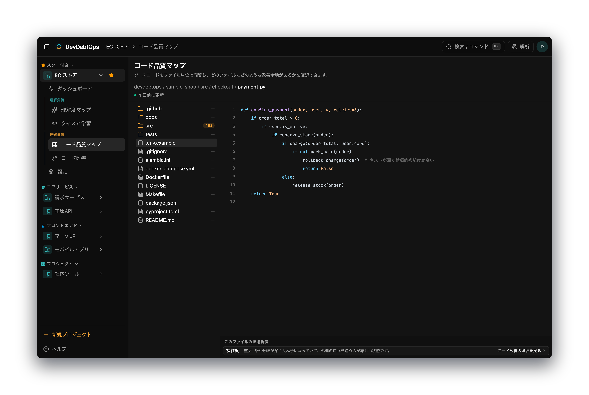

コード改善画面では、品質が低い理由・優先度・推定工数を確認したうえで、**AI に修正 PR の自動作成を依頼** するか、担当者を割り当てて **Issue を作成** するかを選べます。見つけて終わりではなく、直すところまでを一気通貫で扱えます。

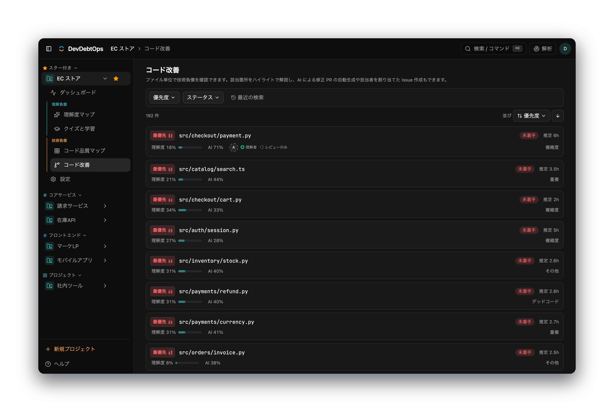

▶ デモ動画 [3:22〜4:16](https://youtu.be/j3r0Ybvz9Js?t=202)

こうして DevDebtOps は、**理解を測って・学んで埋め、低品質コードを見つけて直す** という一連の流れを、AI エージェントとともに開発・運用のサイクルへ自然に組み込みます。

### 中核を支える AI エージェント — 自律的な Agentic アーキテクチャ

**オーケストレーターエージェント・サブエージェント・MCP・Hooks** を組み合わせた Agentic アーキテクチャを据えています。  
本プロダクトにおいて Agentic アーキテクチャを採用した理由は、**解析の道筋を事前に決め打ちできない**からです。  
対象リポジトリは言語・規模・ディレクトリ構成が千差万別で、どのファイルをどこまで深掘りすべきかを固定手順では決められず、探索範囲と深さを **エージェント自身が判断しながら網羅的に探索** する必要があります。  
加えて、コード構造・依存関係・変更履歴といった **複数の観点を横断** して使うツールを切り替え、学習プランやクイズはそのリポジトリ **固有の実装・用語に適応** して生成しなければなりません。  

「探索範囲を自ら決め、多角的に解析し、結果から次の一手を判断する」

このような高度な探索と解析を Agentic アーキテクチャによって実現しています。

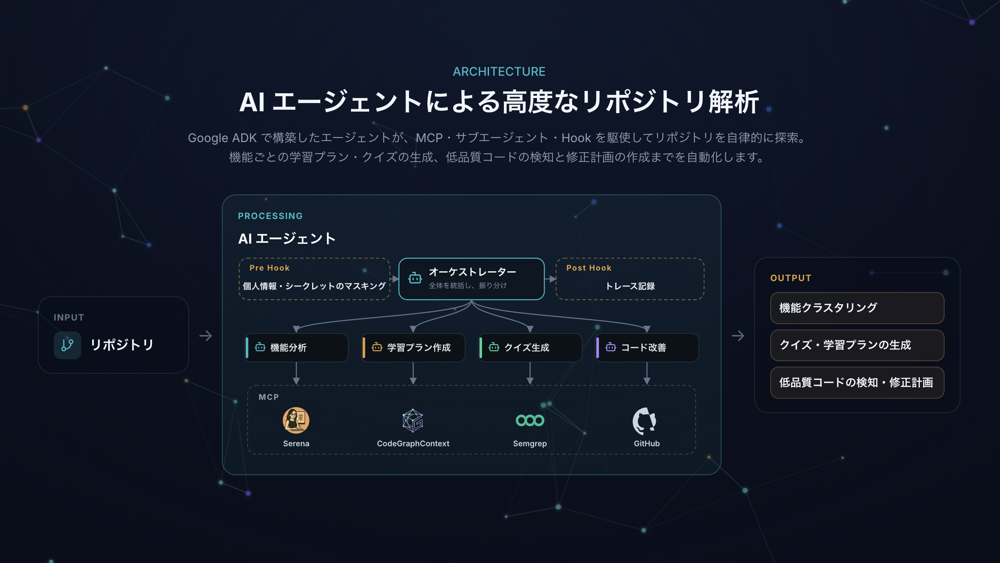

▶ デモ動画 [4:44〜5:22](https://youtu.be/j3r0Ybvz9Js?t=284)

- **オーケストレーター × サブエージェント** — オーケストレーターエージェントが役割の異なるサブエージェントを協調。リポジトリ探索によって構造化したスキーマ（機能 / コード所見 / 理解所見 / 技術スタック）を整理した上で、 **機能分析 / 学習プラン作成 / クイズ生成 / コード改善** など用途特化のサブエージェントが各機能の出力を生成します。
- **MCP** — LSPベースのリポジトリ探索には Serena MCP、リポジトリ解析におけるグラフ化にはCodeGraphContext MCP、コード品質や脆弱性の検出には Semgrep MCP、変更履歴・レビュー履歴・PR履歴の取得には、GitHub MCP を活用し、リポジトリを多角的に解析します。
- **Hooks** — エージェントの行動前後に必ず実行される処理を Hook として設定し、**予算ガード**（ツール・モデル・ファイル呼び出しの上限）や行動記録のトレース、**LLM 送信前のシークレット / 個人情報（PII）をマスキング**を実施しています。

### 実運用・サービス化を見据えた作り込み

個人が使うツールで終わらせず、チーム・組織に提供する サービスとしての完成度を追求しています。

- **認証・ユーザー管理** — GitHub SSO による認証・認可、アカウント設定、管理者によるユーザー管理。管理ダッシュボードでは、メンバーの管理と解析クレジットの付与を一元的に行えます。

  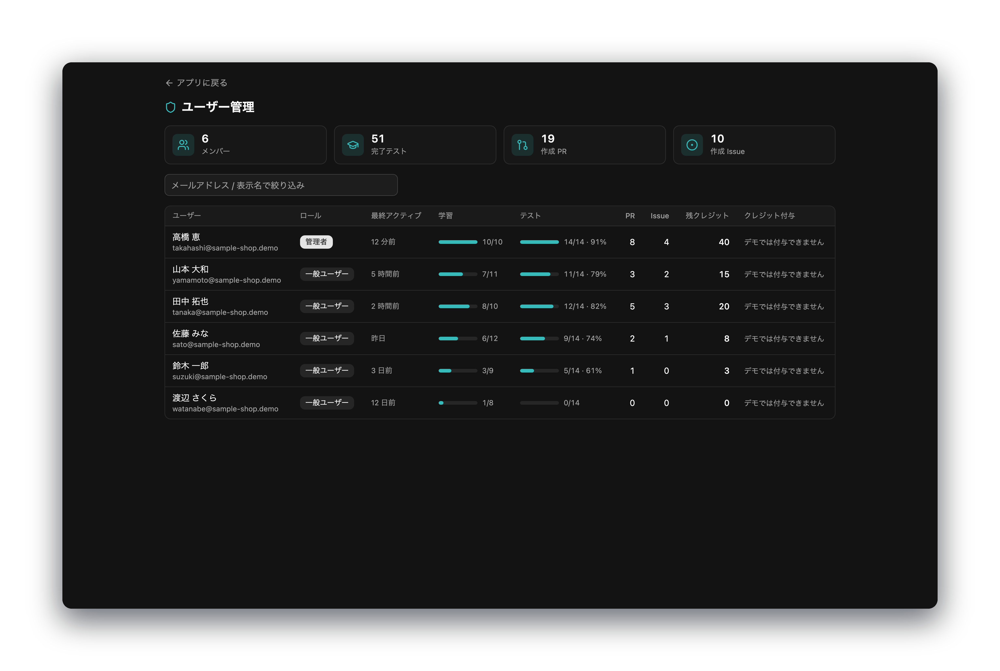

- **多言語対応（i18n）** — Paraglide による **6 言語**（日本語・英語・中国語・韓国語・スペイン語・ドイツ語）対応。右上のメニューから言語やテーマをいつでも切り替えられます。

  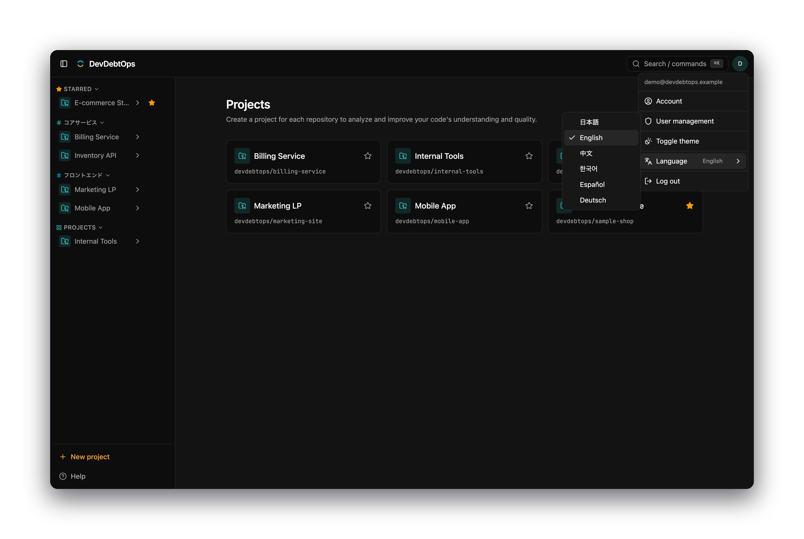

- **プロジェクト運用** — プロジェクト管理、オンボーディングガイド、充実したショートカット、課金機能を管理者のクレジット付与で制御、リリースバージョンの履歴確認。初めてのユーザーにはガイド付きツアーで主要機能を案内します。

  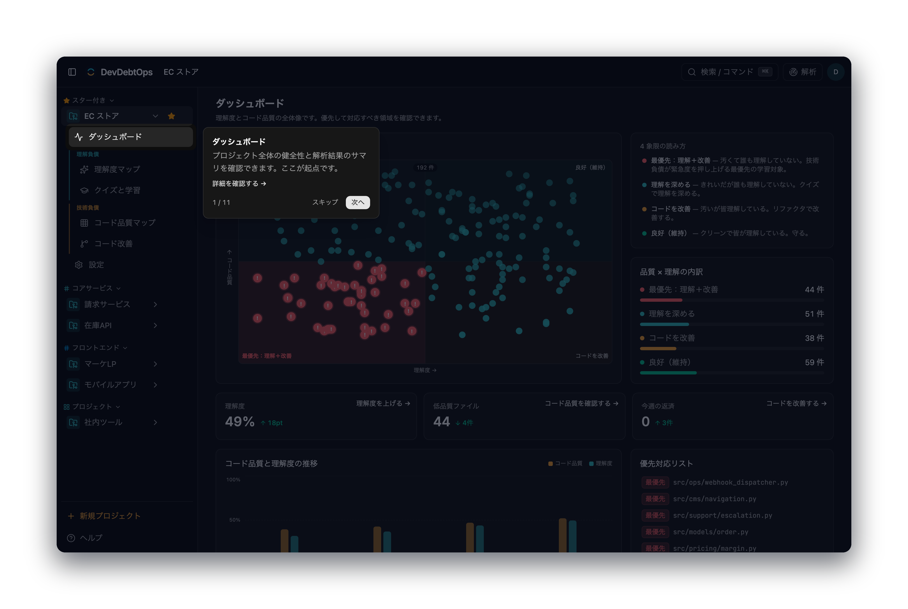

  リリースごとの変更点は、アプリ内の変更履歴からいつでも確認できます。

  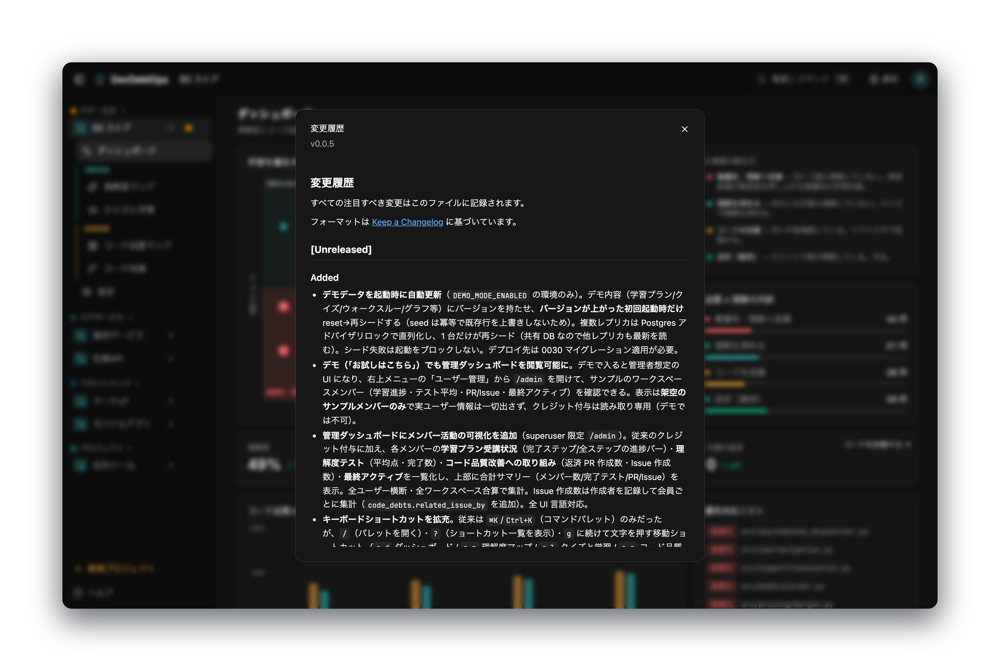

- **公開に耐える体裁** — [ランディングページ](https://stg.devdebtops.harutotakita.dev/lp)、プライバシーポリシー・利用規約を整備し、外部公開・サービス提供の要件を満たす。
- **可観測性** — Cloud Monitoring / Logging で 5xx エラー率やサービスの稼働状況を継続監視。
- **ユーザーの声を集める仕組み** — LP に使い方アシスタント（チャット）を設置し、ユーザーからの質問対応や改善要望の収集を行う。集まった声をプロダクトの継続的な改善に繋げる、フィードバックの入口を用意しています。

### 拡張性・保守性 — ドキュメントの自動整備

主要ドキュメントはリリースごとに自動で最新化し、加えて設計・運用を支えるドキュメントも体系的に整備することで、コードに追従し続ける保守性・拡張性を確保しています。

[`/release-version`](https://github.com/HarutoTakita/dev-debt-ops/blob/main/.claude/skills/release-version/SKILL.md) で新バージョンを切ると、

- **API ドキュメント**（[`openapi.json`](https://github.com/HarutoTakita/dev-debt-ops/blob/main/docs/reference/openapi.json)、OpenAPI 3.1）
- **ER 図**（[`schema.dbml`](https://github.com/HarutoTakita/dev-debt-ops/blob/main/docs/reference/schema.dbml)、DBML）
- **取扱説明書**（[`README.md`](https://github.com/HarutoTakita/dev-debt-ops/blob/main/docs/user-guide/README.md)
- **チェンジログ**（[`CHANGELOG.md`](https://github.com/HarutoTakita/dev-debt-ops/blob/main/CHANGELOG.md)）

が自動で最新化。

ドキュメントが常にコードへ追従するため、機能追加やチーム拡大にも耐える保守性・拡張性を確保します。

加えて、

- **運用手順書**（[`operations.md`](https://github.com/HarutoTakita/dev-debt-ops/blob/main/docs/operations.md)）
- **シーケンス図**（[`sequence-diagrams.md`](https://github.com/HarutoTakita/dev-debt-ops/blob/main/docs/infra/sequence-diagrams.md)）
- **アーキテクチャ構成図**（[`infrastructure.png`](https://github.com/HarutoTakita/dev-debt-ops/blob/main/docs/infra/infrastructure.png)）
- **ユースケース図**（[`use-cases.md`](https://github.com/HarutoTakita/dev-debt-ops/blob/main/docs/infra/use-cases.md)）

など、デプロイ・障害対応から解析パイプラインの内部フロー、システム構成、機能全体像までを示すドキュメントも整備し、開発・運用を支える情報を体系的に揃えています。

## 4. この技術の本質と応用可能性

DevDebtOps の本質は、**「動いているか」ではなく「本当に理解されているか」を、推測ではなく能動的に実測し、学習と修正で閉じる**ことにあります。git blame や複雑度からの“推測”に頼らず、クイズで理解を実測する——この構造は、現状のリポジトリ解析にとどまらず幅広く応用できます。

### 想定される機能拡張

現在の基盤（**AI エージェント × MCP × 理解度の実測**）は、次の 3 方向へ自然に拡張できます。

- **開発フローへの深い統合** — 理解負債の検知を「解析して終わり」にせず、日々の PR・レビューのゲートに組み込む。
  - PR で変更された機能・ファイルの理解度を自動チェックし、閾値を下回る変更には「理解負債」ラベルを付けて **GitHub の Status Check** としてマージ前に警告する。
  - 「その領域を最も理解している人」をレビュアーに推薦。逆に、誰も理解していないホットスポットは学習ユニットへのリンクを提示してから通す。
  - コード変更に連動して関連する学習ユニット・クイズを自動再生成し、「この変更で再学習が必要」と担当者へ通知する。
  - **例** — AI で PR を量産するチームが、レビュアー自身も理解していないコードを素通しでマージするのを防ぐ。PR ごとに変更範囲の理解度を可視化し、低ければ学んでからマージする運用に切り替えられる。
- **学習の最適化** — 一律のクイズ・学習プランから、個人とチームに最適化された学習へ進化させる。
  - **間隔反復（SRS）と適応的な難易度調整** — 忘却曲線に沿ってクイズを再出題し、正答率に応じて難易度を変え、長期定着を狙う。
  - **つまずきの根本からの学習** — 間違えた設問に絞るだけでなく、その前提となる依存先の知識を先に出題し、理解の土台から埋める。
  - **チーム学習の推奨** — チーム全体で理解が薄い機能を検出し、勉強会のテーマやペアプロの相手を提案する。
  - **例** — 新人が特定モジュールで繰り返し間違えたら、まず依存先の前提知識を出題して定着させ、そのうえで本題のモジュールへ進む、個別最適な学習パスを提示する。
- **運用連携・定期監視** — 単発の解析から、理解負債を継続的に監視・通知する運用へ広げる。
  - **定期スキャン** — Cloud Scheduler などで差分解析を定期実行し、理解負債・技術負債のトレンドを自動更新する。
  - **チャット通知・レポート** — 負債の増加や低品質ホットスポットの発生を Slack へ通知し、週次で「今週の理解負債トップ 5」を配信する。
  - **属人化リスクの警告** — 重要モジュールを 1 人しか理解していない（バス係数 1）状態を検出し、引き継ぎ学習を促す。
  - **例** — 退職・異動が決まったメンバーが唯一理解しているモジュールを検出して警告し、知識が失われる前に学習ユニット化して組織へ残す。

## 5. 制作背景

正直に言うと、このアプリは「自分がずっと困っていたこと」から生まれました。

私はプロジェクト型の仕事をしていて、1年以上続くものもあれば、3ヶ月だけ関わって離れるものもあります。

そのたびに、初めて見る大きなコードベースを短期間でキャッチアップしなければならない。

毎回それが大変で、「このコードを自分がどこまで理解できているかをわかりやすく確認できたら嬉しい」と思っていました。

マネージャーを務めた際には、新しく入ったメンバーのオンボーディングで、ソースコードの説明にかなりの時間を取られました。

「どこから読めばいいか」「この機能は何をしているのか」を口頭で何度も説明する。

属人化した知識を、毎回人力で受け渡している感覚がありました。

そして最近、AI 駆動開発を進める中で、一番気になり始めたのは自分自身のことでした。

締切やクライアントの期待に追われ、AI が出したコードを「なんとなく動くから」と、理解しきらないまま進めてしまう。

気づけば、詳細な仕様も実装も、自分の言葉では説明できない箇所が増えていました。

この「理解負債」を、感覚ではなくちゃんと測って、学習とクイズで埋め、必要なら AI に直させる。自分が一番ほしかったものを、そのまま形にしたのが DevDebtOps です。

---

## メンバー登録 〔任意〕

`記載済み`

---

## 関連 URL 〔任意〕

- GitHub リポジトリ: `https://github.com/HarutoTakita/dev-debt-ops`
- デモ環境（staging）: `https://stg.devdebtops.harutotakita.dev/login`
- LP : `https://stg.devdebtops.harutotakita.dev/lp`
