# DevDebtOps 取扱説明書

DevDebtOps は「**理解負債（Knowledge / Understanding Debt）**」を主役に据えた開発プラットフォームです。理解度を git blame から推測するのではなく、**クイズで能動的に実測**し（blame 非依存。単独開発でも、コードを書かない PM でも計測できます）、**学習プラン → クイズ再受験で返済する閉ループ**でチームの理解を底上げします。あわせてコード品質（技術負債）も検知し、理解度 × コード品質の**二軸マトリクス**で「どの理解ギャップが緊急か」を示す**ホットスポット**として位置づけます。解析には Google ADK エージェント＋MCP を用い、改善は修正 PR / GitHub Issue で返します。

## デモで試す

ログインは不要です。`/login`（[はじめに](#01-ログインお試しデモ入口)参照）の **「お試しはこちら」** から、サンプルのデモ組織（`/demo`）にそのまま入れます。以下のスクリーンショットはすべてデモ環境（`ECストア` プロジェクト）のものです。

## 目次

- [1. はじめに・基本操作](#1-はじめに基本操作)
  - [ログイン・お試しデモ入口](#01-ログインお試しデモ入口)
  - [組織ダッシュボード（プロジェクト一覧）](#02-組織ダッシュボードプロジェクト一覧)
  - [プロジェクトのセクション分け・スター](#03-プロジェクトのセクション分けスター)
  - [新規プロジェクト作成](#04-新規プロジェクト作成)
  - [コマンドパレット（⌘K 検索）](#05-コマンドパレットk-検索)
  - [ヘルプメニュー](#06-ヘルプメニュー)
  - [オンボーディングガイド（ツアー）](#07-オンボーディングガイドツアー)
  - [変更履歴（CHANGELOG）](#08-変更履歴changelog)
  - [アカウントメニュー（言語・テーマ・ログアウト）](#09-アカウントメニュー言語テーマログアウト)
  - [キーボードショートカット](#10-キーボードショートカット)
- [2. プロジェクトの全体像](#2-プロジェクトの全体像)
  - [ダッシュボード（プロジェクト概要）](#11-ダッシュボードプロジェクト概要)
  - [解析ステータス（解析ラン・コックピット）](#12-解析ステータス解析ランコックピット)
- [3. コード品質（技術負債）を見つける・直す](#3-コード品質技術負債を見つける直す)
  - [コード改善（優先度リスト）](#13-コード改善優先度リスト)
  - [負債の詳細（返済プラン・担当）](#14-負債の詳細返済プラン担当)
  - [コード品質マップ（ファイルツリー + 負債）](#15-コード品質マップファイルツリー--負債)
- [4. 理解度（理解負債）を可視化する](#4-理解度理解負債を可視化する)
  - [Knowledge Galaxy（理解度マップ・マップ表示）](#16-knowledge-galaxy理解度マップマップ表示)
  - [理解度マップ（リスト表示）](#17-理解度マップリスト表示)
- [5. クイズで実測し、学習で返済する（閉ループ）](#5-クイズで実測し学習で返済する閉ループ)
  - [クイズと学習（統合ハブ）](#18-クイズと学習統合ハブ)
  - [クイズ受験（集中モード）](#19-クイズ受験集中モード)
  - [クイズ採点結果（理解度の更新）](#20-クイズ採点結果理解度の更新)
  - [コード学習ウォークスルー](#21-コード学習ウォークスルー)
- [6. 設定](#6-設定)
  - [プロジェクト設定](#22-プロジェクト設定)
  - [アカウント画面（残りの解析クレジット）](#23-アカウント画面残りの解析クレジット)
- [7. モバイル対応](#7-モバイル対応)
- [8. 管理者向け機能（ユーザー管理・クレジット付与）](#8-管理者向け機能ユーザー管理クレジット付与)

---

## 1. はじめに・基本操作

### 01 ログイン・お試しデモ入口

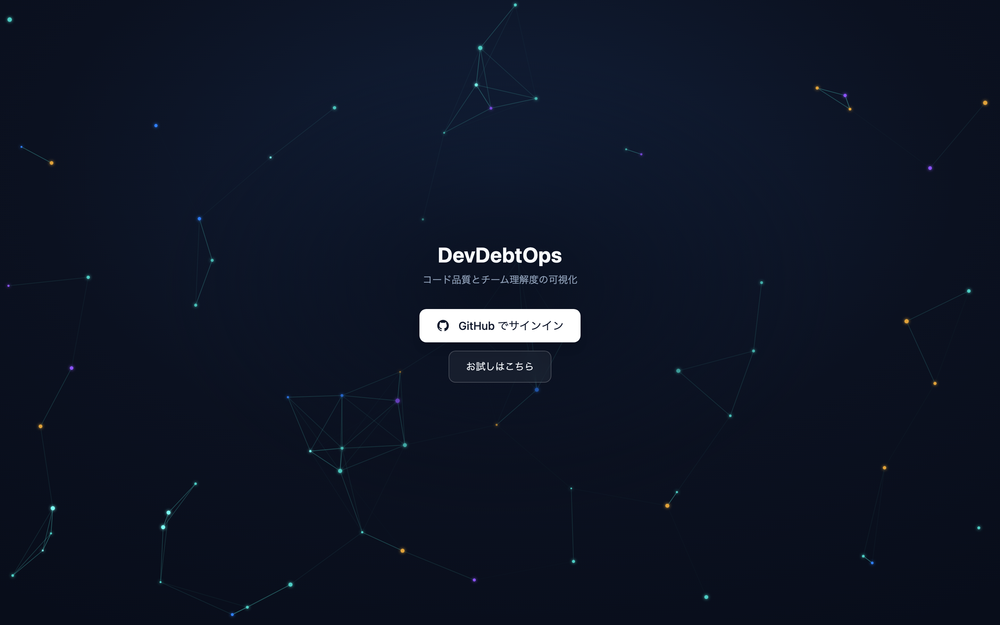

**この画面は何か:** DevDebtOps の入口です。「コード品質とチーム理解度の可視化」というサービスの一言説明とともに、サインイン手段が並びます。

**主な操作:**
- **「GitHub でサインイン」** — 自分の GitHub アカウントで認証し、実際のリポジトリを接続して利用を始めます。
- **「お試しはこちら」** — ログイン不要で、サンプルデータの入ったデモ組織（`/demo`）に入れます。まず触ってみたいときはこちら。
- サインイン後・デモ入場後は、いずれも[組織ダッシュボード](#02-組織ダッシュボードプロジェクト一覧)に遷移します。

**ヒント:** デモではデータの閲覧・操作を一通り試せますが、解析の実行や PR / Issue 作成など GitHub 連携が必要な操作は行えません（サインインが必要です）。

### 02 組織ダッシュボード（プロジェクト一覧）

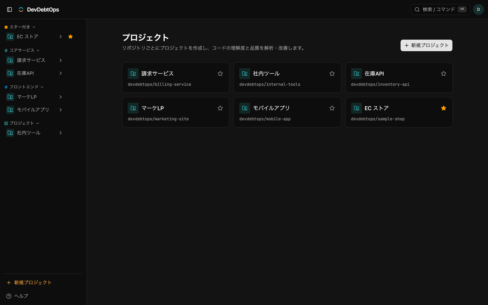

**この画面は何か:** リポジトリごとに作成した「プロジェクト」の一覧です。「リポジトリごとにプロジェクトを作成し、コードの理解度と品質を解析・改善します。」という説明のとおり、ここが利用の起点になります。

**主な操作:**
- 各**プロジェクトカード**（例: `請求サービス` / `devdebtops/billing-service`）をクリックすると、そのプロジェクトの[ダッシュボード](#11-ダッシュボードプロジェクト概要)へ入ります。
- カード右上の**スターアイコン**でお気に入り登録でき、左サイドバーの「スター付き」に固定されます。
- 右上の **「＋ 新規プロジェクト」**（左下にも同名リンク）から[新規プロジェクト作成](#04-新規プロジェクト作成)を開きます。
- 左サイドバーはプロジェクトを「スター付き」「コアサービス」「フロントエンド」などのセクションで整理しています。
- 右上の **検索 / コマンド（⌘K）** から[コマンドパレット](#05-コマンドパレットk-検索)を開けます。

### 03 プロジェクトのセクション分け・スター

**この画面は何か:** 組織ダッシュボードの左サイドバーで、プロジェクトをセクション（グループ）ごとに束ねて見やすくした状態です。

**主な操作:**
- サイドバー上部の **「★ スター付き」** には、スター登録したプロジェクト（例: `EC ストア`）がまとまります。
- **「# コアサービス」「# フロントエンド」「プロジェクト」** といった見出しごとにプロジェクトが分類され、各見出しの `∨` で開閉できます。
- 一覧側の各カード右上の**スターアイコン**をクリックすると、そのプロジェクトのスターの ON / OFF が切り替わります（ON にすると「スター付き」に表示）。

**ヒント:** プロジェクト数が増えても、よく使うものをスターで手元に固定しておくと素早く行き来できます。

### 04 新規プロジェクト作成

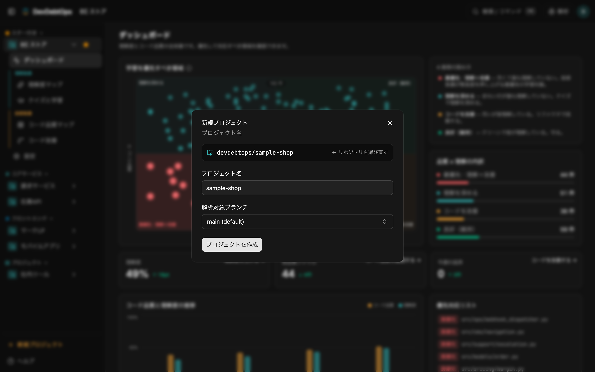

**この画面は何か:** 解析対象のリポジトリを DevDebtOps に取り込むためのダイアログです。「＋ 新規プロジェクト」から開きます。

**主な操作:**
- **リポジトリ**欄で対象リポジトリ（例: `devdebtops/sample-shop`）を選びます。選び間違えたら **「← リポジトリを選び直す」** で戻れます。
- **「プロジェクト名」** を入力します（初期値はリポジトリ名。例: `sample-shop`）。
- **「解析対象ブランチ」** をプルダウンから選択します（初期値は `main (default)`）。
- **「プロジェクトを作成」** で確定すると、そのリポジトリのプロジェクトが作られ、解析を実行できるようになります。

**ヒント:** ブランチを切り替えれば、リリース前ブランチと `main` を別プロジェクトとして比較する、といった使い方もできます。

### 05 コマンドパレット（⌘K 検索）

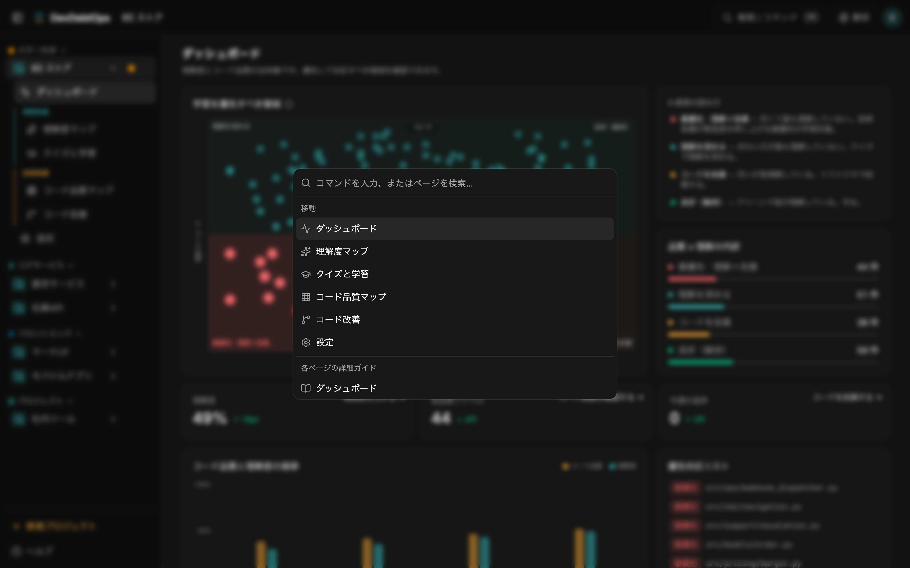

**この画面は何か:** どの画面からでも `⌘K`（Windows は `Ctrl+K`）または右上の「検索 / コマンド」で開ける、キーボード中心の高速ナビゲーションです。

**主な操作:**
- 上部の入力欄に **「コマンドを入力、またはページを検索…」** と表示され、キーワードで候補を絞り込めます。
- **「移動」** グループから `ダッシュボード` / `理解度マップ` / `クイズと学習` / `コード品質マップ` / `コード改善` / `設定` に直接ジャンプできます。
- **「プロジェクトを切り替え」** グループから、別プロジェクト（例: `請求サービス` / `devdebtops/billing-service`）へ即座に移動できます。
- 候補を矢印キーで選び、Enter で実行します。

### 06 ヘルプメニュー

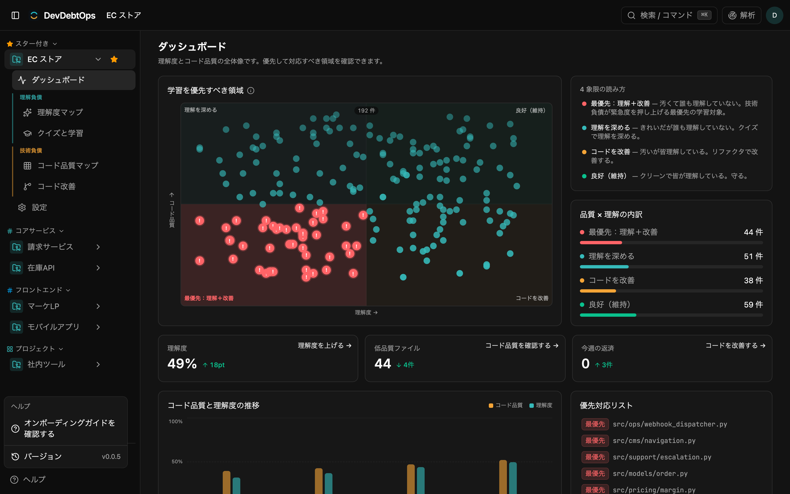

**この画面は何か:** サイドバー左下の **「ヘルプ」** から開くメニューです。使い方の入口とバージョン情報がまとまっています。

**主な操作:**
- **「オンボーディングガイドを確認する」** — 画面の使い方を順に案内する[ツアー](#07-オンボーディングガイドツアー)を再生します。
- **「LP を確認する」** — サービス紹介のランディングページを開きます。
- **「バージョン」** — 現在のアプリバージョン（例: `v0.0.5`）を表示します。クリックすると[変更履歴](#08-変更履歴changelog)を開けます。

### 07 オンボーディングガイド（ツアー）

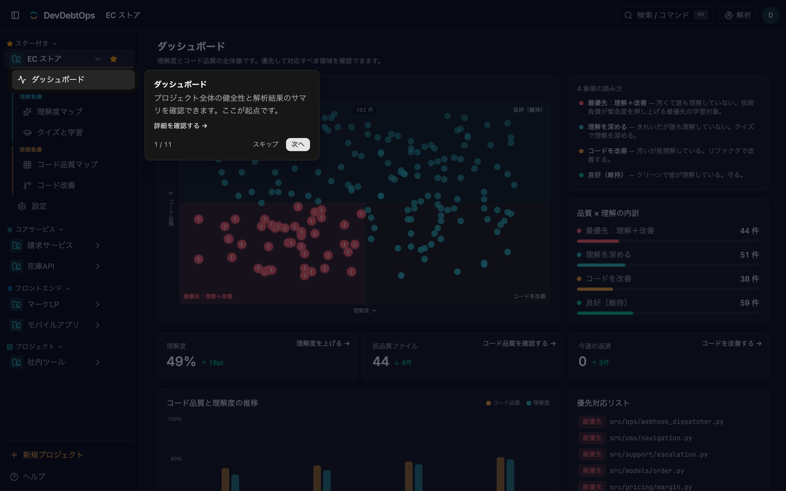

**この画面は何か:** 初回利用者向けに、主要な画面要素を吹き出しで順番に解説するガイドツアーです。ダッシュボードを起点に進みます。

**主な操作:**
- 吹き出しには対象の説明（例: 「プロジェクト全体の健全性と解析結果のサマリを確認できます。ここが起点です。」）と進捗（例: `1 / 8`）が表示されます。
- **「次へ」** で次のステップへ、**「スキップ」** でツアーを終了します。
- **「詳細を確認する →」** から、その要素に対応する画面へ移動できます。
- ツアーはヘルプメニューの「オンボーディングガイドを確認する」からいつでも再生できます。

### 08 変更履歴（CHANGELOG）

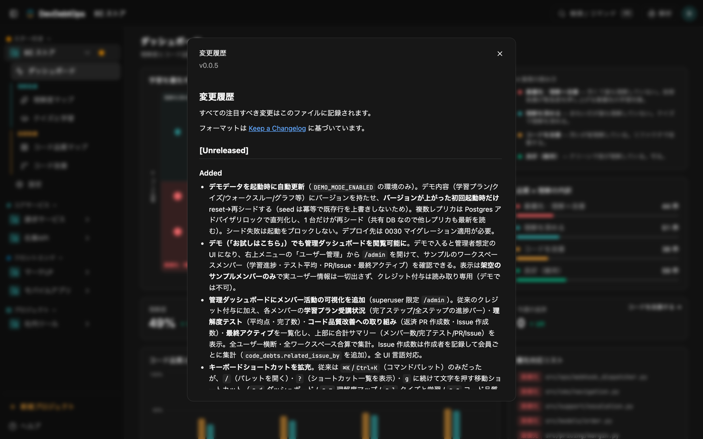

**この画面は何か:** アプリの更新内容をまとめた変更履歴（CHANGELOG）モーダルです。「すべての注目すべき変更はこのファイルに記録されます。」とあり、フォーマットは Keep a Changelog に準拠します。

**主な操作:**
- 先頭に現在のバージョン（例: `v0.0.5`）、続いて **`[Unreleased]`** など各リリースの `Added` / `Changed` などのセクションが時系列で並びます。
- リンク（`Keep a Changelog`）から書式の説明を開けます。
- 右上の **×** で閉じます。ヘルプメニューの「バージョン」からいつでも開けます。

### 09 アカウントメニュー（言語・テーマ・ログアウト）

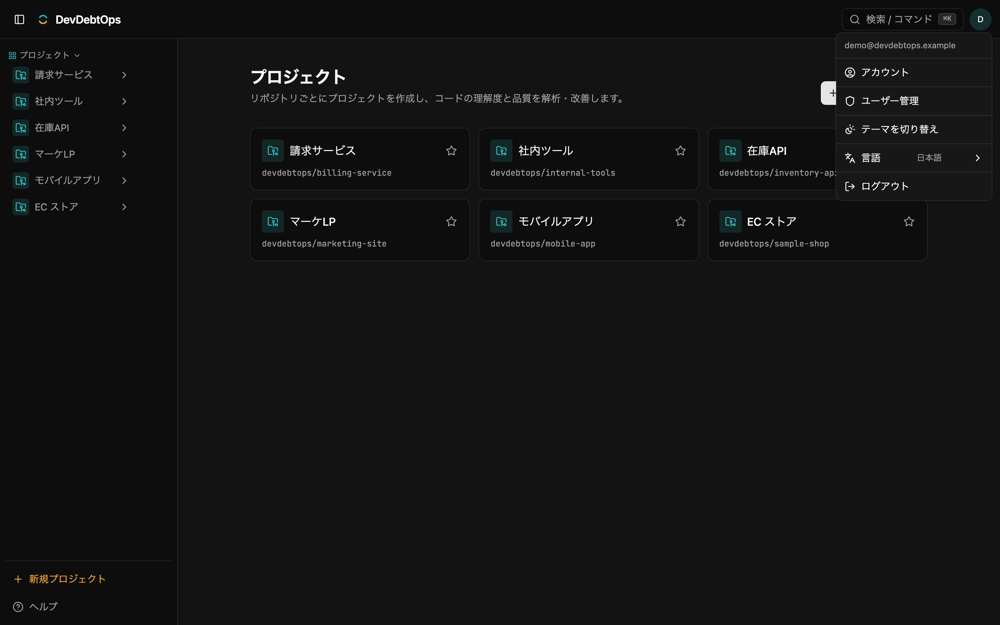

**この画面は何か:** 画面右上のアカウントアイコン（アバター）から開くメニューです。表示言語やテーマの切り替え、アカウント情報、ログアウトなど、アプリ全体に関わる操作をまとめています。

**主な操作:**
- **言語切替** — 「言語」から **日本語 / English / 中文 / 한국어 / Español / Deutsch** の 6 言語を切り替えられます（選択は保存され、次回以降も維持）。UI 全体が選択言語で表示されます（AI 生成コンテンツと GitHub へ送る PR / Issue 本文は対象外）。
- **テーマ切替** — ダークモード / ライトモードを切り替えます。
- **アカウント** — [アカウント画面](#23-アカウント画面残りの解析クレジット)（メール・ロール・残りの解析クレジット）を開きます。
- **ユーザー管理** — 管理者のみ表示。[管理者向け機能](#8-管理者向け機能ユーザー管理クレジット付与)（`/admin`）を開きます。
- **ログアウト** — サインアウトしてログイン画面に戻ります。

**ヒント:** セキュリティのため、30 分間操作がないと自動的にログアウトされます（残り 5 分で警告モーダルを表示）。デモユーザーは対象外です。

### 10 キーボードショートカット

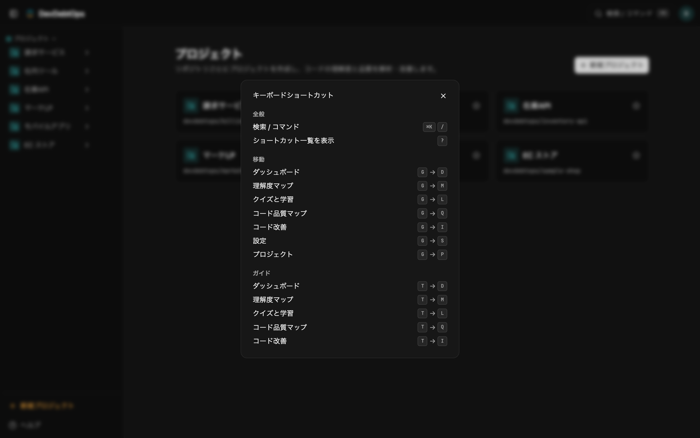

**この画面は何か:** マウスを使わずに素早く移動・操作するためのショートカットです。一覧は **`?`** キーでいつでも表示できます（GitHub / Linear 流）。

**主な操作:**
- **`⌘K` / `Ctrl+K`**（または **`/`**）— [コマンドパレット](#05-コマンドパレットk-検索)を開く。
- **`?`** — ショートカット一覧を表示。
- **`g` に続けて文字** — 画面移動: `g d` ダッシュボード / `g m` 理解度マップ / `g l` クイズと学習 / `g q` コード品質マップ / `g i` コード改善 / `g s` 設定 / `g p` プロジェクト一覧。
- 入力欄にフォーカス中は、移動系ショートカットは無効化されます（Mac は ⌘、その他は Ctrl に対応）。

---

## 2. プロジェクトの全体像

### 11 ダッシュボード（プロジェクト概要）

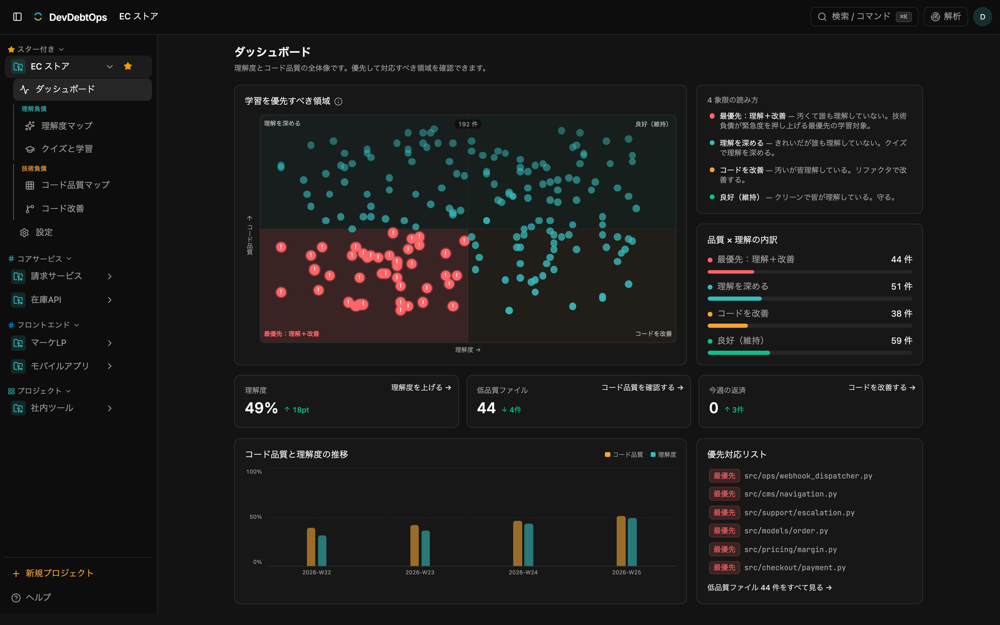

**この画面は何か:** プロジェクトの起点となる俯瞰画面です。「理解度とコード品質の全体像です。優先して対応すべき領域を確認できます。」のとおり、チームの状態を一枚で把握できます。サイドバーの **「ダッシュボード」** で表示します。

**主な操作:**
- **「学習を優先すべき領域」** は、理解度（横軸）× コード品質（縦軸）の**二軸マトリクス（散布図）**です。左下の赤いエリア「最優先：理解＋改善」に集まる点ほど緊急のホットスポットです。
- 右の **「4 象限の読み方」** で各象限（最優先：理解＋改善 / 理解を深める / コードを改善 / 良好（維持））の意味を確認できます。
- **「品質 × 理解の内訳」** に各象限の件数（例: 最優先 43 件）が並びます。
- KPI カード **「理解度（例: 49%）」「低品質ファイル（例: 43）」「今週の返済」** から、それぞれ「理解度を上げる →」「コード品質を確認する →」「コードを改善する →」で該当画面へ遷移します。
- **「コード品質と理解度の推移」** グラフで週次の変化を、**「優先対応リスト」** で「最優先」ファイル（例: `src/ops/webhook_dispatcher.py`）を確認できます。

**ヒント:** 二軸で見ることで「汚くて誰も理解していない箇所」を最優先に、限られた時間の投資先を判断できます。

### 12 解析ステータス（解析ラン・コックピット）

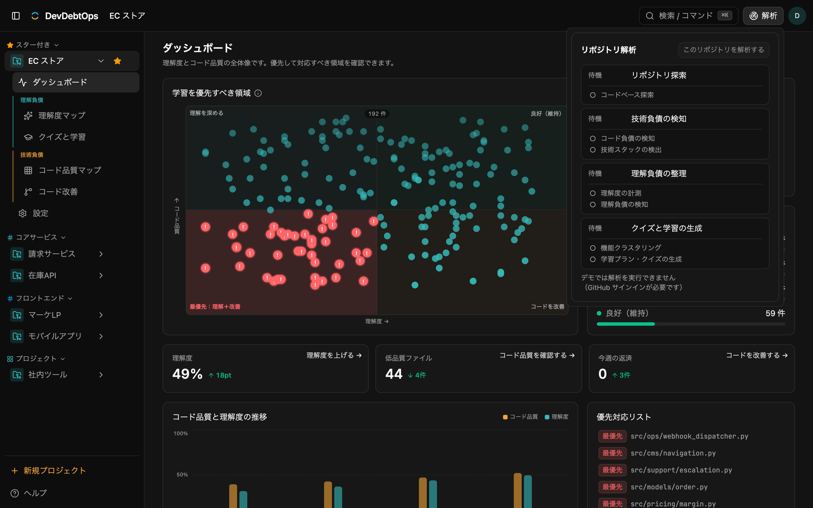

**この画面は何か:** 右上の **「解析」** ボタンから開く「リポジトリ解析」パネルです。解析パイプラインの各工程と進捗をコックピットのように確認できます。

**主な操作:**
- **「このリポジトリを解析する」** ボタンで解析を開始します（各工程の状態は `待機` などのバッジで表示）。
- 工程は大きく4段階です: **リポジトリ探索**（コードベース探索）／**技術負債の検知**（コード負債の検知・技術スタックの検出）／**理解負債の整理**（理解度の計測・理解負債の検知）／**クイズと学習の生成**（機能クラスタリング・学習プラン/クイズの生成）。
- デモ環境では「デモでは解析を実行できません（GitHub サインインが必要です）」と表示され、実行はできません。

**ヒント:** 解析が完了すると、コード改善・理解度マップ・クイズと学習の各画面のデータが最新化されます。

---

## 3. コード品質（技術負債）を見つける・直す

### 13 コード改善（優先度リスト）

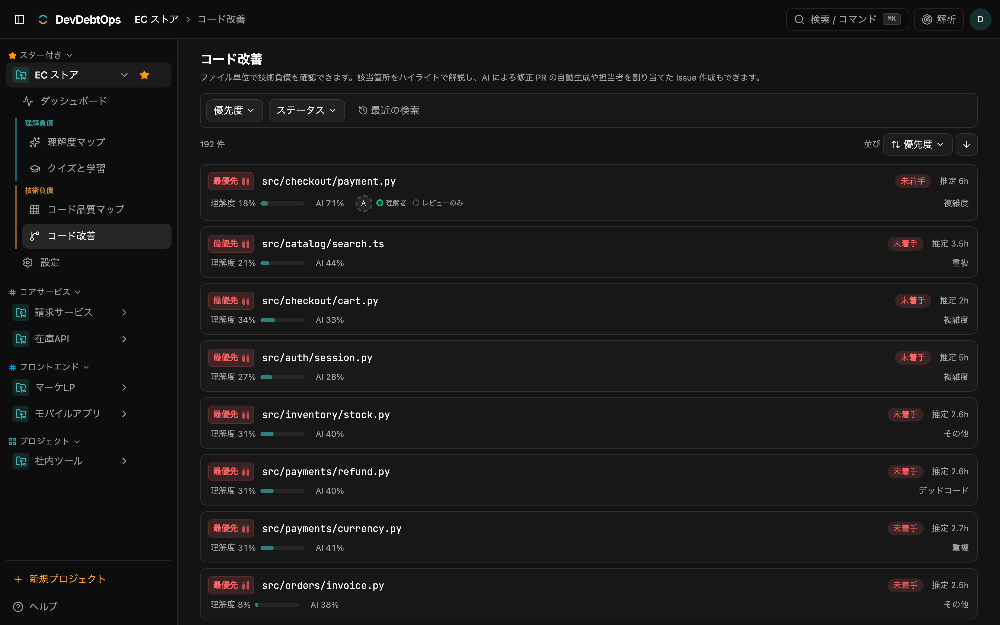

**この画面は何か:** ファイル単位で技術負債を一覧し、着手優先度の高い順に確認する画面です。「該当コードを行ハイライトで解説し、AI による修正 PR の自動生成や担当者を割り当てた Issue 作成もできます。」サイドバーの技術負債グループ **「コード改善」** から開きます。

**主な操作:**
- 上部の **「優先度」「ステータス」** フィルタと **「最近の検索」**、右側の **並び順（優先度など）** で対象を絞り込みます。
- 各行にはファイル名（例: `src/checkout/payment.py`）、**理解度 %**、**AI %**（AI 生成痕跡の度合い）、担当（理解者 / レビューのみ）、**推定工数**（例: 推定 6h）、負債の種別（複雑度 / 重複 / デッドコード / その他）が表示されます。
- **「最優先」** バッジと **「未着手」** などのステータスで状態が分かります。
- 行をクリックすると[負債の詳細](#14-負債の詳細返済プラン担当)へ遷移します。

### 14 負債の詳細（返済プラン・担当）

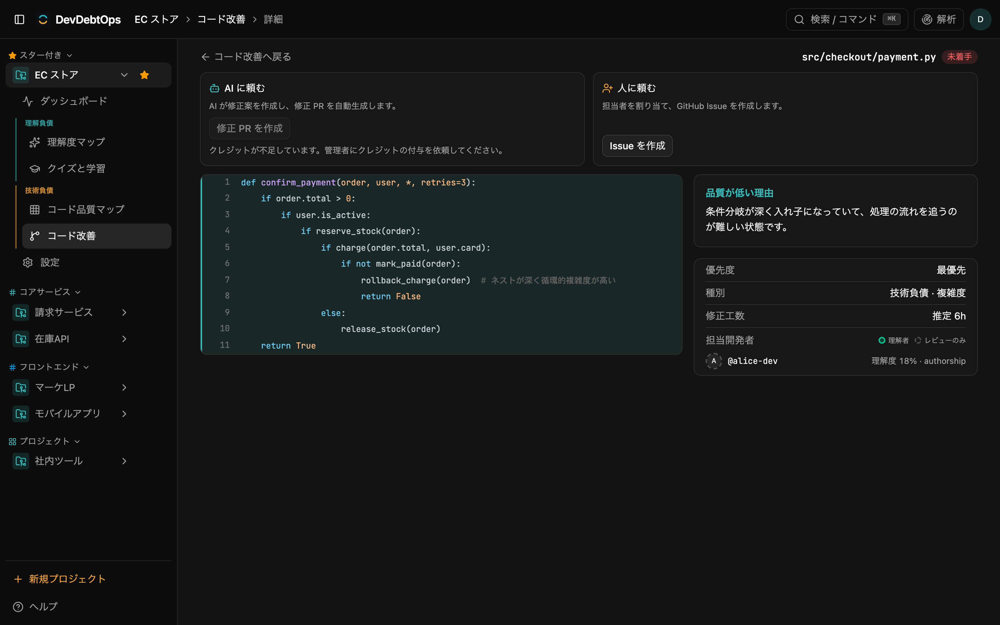

**この画面は何か:** 選んだファイルの技術負債を掘り下げ、返済（修正）につなげる画面です。上部の「← コード改善へ戻る」で一覧に戻れます。

**主な操作:**
- **「AI に頼む」** — 「AI が修正案を作成し、修正 PR を自動生成します。」**「修正 PR を作成」** ボタンで実行します。
- **「人に頼む」** — 「担当者を割り当て、GitHub Issue を作成します。」**「Issue を作成」** ボタンで起票します。
- 中央のコードビューで該当箇所を確認できます（例: `# 6 段ネスト / 循環的複雑度 31` のような注釈付き）。
- 右側に **「品質が低い理由」**（例: 条件分岐が深く入れ子）、**優先度 / 種別（技術負債・複雑度）/ 修正工数 / 担当開発者**（例: `@alice-dev` 理解度 18%）が並びます。

**ヒント:** 生成された PR は未レビュー扱いです。必ず内容を確認してからマージしてください。

### 15 コード品質マップ（ファイルツリー + 負債）

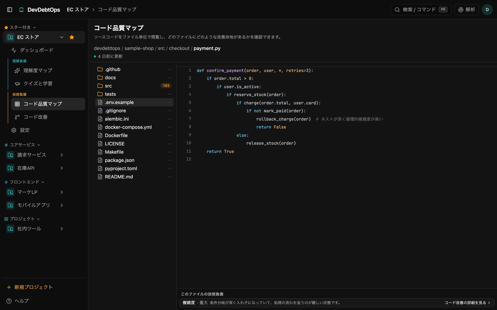

**この画面は何か:** ソースコードをファイル単位で閲覧し、「どのファイルに技術負債が多いか（負債の分布）を俯瞰できます」。サイドバーの技術負債グループ **「コード品質マップ」** から開きます。

**主な操作:**
- 左の**ファイルツリー**（`.github` / `docs` / `src` …）からファイルを選ぶと、右の**コードビュー**に内容が表示されます。フォルダ横のバッジ（例: `src 192`）は負債件数の目安です。
- 上部のパンくず（例: `devdebtops / sample-shop / src / checkout / payment.py`）で現在地を確認できます。
- コード内には循環的複雑度などの注釈が表示されます。
- 下部の **「このファイルの技術負債」** に要約（例: 複雑度・重大）が出て、**「コード改善の詳細を見る →」** から[負債の詳細](#14-負債の詳細返済プラン担当)へ移動できます。

---

## 4. 理解度（理解負債）を可視化する

### 16 Knowledge Galaxy（理解度マップ・マップ表示）

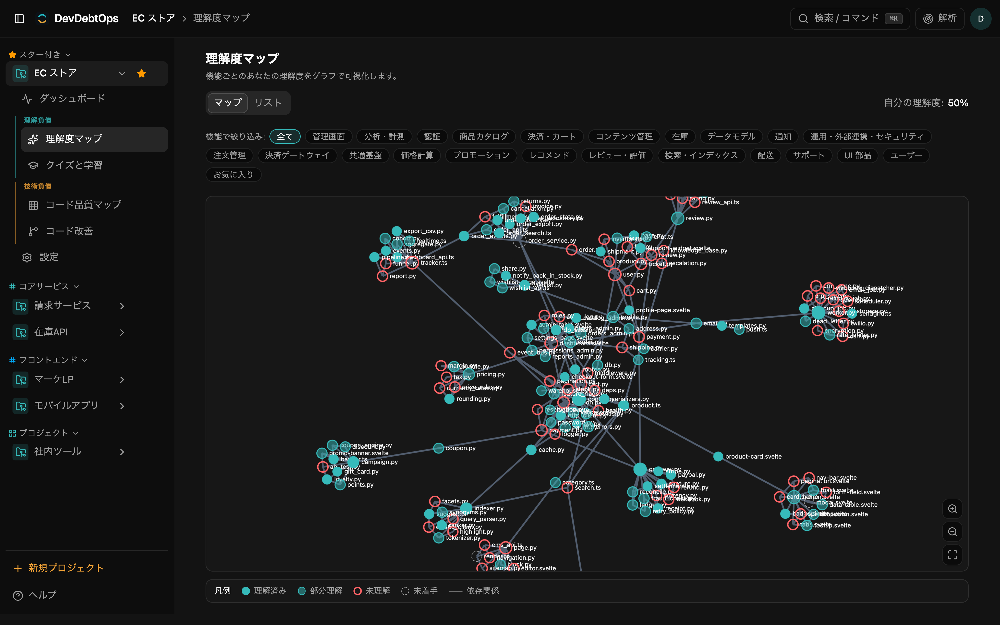

**この画面は何か:** リポジトリをファイル単位のノードリンクグラフ（force-graph）で可視化し、「機能ごとのあなたの理解度をグラフで可視化します」。ノード＝ファイル、色＝理解度、線＝ファイル間の依存・呼び出し（import・関数コール）です。サイドバーの理解負債グループ **「理解度マップ」** から開きます。

**主な操作:**
- 左上の **「マップ / リスト」** トグルで表示を切り替えます（リストは[17](#17-理解度マップリスト表示)参照）。右上に **「自分の理解度」**（例: 50%）が出ます。
- **「機能で絞り込み」** のチップ（全て / 認証 / 決済・カート / 在庫 …）で、特定機能に関わるファイル群だけに絞れます。
- 下部の **凡例**（理解済み / 部分理解 / 未理解 / 未着手 / 依存関係）で色の意味を確認できます。
- 右下のズームボタンで拡大・縮小・全体表示ができ、ノードをドラッグして探索できます。

**ヒント:** 色は git blame ではなくクイズの実測に基づくため、コミット履歴のない人でも「自分がどこを分かっているか」を客観的に把握できます。

### 17 理解度マップ（リスト表示）

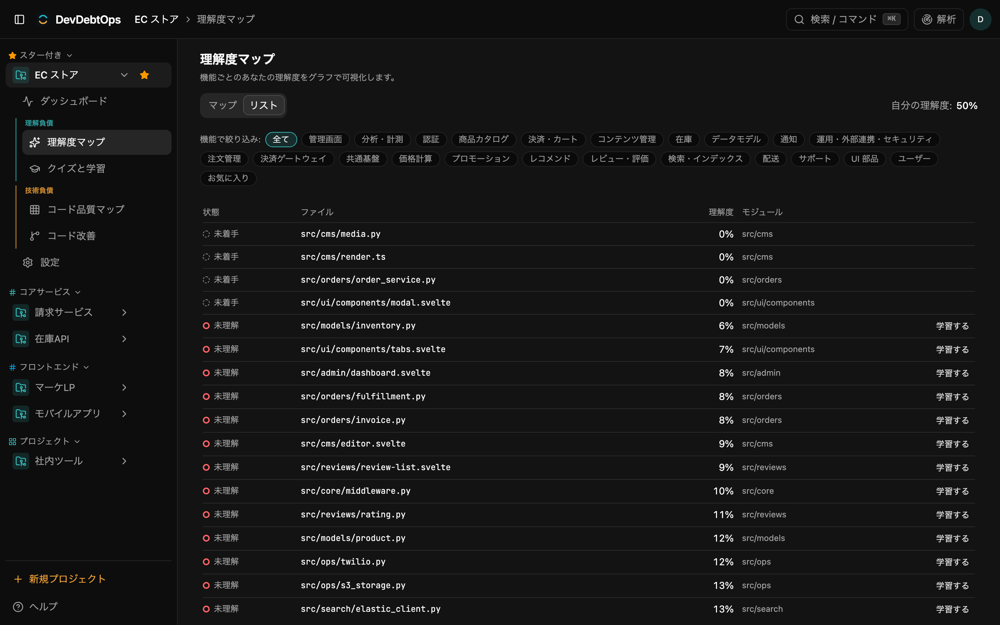

**この画面は何か:** 理解度マップの「リスト」表示です。同じデータを表形式で、理解度の低い順などに並べて確認できます。

**主な操作:**
- **「マップ / リスト」** トグルの「リスト」を選ぶと表示されます。「機能で絞り込み」チップはマップと共通で効きます。
- 表は **状態（未着手 / 未理解 …）/ ファイル / 理解度（%）/ モジュール** の列で構成されます。
- 各行右端の **「学習する」** から、そのファイルの学習・クイズへ進めます。

**ヒント:** 理解度の低いファイルを上から順に潰していく、返済の作業リストとして使えます。

---

## 5. クイズで実測し、学習で返済する（閉ループ）

### 18 クイズと学習（統合ハブ）

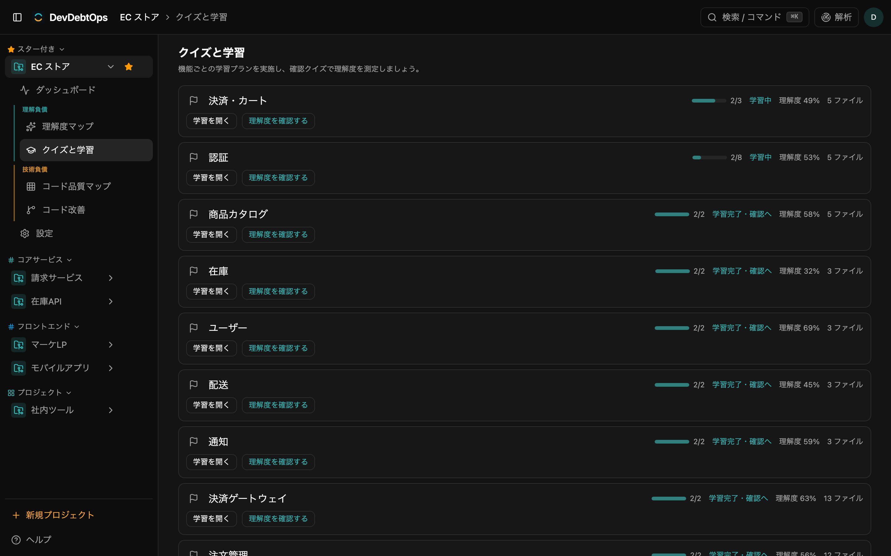

**この画面は何か:** 機能ごとの学習プランを進め、確認クイズで理解度を実測する統合ハブです。「機能ごとの学習プランを実施し、確認クイズで理解度を測定しましょう。」サイドバーの理解負債グループ **「クイズと学習」** から開きます。

**主な操作:**
- 機能（例: `決済・カート` / `認証` / `商品カタログ`）ごとに行が並び、右側に **学習ステータス（学習中 など）/ 理解度（%）/ ファイル数** が表示されます。
- **「学習を開く」** で[コード学習ウォークスルー](#21-コード学習ウォークスルー)を開始します。
- **「理解度を確認する」** で[クイズ受験](#19-クイズ受験集中モード)を開始します。
- 学習 → クイズ → 理解度更新の順に回すことで、理解負債を「返済」していきます。

### 19 クイズ受験（集中モード）

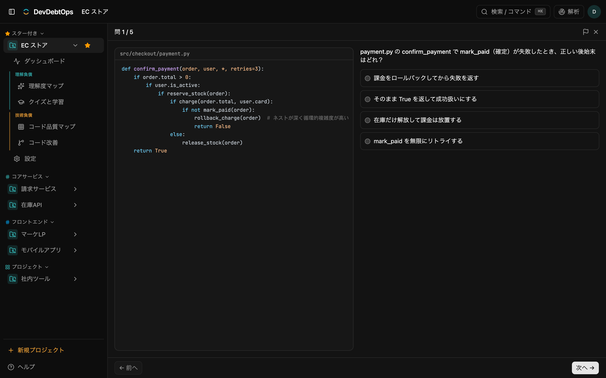

**この画面は何か:** 実際のコードを題材にした確認クイズを解く画面です。集中できるよう、余分な UI を抑えた表示になります。

**主な操作:**
- 上部に進捗（例: `問 1 / 5`）、右上の **難易度バッジ（L1〜L5、例: `L3`）** で問題の難しさが分かります。
- 左に対象コード（例: `src/checkout/payment.py`）、右に設問と**選択肢**が表示されます。設問は選択式の 2 種類で、**単一選択（ラジオボタン）** と**複数選択（チェックボックス）** があります。
- 選択肢を選び、**「次へ →」** で進みます。**「← 前へ」** で戻れます。右上の **×** で中断します。
- 全問終えると[採点結果](#20-クイズ採点結果理解度の更新)に進みます。

**ヒント:** 問題は Gemini により対象コードから自動生成され、L1〜L5 の難易度で理解の深さを測ります。

### 20 クイズ採点結果（理解度の更新）

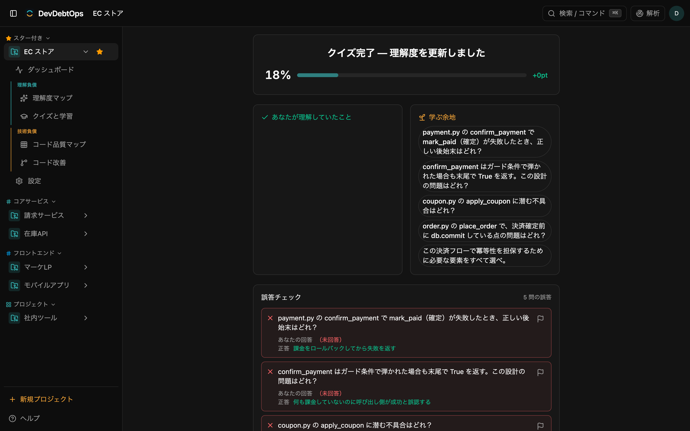

**この画面は何か:** クイズの採点結果を表示し、実測した理解度を反映する画面です。「返済完了 — 理解度を更新しました」と表示されます。

**主な操作:**
- 上部の**理解度バー**に更新後の値（例: 18%）と増減（例: `+0pt`）が示されます。
- **「あなたが理解していたこと」** に正答できた観点、**「学ぶ余地」** に取りこぼした設問・論点が一覧されます。
- **「一覧へ戻る」** で[クイズと学習](#18-クイズと学習統合ハブ)に戻り、次の対象に進めます。

**ヒント:** 「学ぶ余地」に挙がった項目は、そのまま次の学習ウォークスルーで重点的に補うと効率的です。

### 21 コード学習ウォークスルー

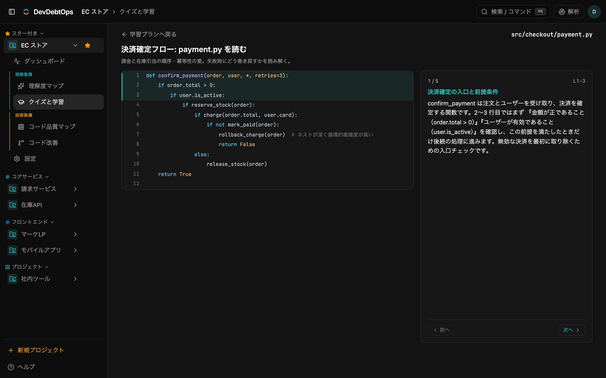

**この画面は何か:** 対象コードを段階的に読み解く学習コンテンツです（例: 「決済確定フロー: payment.py を読む」）。「クイズと学習」の「学習を開く」から入ります。

**主な操作:**
- 左に対象コード、右に**ステップ解説パネル**が表示されます。パネル右上に進捗（例: `1 / 5`）と対象行（例: `L1–3`）が出ます。
- 解説はコードの該当行に対応しており、読み進めるとコード側のハイライトが移動します。
- **「次へ」「前へ」** でステップを移動、**「← 学習プランへ戻る」** で一覧に戻ります。

**ヒント:** ウォークスルーで理解を深めたら、同じ機能のクイズを再受験して理解度の上昇を確認する——これが返済の閉ループです。

---

## 6. 設定

### 22 プロジェクト設定

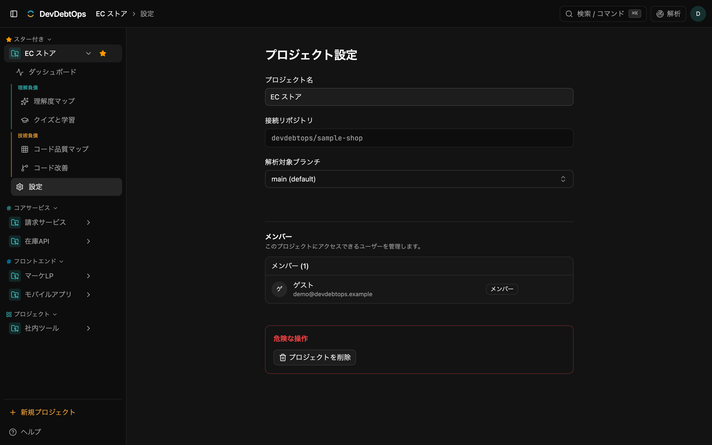

**この画面は何か:** プロジェクト単位の設定画面です。サイドバーの **「設定」** から開きます。

**主な操作:**
- **「プロジェクト名」** を編集できます。
- **「接続リポジトリ」**（例: `devdebtops/sample-shop`）を確認できます。
- **「解析対象ブランチ」**（例: `main (default)`）をプルダウンで変更できます。
- **「メンバー」** でプロジェクトにアクセスできるユーザーを管理します（例: `ゲスト / demo@devdebtops.example`、ロール表示）。
- **「危険な操作」** の **「プロジェクトを削除」** でプロジェクトを削除できます（取り消せない操作のため注意）。

### 23 アカウント画面（残りの解析クレジット）

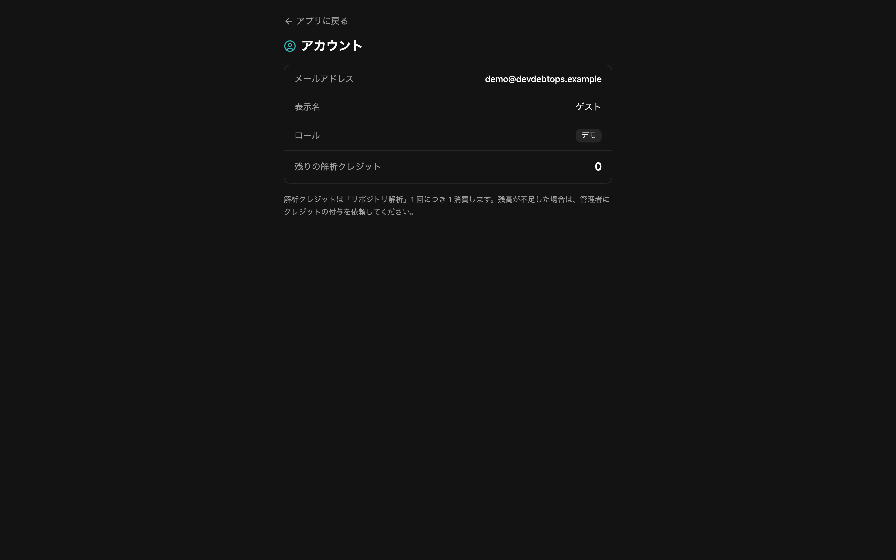

**この画面は何か:** アカウントメニューの **「アカウント」** から開く、全ユーザー向けの画面（`/account`）です。

**主な操作:**
- **メールアドレス**と**ロール**（一般ユーザー / 管理者）を確認できます。
- **残りの解析クレジット**を確認できます（環境変数 `ANALYSIS_CREDITS_ENABLED` が有効なときのみ）。クレジットはリポジトリ解析 1 回につき 1 消費し、残高がないと修正 PR の作成ができません（コスト上限化）。付与は管理者が行います（無効時・管理者は制限なし）。

---

## 7. モバイル対応

DevDebtOps はスマートフォンでも主要画面を操作できます。参考として、`images/screens-mobile/` に主要画面（`01`〜`12`）のスマホ版スクリーンショットを収録しています。

モバイルではヘッダー左のハンバーガーメニュー（≡）からサイドバーを開き、プロジェクト一覧やナビゲーションにアクセスします。カード・表・機能フィルタは縦並びに再レイアウトされます。

  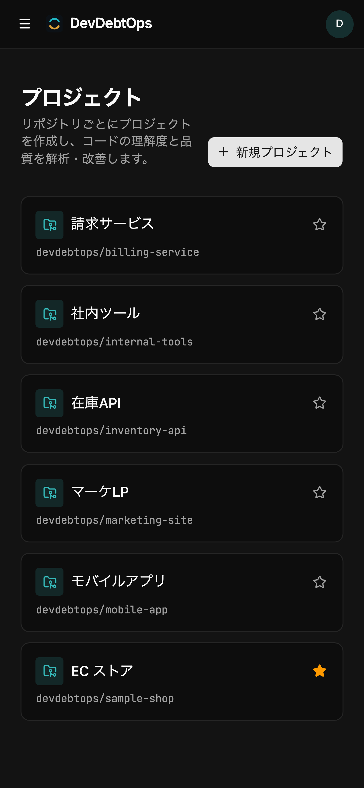
  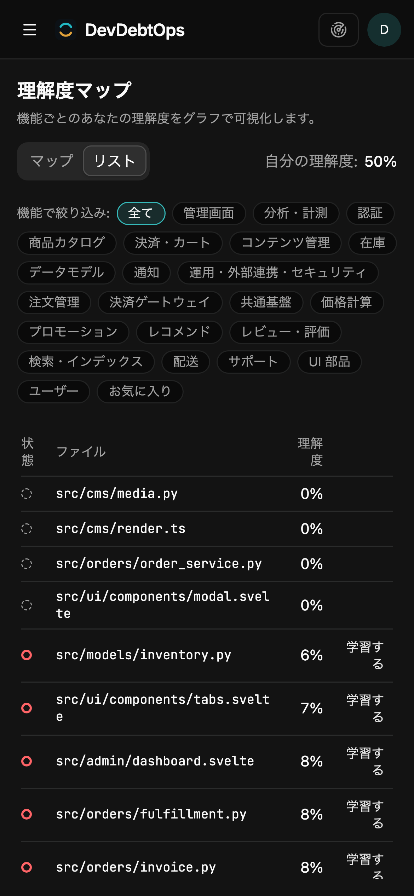

左: 組織ダッシュボード（プロジェクト一覧）／右: 理解度マップ（リスト表示に切り替えた状態）。

---

## 8. 管理者向け機能（ユーザー管理・クレジット付与）

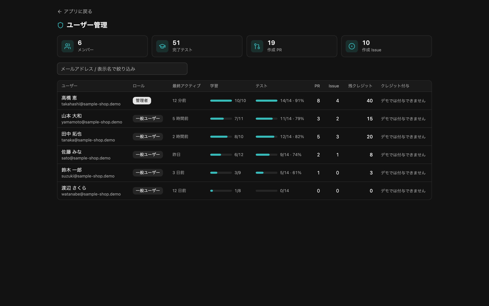

管理者（環境変数 `ADMIN_EMAILS` に登録されたユーザー）のみが利用できる機能です。アカウントメニューの **「ユーザー管理」** から管理ダッシュボード（`/admin`）を開きます。

**主な操作:**
- **ユーザー一覧**を閲覧し、各ユーザーへ**解析クレジットを付与**できます（コストの大きいリポジトリ解析・修正 PR 作成の上限を管理）。
- **メンバー活動の可視化** — 各メンバーの**学習プラン受講状況**（完了ステップ / 全ステップの進捗バー）・**理解度テスト**（平均点・完了数）・**コード改善への取り組み**（返済 PR 作成数・Issue 作成数）・**最終アクティブ**を一覧化。上部に合計サマリー（メンバー数 / 完了テスト / PR / Issue）を表示します。
- 集計は全ユーザー横断・全ワークスペース合算です。

**ヒント:** デモ環境でも管理ダッシュボードの画面自体は閲覧できますが、表示されるのは**架空のサンプルメンバー**のみ（実ユーザー情報は出しません）で、クレジット付与は読み取り専用です。
